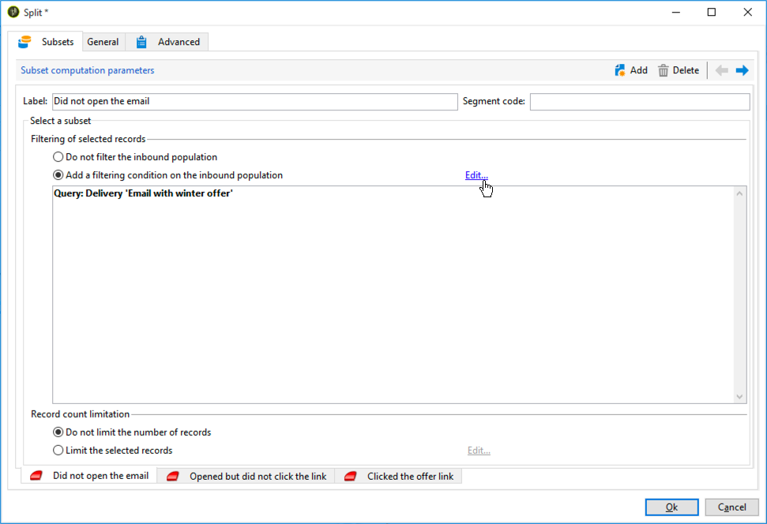

# Workflow voor levering tussen kanalen{#cross-channel-delivery-workflow}

In dit geval wordt een voorbeeld weergegeven met een workflow voor levering over meerdere kanalen. Het algemene concept van kanaalleveringen wordt gepresenteerd in [deze sectie](../../workflow/using/cross-channel-deliveries.md).

Het doel is een publiek van de ontvangers van uw gegevensbestand in verschillende groepen te segmenteren met als doel een e-mail naar een groep en een SMS-bericht naar een andere groep te verzenden.

De belangrijkste stappen voor de implementatie van dit gebruiksgeval zijn als volgt:

1. Het creëren van een **[!UICONTROL Query]** activiteit om uw publiek te richten.
1. Het creëren van een **[!UICONTROL Email delivery]** activiteit die een verbinding aan een aanbieding bevat.
1. Een **[!UICONTROL Split]**-activiteit gebruiken om:

   * Stuur een andere e-mail naar de ontvangers die het eerste e-mailbericht niet hebben geopend.
   * Verzend een SMS-bericht naar de ontvangers die het e-mailbericht hebben geopend, maar klik niet op de koppeling naar het voorstel.
   * Voeg aan het gegevensbestand de ontvangers toe die e-mail opende en de verbinding klikte.

## Stap 1: Doelgroep {#step-1--targeting-the-audience}

Om uw doel te bepalen, creeer een vraag om de ontvangers te identificeren.

1. Een campagne maken. Raadpleeg [deze sectie](../../campaign/using/setting-up-marketing-campaigns.md#creating-a-campaign) voor meer informatie.
1. Voeg op het tabblad **[!UICONTROL Targeting and workflows]** van uw campagne een **Query**-activiteit toe aan uw workflow. Raadpleeg [deze sectie](../../workflow/using/query.md) voor meer informatie over het gebruik van deze activiteit.
1. Bepaal de ontvangers die uw leveringen zullen ontvangen. Selecteer bijvoorbeeld &#39;Gold&#39;-leden als doeldimensie.
1. Voeg filtervoorwaarden aan uw vraag toe. Selecteer in dit voorbeeld ontvangers met een e-mailadres en een mobiel nummer.

   

1. Sla uw wijzigingen op.

## Stap 2: Een e-mail maken met een aanbieding {#step-2--creating-an-email-including-an-offer}

1. Maak een **[!UICONTROL Email delivery]**-activiteit en dubbelklik erop in de workflow om deze te bewerken. Raadpleeg [deze sectie](../../delivery/using/about-email-channel.md) voor meer informatie over het maken van een e-mailbericht.
1. Ontwerp het bericht en voeg een verbinding met inbegrip van een aanbieding in de inhoud op.

   

   Voor meer bij het integreren van een aanbieding in het lichaam van een bericht, verwijs naar [deze sectie](../../interaction/using/integrating-an-offer-via-the-wizard.md#delivering-with-a-call-to-the-offer-engine).

1. Sla uw wijzigingen op.
1. Klik met de rechtermuisknop op de activiteit **[!UICONTROL Email delivery]** om deze te openen.
1. Selecteer de optie **[!UICONTROL Generate an outbound transition]** om de populatie en de logbestanden voor bijhouden te herstellen.

   

   Hierdoor kunt u deze informatie gebruiken om een andere levering te verzenden, afhankelijk van het gedrag van de ontvangers bij het ontvangen van de eerste e-mail.

1. Voeg een **[!UICONTROL Wait]** activiteit toe om een paar dagen voor de ontvangers te laten om e-mail te openen.

   

## Stap 3: Het resulterende publiek {#step-3--segmenting-the-resulting-audience} segmenteren

Zodra uw doel wordt geïdentificeerd en uw eerste levering gecreeerd, moet u het doel in verschillende populaties segmenteren gebruikend het filtreren voorwaarden.

1. Voeg een **Gesplitste** activiteit aan het werkschema toe en open het. Raadpleeg [deze sectie](../../workflow/using/split.md) voor meer informatie over het gebruik van deze activiteit.
1. Creeer drie segmenten van de bevolking die stroomopwaarts in de vraag wordt berekend.

   

1. Voor de eerste subset selecteert u de optie **[!UICONTROL Add a filtering condition on the inbound population]** en klikt u op **[!UICONTROL Edit]**.

   

1. Selecteer **[!UICONTROL Recipients of a delivery]** als beperkingsfilter en klik **[!UICONTROL Next]**.

   

1. Selecteer **[!UICONTROL Recipients who have not opened or clicked (email)]** in de vervolgkeuzelijst **[!UICONTROL Behavior]** in de filterinstellingen en selecteer de e-mail met de aanbieding die u wilt verzenden in de leveringslijst. Klik op **[!UICONTROL Finish]**.

   

1. Ga zo ook voor de tweede ondergroep te werk en selecteer **[!UICONTROL Recipients who have not clicked (email)]** van **[!UICONTROL Behavior]** drop-down-list.

   

1. Voor de derde subset selecteert u de optie **[!UICONTROL Add a filtering condition on the inbound population]** nadat u op **[!UICONTROL Edit]** hebt geklikt.**[!UICONTROL Use a specific filtering dimension]**
1. Selecteer **[!UICONTROL Recipient tracking log]** in de vervolgkeuzelijst **[!UICONTROL Filtering dimension]**, markeer **[!UICONTROL Filtering conditions]** in **[!UICONTROL List of restriction filters]** en klik **[!UICONTROL Next]**.

   

1. Selecteer de filtervoorwaarden als volgt:

   

1. Klik **[!UICONTROL Finish]** om uw veranderingen te bewaren.

## Stap 4: De workflow voltooien {#step-4--finalizing-the-workflow}

1. Voeg de relevante activiteiten aan uw werkschema na de drie ondergroepen toe resulterend uit **[!UICONTROL Split]** activiteit:

   * Voeg een **[!UICONTROL Email delivery]** activiteit toe om een herinnering e-mail naar de eerste ondergroep te verzenden.
   * Voeg een **[!UICONTROL Mobile delivery]** activiteit toe om een bericht van SMS naar de tweede ondergroep te verzenden.
   * Voeg een **[!UICONTROL List update]** activiteit toe om de overeenkomstige ontvangers aan het gegevensbestand toe te voegen.

1. Dubbelklik op de leveringsactiviteiten in uw workflow om deze te bewerken. Raadpleeg [E-mailkanaal](../../delivery/using/about-email-channel.md) en [SMS-kanaal](../../delivery/using/sms-channel.md) voor meer informatie over het maken van een e-mail en een sms.
1. Dubbelklik op de **[!UICONTROL List update]**-activiteit en selecteer de optie **[!UICONTROL Generate an outbound transition]**.

   Vervolgens kunt u de resulterende ontvangers van Adobe Campaign naar de Adobe Experience Cloud exporteren. U kunt bijvoorbeeld het publiek in Adobe Target gebruiken door een **[!UICONTROL Update shared audience]** activiteit toe te voegen aan de workflow. Voor meer op dit, verwijs naar [Exporting an publiek](../../integrations/using/importing-and-exporting-audiences.md#exporting-an-audience).

1. Klik op de knop **Start** in de actiebalk om de workflow uit te voeren.

De populatie waarop de activiteit **Query** betrekking heeft, wordt gesegmenteerd om een e-mail of een levering van SMS te ontvangen volgens het gedrag van de ontvangers. De resterende populatie wordt aan de database toegevoegd met de activiteit **[!UICONTROL List update]**.
