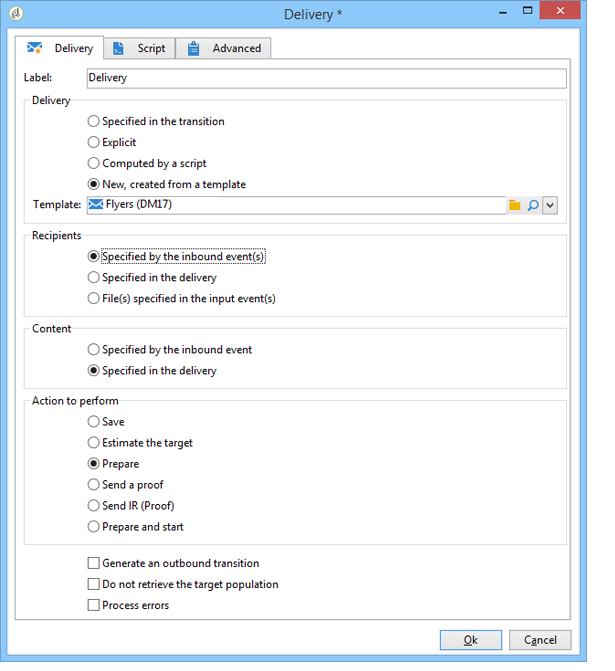

# Levenscyclus gegevens {#data-life-cycle}

## Werktabel {#work-table}

In werkstromen, worden de gegevens die van één activiteit aan een andere worden vervoerd opgeslagen in een tijdelijke het werklijst.

Deze gegevens kunnen worden weergegeven en geanalyseerd door met de rechtermuisknop op de juiste overgang te klikken.


Selecteer hiertoe het relevante menu:

* Het doel weergeven

   Dit menu toont de beschikbare gegevens over de doelpopulatie evenals de structuur van de het werklijst (**[!UICONTROL Schema]** tabel).

   

   Raadpleeg [Worktables en workflowschema](../../workflow/using/monitoring-workflow-execution.md#worktables-and-workflow-schema)voor meer informatie.

* Het doel analyseren

   In dit menu hebt u toegang tot de wizard voor beschrijvende analyse, waarmee u statistieken en rapporten over de overgangsgegevens kunt produceren.

   For more on this, refer to this [section](../../reporting/using/using-the-descriptive-analysis-wizard.md).

De doelgegevens worden gewist terwijl de workflow wordt uitgevoerd. Alleen de laatste werktabel is toegankelijk. U kunt het werkschema vormen zodat alle het werklijsten toegankelijk blijven: Controleer de **[!UICONTROL Keep the result of interim populations between two executions]** optie in de werkschemaeigenschappen.

Wij raden u echter aan deze optie niet te activeren als er grote hoeveelheden gegevens zijn.


## Doelgegevens {#target-data}

De gegevens die in de werktabel van de workflow zijn opgeslagen, zijn toegankelijk in de velden voor personalisatie.

Hiermee kunt u gegevens gebruiken die via een lijst zijn verzameld of die zijn gebaseerd op antwoorden op een enquête in een levering. Hiervoor gebruikt u de volgende syntaxis:

```
%= targetData.FIELD %
```

**[!UICONTROL Target extension]** (targetData) type verpersoonlijkingselementen zijn niet beschikbaar voor het richten van werkschema&#39;s. Het leveringsdoel moet in het werkschema worden gebouwd en in de binnenkomende overgang van de levering worden gespecificeerd.

Als u leveringsproeven wilt tot stand brengen, moet het proefdrukdoel op de **[!UICONTROL Address substitution]** wijze worden gebouwd zodat de verpersoonlijkingsgegevens kunnen worden ingegaan. For more on this, refer to this [section](../../delivery/using/steps-defining-the-target-population.md#using-address-substitution-in-proof).

In het volgende voorbeeld, gaan wij een lijst van informatie over klanten verzamelen, die in een gepersonaliseerd e-mail moet worden gebruikt.

Voer de volgende stappen uit:

1. Maak een workflow voor het verzamelen van informatie, pas deze aan met de gegevens die al in de database staan en start vervolgens een levering.

   

   In ons voorbeeld ziet de bestandsinhoud er als volgt uit:

   ```
   Music,First name,Last name,Account,CD/DVD,Card
   Pop,David,BLAIR,4323,CD,0
   Rock,Daniel,ARCARI,3222,DVD,1
   Disco,Uma,ALTON,0488,DVD,0
   Jazz,Paul,BOLES,6475,CD,1
   Jazz,David,BOUKHARI,0841,DVD,1
   [...]
   ```

   Voer de volgende stappen uit om het bestand te laden:

   

1. Configureer de **[!UICONTROL Enrichment]** tekstactiviteit om de verzamelde gegevens te combineren met de gegevens die al in de Adobe Campagne-database staan.

   Hier is de afstemmingssleutel het rekeningnummer:

   

1. Configureer vervolgens de **[!UICONTROL Delivery]**: het wordt gecreeerd gebaseerd op een malplaatje, en de ontvangers worden gespecificeerd door de binnenkomende overgang.

   

   >[!CAUTION]
   >
   >Alleen gegevens in de overgang mogen worden gebruikt om de levering aan te passen. **Het type van targetData** verpersoonlijkingsgebieden zijn slechts beschikbaar voor de binnenkomende bevolking van de **[!UICONTROL Delivery]** activiteit.

1. In het leveringsmalplaatje, gebruik de gebieden die in het werkschema worden verzameld.

   U doet dit door velden voor **[!UICONTROL Target extension]** typepersonalisatie in te voegen.

   

   Hier willen we het favoriete muziekgenre en mediatype (CD of DVD) van de klant invoegen, zoals vermeld in het bestand dat tijdens de workflow wordt verzameld.

   Als plus gaan we een coupon toevoegen voor houders van een loyaliteitskaart, dat wil zeggen ontvangers voor wie de waarde van de &#39;Kaart&#39; gelijk is aan 1.

   

   **[!UICONTROL Target extension]** (targetData) typegegevens worden opgenomen in leveringen gebruikend de zelfde kenmerken zoals alle verpersoonlijkingsgebieden. Ze kunnen ook worden gebruikt in het onderwerp, koppelingslabels of de koppelingen zelf.

   Berichten die aan verzamelde ontvangers worden gericht zullen de volgende gegevens bevatten:

   
