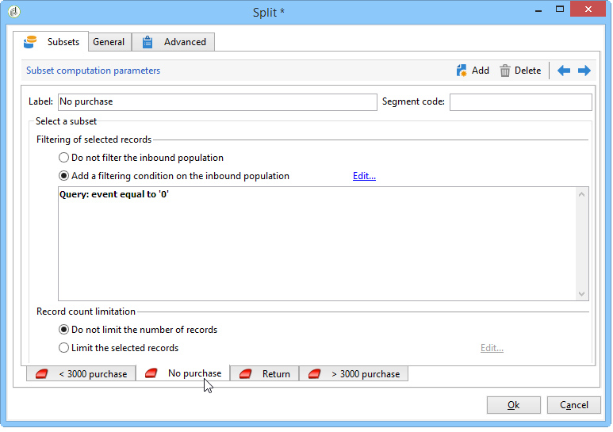

# Gegevens laden (bestand){#data-loading-file}

## Gebruiken {#use}

Met deze **[!UICONTROL Data loading (File)]** activiteit hebt u rechtstreeks toegang tot een bron met externe gegevens en kunt u deze gebruiken in Adobe Campaign. Alle gegevens die vereist zijn voor doelbewerkingen worden niet altijd gevonden in de Adobe Campagne-database: het kan in externe dossiers ter beschikking worden gesteld.

Het bestand dat moet worden geladen, kan worden opgegeven door de overgang of worden berekend tijdens de uitvoering van deze activiteit. Bijvoorbeeld, kan het de lijst van 10 favoriete producten van een cliënt zijn de waarvan aankopen in een extern gegevensbestand worden beheerd.

In het bovenste gedeelte van het configuratievenster voor deze activiteit kunt u de bestandsindeling definiëren. Hiervoor gebruikt u een voorbeeldbestand met dezelfde indeling als het bestand dat u wilt importeren. Dit bestand kan lokaal of op de server worden opgeslagen.

>[!CAUTION]
>
>Alleen &#39;platte&#39; structuurbestanden worden ondersteund (bijvoorbeeld CSV, TXT, enz.). Het gebruik van de XML-indeling wordt afgeraden.

U kunt een vooraf uitgevoerd proces definiëren tijdens het importeren van bestanden, bijvoorbeeld om het bestand niet op de server uit te pakken (en dus ruimte voor het uitgepakt bestand op te slaan) maar om het uitpakken op te nemen in de bestandsverwerking. Selecteer de **[!UICONTROL Pre-process the file]** optie en kies een van de drie opties: **[!UICONTROL None]**, **[!UICONTROL Decompression]** (zcat) of **[!UICONTROL Decrypt]** (gpg).

## De bestandsindeling definiëren {#defining-the-file-format}

Wanneer u een bestand laadt, wordt de kolomindeling automatisch gedetecteerd met de standaardparameters voor elk gegevenstype. U kunt deze standaardparameters wijzigen om de specifieke processen te specificeren die op uw gegevens moeten worden toegepast, in het bijzonder wanneer er een fout of een lege waarde is.

U doet dit door **[!UICONTROL Click here to change the file format...]** in het hoofdvenster van de **[!UICONTROL Data loading (file)]** activiteit te selecteren. Het venster met de indelingsdetails wordt dan geopend.

Vervolgens kunt u de algemene opmaak van het bestand en de opmaak van elke kolom wijzigen.

Met de algemene bestandsindeling kunt u bepalen hoe de kolommen worden herkend (bestandencodering, gebruikte scheidingstekens, enz.).

Met de kolomopmaak kunt u de waardeverwerking van elke kolom definiëren:

* **[!UICONTROL Ignore column]**: Deze kolom wordt niet verwerkt tijdens het laden van gegevens.
* **[!UICONTROL Data type]**: geeft het type gegevens aan dat voor elke kolom wordt verwacht.
* **[!UICONTROL Allow NULLs]**: geeft aan hoe lege waarden moeten worden beheerd.

   * **[!UICONTROL Adobe Campaign default]**: genereert alleen een fout voor numerieke velden. Als dit niet het geval is, wordt een NULL-waarde ingevoegd.
   * **[!UICONTROL Empty value allowed]**: autoriseert lege waarden. De waarde NULL wordt daarom ingevoegd.
   * **[!UICONTROL Always populated]**: genereert een fout als een waarde leeg is.

* **[!UICONTROL Length]**: geeft het maximum aantal tekens voor het **gegevenstype van de tekenreeks** aan.
* **[!UICONTROL Format]**: definieert de notatie voor tijd en datum.
* **[!UICONTROL Data transformation]**: definieert of een proces met hoofdletters/kleine letters moet worden toegepast op een **tekenreeks**.

   * **[!UICONTROL None]**: de geïmporteerde tekenreeks wordt niet gewijzigd.
   * **[!UICONTROL First letter in upper case]**: De eerste letter van elk woord van de tekenreeks begint met een hoofdletter.
   * **[!UICONTROL Upper case]**: alle tekens in de tekenreeks zijn in hoofdletters weergegeven.
   * **[!UICONTROL Lower case]**: alle tekens in de tekenreeks zijn in kleine letters weergegeven.

* **[!UICONTROL White space management]**: Geeft aan of bepaalde spaties in een tekenreeks moeten worden genegeerd. Met de **[!UICONTROL Ignore spaces]** waarde kunnen alleen spaties aan het begin en het einde van een tekenreeks worden genegeerd.
* **[!UICONTROL Error processings]**: definieert het gedrag als een fout optreedt.

   * **[!UICONTROL Ignore the value]**: de waarde wordt genegeerd. Er wordt een waarschuwing gegenereerd in het logboek voor workflowuitvoering.
   * **[!UICONTROL Reject line]**: de gehele lijn wordt niet verwerkt.
   * **[!UICONTROL Use a default value in case of error]**: vervangt de waarde die de fout veroorzaakt door een standaardwaarde, die op het **[!UICONTROL Default value]** gebied wordt bepaald.
   * **[!UICONTROL Reject the line when there is no remapping value]**: de hele lijn wordt alleen verwerkt als een toewijzing voor de onjuiste waarde is gedefinieerd (zie de onderstaande **[!UICONTROL Mapping]** optie).
   * **[!UICONTROL Use a default value in case the value is not remapped]**: vervangt de waarde die de fout veroorzaakt door een standaardwaarde, die in het **[!UICONTROL Default value]** gebied wordt bepaald, tenzij een afbeelding voor de verkeerde waarde (zie de hieronder **[!UICONTROL Mapping]** optie) was bepaald.

* **[!UICONTROL Default value]**: geeft de standaardwaarde op basis van de gekozen foutafhandeling.
* **[!UICONTROL Mapping]**: dit veld is alleen beschikbaar in de configuratie van de kolomdetails (toegankelijk via een dubbelklik of via de opties rechts van de kolomlijst). Hiermee worden bepaalde waarden getransformeerd wanneer ze worden geïmporteerd. U kunt bijvoorbeeld &quot;three&quot; omzetten in &quot;3&quot;.

## Voorbeeld: Gegevens verzamelen en laden in de database {#example--collecting-data-and-loading-it-in-the-database}

In het volgende voorbeeld kunt u elke dag een bestand op de server verzamelen, de inhoud van het bestand laden en de gegevens in de database bijwerken, afhankelijk van de informatie die het bevat. Het te verzamelen bestand bevat informatie over klanten die mogelijk aankopen hebben gedaan (voor meer of minder dan 3000 euro), om terugbetaling hebben gevraagd bij een aankoop of de winkel hebben bezocht zonder iets te kopen. Afhankelijk van deze informatie worden verschillende processen toegepast op hun profiel in de database.

1. Met de bestandscollector kunt u bestanden herstellen die in een map zijn opgeslagen, afhankelijk van de opgegeven frequentie.

   Het **[!UICONTROL Directory]** tabblad bevat informatie over de te herstellen bestanden. In ons voorbeeld worden alle bestanden in tekstopmaak waarvan de naam het woord &#39;klanten&#39; bevat en die zijn opgeslagen in de map tmp/Adobe/Data/files van de server, hersteld.

   Het gebruik van de map **[!UICONTROL File collector]** wordt beschreven in de sectie [Bestandsverzamelaar](../../workflow/using/file-collector.md) .

   

   Op het **[!UICONTROL Schedule]** tabblad kunt u de uitvoering van de verzamelaar plannen, zodat u kunt opgeven met welke frequentie de aanwezigheid van deze bestanden wordt gecontroleerd.

   Hier, willen wij de inzamelaar elke werkdag teweegbrengen om 9PM.

   

   Om dit te doen, klik de **[!UICONTROL Change...]** knoop die in de lagere juiste sectie van het het uitgeven hulpmiddel wordt gevestigd en vorm het programma.

   Raadpleeg [Scheduler](../../workflow/using/scheduler.md)voor meer informatie.

1. Configureer vervolgens de activiteit voor het laden van gegevens (bestand) om aan te geven hoe de verzamelde bestanden moeten worden gelezen. Selecteer hiertoe een voorbeeldbestand met dezelfde structuur als de bestanden die u wilt laden.

   

   Hier bevat het bestand vijf kolommen:

   * de eerste kolom bevat een code die samenvalt met de gebeurtenis: aankoop (meer of minder dan 3000 euro), geen aankoop of terugbetaling voor een of meer aankopen.
   * de vier volgende kolommen bevatten de voornaam, achternaam, e-mail en het rekeningnummer van de klant.
   De indelingsconfiguratie van het te laden bestand valt samen met de configuratie die is gedefinieerd tijdens het importeren van gegevens in Adobe Campaign. For more on this, refer to this [section](../../platform/using/importing-data.md#step-2---source-file-selection).

1. Geef bij de splitsingsactiviteit de subsets op die u wilt maken, op basis van de waarde in de kolom **Gebeurtenis** .

   De activiteit Splitsen wordt gedetailleerd beschreven in de sectie.

   

   Geef voor elke subset een van de waarden in de kolom **Gebeurtenis** op.

   

   De **[!UICONTROL Split]** activiteit zal daarom de volgende informatie bevatten:

   

1. Geef vervolgens aan welke processen voor elk type bevolking moeten worden uitgevoerd. In ons voorbeeld gaan we naar **[!UICONTROL Update the data]** de database. Om dit te doen, plaats een **[!UICONTROL Update data]** activiteit aan het eind van elke uitgaande overgang van de gespleten activiteit.

   De **[!UICONTROL Update data]** activiteit wordt gedetailleerd in de de gegevenssectie van de [Update](../../workflow/using/update-data.md) .

