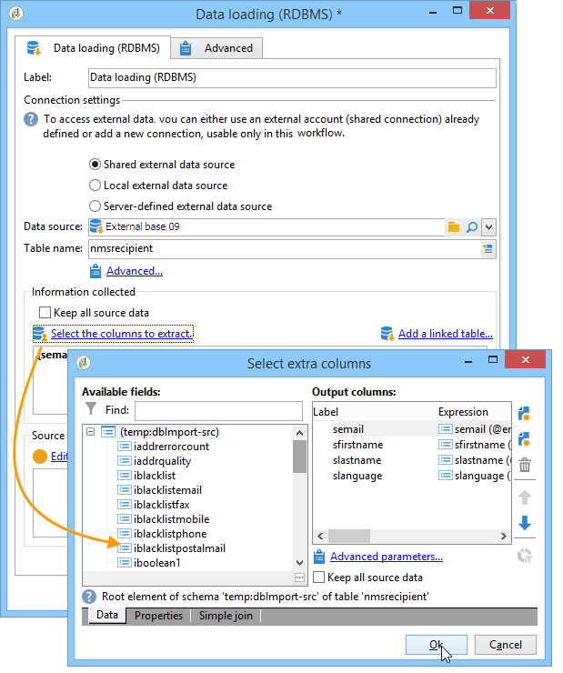

# Gegevens laden (RDBMS){#data-loading-rdbms}

Met de **[!UICONTROL Data loading (RDBMS)]** activiteit hebt u rechtstreeks toegang tot deze externe database en kunt u alleen de gegevens verzamelen die vereist zijn voor het zoeken naar gegevens.

Om prestaties te verbeteren, adviseren wij gebruikend de vraagactiviteit (waar de gegevens van een extern gegevensbestand kunnen worden gebruikt). Raadpleeg [Toegang tot een externe database (FDA)](../../workflow/using/accessing-an-external-database--fda-.md)voor meer informatie hierover.

De bewerking is als volgt:

1. Selecteer de gegevensbron in de lijst en voer de naam in van de tabel die de gegevens bevat die u wilt extraheren.

   

   De naam van de tabel die in het desbetreffende veld wordt ingevoerd, wordt gebruikt als sjabloon voor het verzamelen van gegevens in de externe database. De naam van de tabel die door de workflow wordt verwerkt, kan worden berekend of overgebracht door de binnenkomende overgang van de activiteit voor het laden van gegevens. Klik op de **[!UICONTROL Advanced..]** tabel om de tabel te selecteren die u wilt gebruiken. en selecteer de **[!UICONTROL Specified in the transition]** of **[!UICONTROL Explicit]** optie.

   

1. Klik op de **[!UICONTROL Select the columns to extract...]** koppeling om de gegevens te kiezen die in de database moeten worden verzameld.

   

1. U kunt een filter voor deze gegevens definiëren. Klik hiertoe op de **[!UICONTROL Edit query....]** koppeling.

   De op deze manier verzamelde gegevens kunnen gedurende de gehele levenscyclus van de workflow worden gebruikt.

