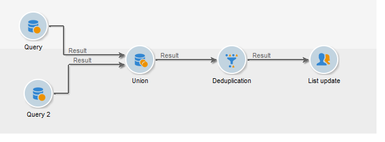
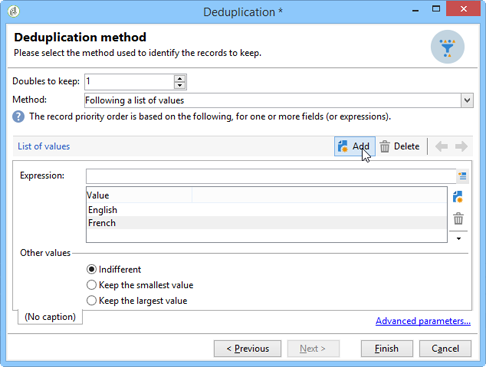

# Deduplicatie{#deduplication}

Deduplicatie verwijdert duplicaten van de resultaten van binnenkomende activiteiten. U kunt deduplicatie uitvoeren op het e-mailadres, telefoonnummer of een ander veld.

## Aanbevolen procedures {#best-practices}

Tijdens deduplicatie worden inkomende stromen afzonderlijk verwerkt. Als bijvoorbeeld ontvanger A in het resultaat van vraag 1 evenals in het resultaat van vraag 2 wordt gevonden, zullen zij niet worden gededupliceerd.

Deze kwestie moet als volgt worden aangepakt:

* Creeer een **Actie van de Unie** om elke binnenkomende stroom te verenigen.
* Creëer een **deduplicatie** -activiteit na de activiteit van de **Unie** .

## Configuratie {#configuration}

Als u een deduplicatie wilt configureren, voert u het label, de methode en de criteria voor deduplicatie in en de opties voor het resultaat.

Klik op de **[!UICONTROL Edit configuration...]** koppeling om de deduplicatiemodus te definiëren.

1. Doelselectie

   Selecteer het type doel voor deze activiteit (deduplicatie heeft standaard betrekking op ontvangers) en het te gebruiken criterium, d.w.z. het veld waarvoor identieke waarden u in staat stellen duplicaten te identificeren: e-mailadres, mobiel of telefoonnummer, faxnummer of direct-mailadres.

   

   >[!NOTE]
   >
   >Als u externe gegevens als invoer gebruikt, bijvoorbeeld uit een extern bestand, moet u de **[!UICONTROL Temporary schema]** optie selecteren.
In de volgende stap kunt u met de **[!UICONTROL Other]** optie het criterium of de criteria selecteren die u wilt gebruiken:

   

1. Methoden voor deduplicatie

   Selecteer in de vervolgkeuzelijst de deduplicatiemethode die u wilt gebruiken en voer het aantal duplicaten in dat u wilt behouden.

   

   De volgende methoden zijn beschikbaar:

   * **[!UICONTROL Choose for me]**: Hiermee selecteert u willekeurig de record die u uit de duplicaten wilt verwijderen.
   * **[!UICONTROL Following a list of values]**: Hiermee kunt u een prioriteit voor een of meer velden definiëren. Als u de waarden wilt definiëren, selecteert u een veld of maakt u een expressie. Voeg vervolgens de waarde(n) toe aan de desbetreffende tabel. Als u een nieuw veld wilt definiëren, klikt u op de **[!UICONTROL Add]** knop boven de lijst met waarden.

      

   * **[!UICONTROL Non-empty value]**: Hiermee kunt u records bewaren waarvoor de waarde van de geselecteerde expressie niet leeg is als prioriteit.

      

   * **[!UICONTROL Using an expression]**: Hiermee kunt u records met de laagste (of hoogste) waarde van de opgegeven expressie bijhouden.

      
   Klik **[!UICONTROL Finish]** om de geselecteerde deduplicatiemethode goed te keuren.

   Het middelste gedeelte van het venster geeft een overzicht van de gedefinieerde configuratie.

   In de onderste sectie van het venster van de activiteitenredacteur, kunt u het etiket voor de uitgaande overgang van het grafische voorwerp wijzigen en een segmentcode ingaan die met het resultaat van de activiteit zal worden geassocieerd. Deze code kan later als het richten criterium worden gebruikt.

   

   Controleer de **[!UICONTROL Generate complement]** optie als u de resterende populatie wilt uitbuiten. Het complement bestaat uit alle duplicaten. Vervolgens wordt als volgt een aanvullende overgang aan de activiteit toegevoegd:

   

## Voorbeeld: De duplicaten identificeren vóór levering {#example--identify-the-duplicates-before-a-delivery}

In het volgende voorbeeld betreft de deduplicatie de samenvoeging van drie vragen.

Het doel van de workflow is om het doel voor een levering te bepalen door duplicaten uit te sluiten, zodat deze niet meerdere keren naar dezelfde ontvanger worden gestuurd.

De geïdentificeerde duplicaten worden ook geïntegreerd in een speciale lijst met duplicaten die indien nodig opnieuw kan worden gebruikt.

1. Voeg de verschillende activiteiten toe en koppel deze die nodig zijn om de workflow te laten werken, zoals hierboven wordt weergegeven.

   De vakbondsactiviteit wordt hier gebruikt om de drie vragen in één enkele overgang te &quot;verenigen&quot;. Op deze manier werkt deduplicatie niet voor elke query afzonderlijk, maar voor de gehele query. Raadpleeg de [aanbevolen procedures](#best-practices)voor meer informatie over dit onderwerp.

1. Open de deduplicatieactiviteit en klik vervolgens op de **[!UICONTROL Edit configuration...]** koppeling om de deduplicatiemodus te definiëren.
1. Selecteer in het nieuwe venster **[!UICONTROL Database schema]**.
1. Selecteer **Ontvangers** als doel- en filterafmetingen.
1. Selecteer het veld Id voor de **[!UICONTROL Email]** duplicaten om de levering maar één keer naar elk e-mailadres te verzenden en klik vervolgens op **[!UICONTROL Next]**.

   Als u de dubbele id&#39;s wilt baseren op een specifiek veld, selecteert u **[!UICONTROL Other]** om de lijst met beschikbare velden te openen.

1. Kies ervoor om slechts één item bij te houden wanneer hetzelfde e-mailadres wordt geïdentificeerd voor meerdere ontvangers.
1. Selecteer de **[!UICONTROL Choose for me]** deduplicatiemodus, zodat de records die worden opgeslagen in het geval van geïdentificeerde duplicaten willekeurig worden gekozen en klik vervolgens op **[!UICONTROL Finish]**.

Bij het uitvoeren van de workflow worden alle ontvangers die als duplicaten zijn geïdentificeerd, uitgesloten van het resultaat (en dus van de levering) en toegevoegd aan de lijst met duplicaten. Deze lijst kan opnieuw worden gebruikt in plaats van de duplicaten opnieuw te moeten identificeren.

## Invoerparameters {#input-parameters}

* tableName
* schema

Elke binnenkomende gebeurtenis moet een doel specificeren dat door deze parameters wordt bepaald.

## Uitvoerparameters {#output-parameters}

* tableName
* schema
* recCount

Deze reeks van drie waarden identificeert het doel dat uit de deduplicatie voortvloeit. **[!UICONTROL tableName]** is de naam van de lijst die doelherkenningstekens opslaat, is het schema van de bevolking (gewoonlijk nms:ontvanger) en **[!UICONTROL schema]** **[!UICONTROL recCount]** is het aantal elementen in de lijst.

De overgang verbonden aan het complement heeft de zelfde parameters.
