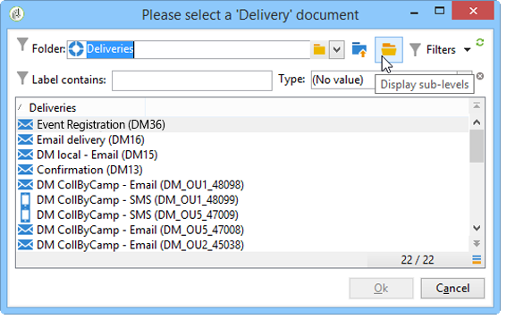
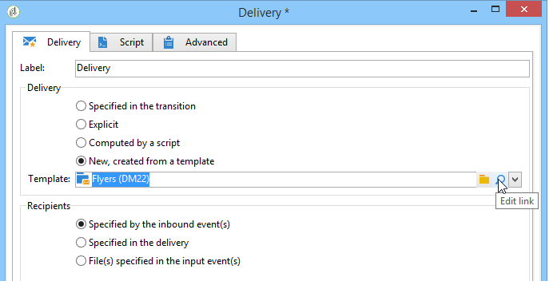
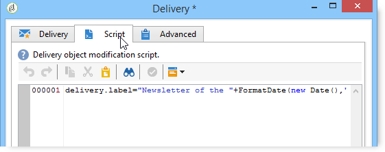

# Aflevering{#delivery}

Met een activiteit van het type **levering** kunt u een leveringsactie maken. Het kan worden geconstrueerd met behulp van inputelementen.

Om het te vormen, geef de activiteit uit en ga de leveringsopties in.


1. **Aflevering**

   U kunt:

   * Akte op de levering in de binnenkomende overgang wordt gespecificeerd die. Selecteer hiertoe de eerste optie van de **[!UICONTROL Delivery]** sectie van het venster.

      Deze optie kan worden gebruikt wanneer een vorige werkstroomactiviteit reeds heeft gecreeerd of de levering gespecificeerd. Dit kan, zoals in het onderstaande voorbeeld, door een activiteit van het zelfde type worden gedaan die een uitgaande overgang heeft geproduceerd.

      In het volgende voorbeeld wordt de levering voor het eerst gemaakt. De populatie en de inhoud worden later gedefinieerd. Daarna, wordt de informatie voor deze drie elementen opnieuw ingegaan in een nieuwe leveringsactiviteit gebruikend de binnenkomende overgang zodat dit kan worden verzonden.

      

   * Selecteer de betrokken levering rechtstreeks. Selecteer hiertoe de **[!UICONTROL Explicit]** optie en selecteer de levering in de vervolgkeuzelijst van het **[!UICONTROL Delivery]** veld.

      In de lijst worden standaard de onvoltooide leveringen weergegeven die zich in de map **Leveringen** bevinden. Klik op het **[!UICONTROL Select link]** pictogram om andere campagnes te openen.

      

      Selecteer de campagne in de vervolgkeuzelijst van het **[!UICONTROL Folder]** veld of klik **[!UICONTROL Display sub-levels]** om alle leveringen in submappen weer te geven:

      

      Nadat u de leveringsactie hebt geselecteerd, kunt u de inhoud weergeven door op het **[!UICONTROL Edit link]** pictogram te klikken.

   * Maak een script om de levering te berekenen. U doet dit door de **[!UICONTROL Computed by a script]** optie te selecteren en het script in te voeren. U kunt een invoervenster openen door op de **[!UICONTROL Edit...]** optie te klikken. In het volgende voorbeeld wordt de id van de levering hersteld:

      

   * Maak een nieuwe levering. Om dit te doen, selecteer de **[!UICONTROL New, created from a template]** optie en selecteer het leveringsmalplaatje waarop de levering zal worden gebaseerd.

      

      Klik op het **[!UICONTROL Select link]** pictogram om door de mappen te bladeren en klik op het **[!UICONTROL Edit link]** pictogram als u de inhoud van de geselecteerde sjabloon wilt weergeven.

1. **Ontvangers**

   Ontvangers kunnen door de binnenkomende gebeurtenissen worden opgegeven, bijvoorbeeld na het importeren van een bestand, of in de leveringsactie worden opgegeven. Ze kunnen ook in een of meer bestanden worden opgeslagen.

   

1. **Inhoud**

   De inhoud van het bericht kan in de levering of de binnenkomende gebeurtenis worden bepaald.

   

1. **Uit te voeren handeling**

   U kunt de levering maken, voorbereiden, starten, het doel schatten of een proefdruk verzenden.

   

   Selecteer het type actie dat moet worden uitgevoerd:

   * **[!UICONTROL Save]**: met deze optie kunt u de levering maken en opslaan. Het zal het niet analyseren of leveren.
   * **[!UICONTROL Estimate the target]**: met deze optie kunt u het leveringsdoel berekenen om het potentieel ervan te beoordelen ( eerste analysefase ) . Deze actie is het equivalent van het selecteren van de **[!UICONTROL Estimate the population to be targeted]** optie en het klikken **[!UICONTROL Analyze]** wanneer het verzenden van een levering naar het belangrijkste doel via **Levering**.
   * **[!UICONTROL Prepare]**: met deze optie kunt u het volledige analyseproces uitvoeren ( doelberekening en inhoudsvoorbereiding ) . De levering wordt niet verzonden. Deze actie is het equivalent van het selecteren van de **[!UICONTROL Deliver as soon as possible]** optie en het klikken **[!UICONTROL Analyze]** wanneer het verzenden van een levering naar het belangrijkste doel met **Levering**.
   * **[!UICONTROL Send a proof]**: met deze optie kunt u een bewijs van levering verzenden. Deze actie is het equivalent van klikken op de **[!UICONTROL Send a proof]** knop op de werkbalk van een levering met **levering**
   * **[!UICONTROL Prepare and start]**: met deze optie wordt het volledige analyseproces gestart ( doelberekening en inhoudsvoorbereiding ) en wordt de levering verzonden . Deze actie is het equivalent van klikken **[!UICONTROL Deliver as soon as possible]**, **[!UICONTROL Analyze]** en **[!UICONTROL Confirm delivery]** optie wanneer het verzenden van een levering naar het belangrijkste doel met **Levering**.
   Met de **[!UICONTROL Act on a delivery]** activiteit die u verder in de workflow gebruikt, kunt u alle resterende stappen starten die vereist zijn voor het starten van de levering (doelberekening, voorbereiding van inhoud, levering). Raadpleeg [Leveringscontrole](../../workflow/using/delivery-control.md)voor meer informatie hierover.

   De volgende opties zijn ook beschikbaar:

   * **[!UICONTROL Generate an outbound transition]**

      Creeert een uitgaande overgang die aan het eind van uitvoering zal worden geactiveerd. U kunt kiezen al dan niet om het doel van de uitgaande levering terug te winnen.

   * **[!UICONTROL Do not recover target]**

      Herstelt niet het doel van de uitgaande leveringsactie.

   * **[!UICONTROL Processing errors]**

      Raadpleeg [Leveringscontrole](../../workflow/using/delivery-control.md).
   Op het tabblad **Script** kunt u de leveringsparameters wijzigen.

   

## Voorbeeld: leveringsworkflow {#example--delivery-workflow}

Maak een nieuwe workflow en voeg activiteiten toe zoals in de onderstaande afbeelding wordt getoond:


Open de activiteit **Levering** en definieer de eigenschappen als volgt:

* Selecteer in de **[!UICONTROL Delivery]** sectie een leveringssjabloon **[!UICONTROL New, created from a template]** en selecteer deze.
* Selecteer in de **[!UICONTROL Recipients]** sectie **[!UICONTROL Specified in the delivery]**.
* Houd de **[!UICONTROL Action to execute]** optie in de **[!UICONTROL Prepare]** sectie.


Klik **[!UICONTROL OK]** om het eigenschappenvenster te sluiten. U hebt net een activiteit gevormd die bestaat uit het creëren van en het voorbereiden van een nieuwe levering die op een leveringsmalplaatje wordt gebaseerd het waarvan doel binnen het zal worden gespecificeerd.

Open de activiteit **Goedkeuring** en definieer de eigenschappen als volgt:

1. Selecteer in het **[!UICONTROL Assignment type]** veld een groep waarin u bent geregistreerd. Als u verbinding hebt via de account &#39;admin&#39;, selecteert u de groep Beheer.
1. Voer vervolgens een titel in en voeg de volgende tekst in de berichttekst in:

   ```
   Do you wish to approve delivery (<%= vars.recCount %> recipient(s))?
   ```

   Dit is een bericht dat een expressie bevat die in JavaScript is geschreven: **[!UICONTROL vars.recCount]** vertegenwoordigt het aantal ontvangers die door de levering van de voorafgaande taak worden gericht. Raadpleeg [JavaScript-scripts en -sjablonen](../../workflow/using/javascript-scripts-and-templates.md)voor meer informatie over JavaScript-expressies.

   

   De taak van de Goedkeuring wordt gedetailleerd in [Goedkeuring](../../workflow/using/approval.md).

## Invoerparameters {#input-parameters}

Leverings-id als de **[!UICONTROL Specified in the transition]** optie is geselecteerd in de **[!UICONTROL Delivery]** sectie.

* deliveryId
* tableName
* schema

Elke binnenkomende gebeurtenis moet een doel specificeren dat door deze parameters wordt bepaald.

>[!NOTE]
>
>Deze parameter wordt alleen weergegeven als de **[!UICONTROL Specified by inbound event(s)]** optie is geselecteerd in de **[!UICONTROL Recipients]** sectie.

* filename

   Volledige naam van het gegenereerde bestand als de **[!UICONTROL File(s) specified by inbound event(s)]** optie is geselecteerd in de **[!UICONTROL Recipients]** sectie.

* contentId

   Inhoud-id als de **[!UICONTROL Specified by inbound events]** optie is geselecteerd in de **[!UICONTROL Content]** sectie.

## Uitvoerparameters {#output-parameters}

* tableName
* schema
* recCount

Deze reeks van drie waarden identificeert het doel resulterend uit de levering. **[!UICONTROL tableName]** is de naam van de lijst die herkenningstekens van het doel memoriseert, **[!UICONTROL schema]** is het schema van de bevolking (gewoonlijk nms:ontvanger) en **[!UICONTROL recCount]** is het aantal elementen in de lijst.

De overgang verbonden aan het complement heeft de zelfde parameters.

>[!NOTE]
>
>Er zijn geen uitvoerparameters wanneer de **[!UICONTROL Do not recover target]** optie wordt geselecteerd.

