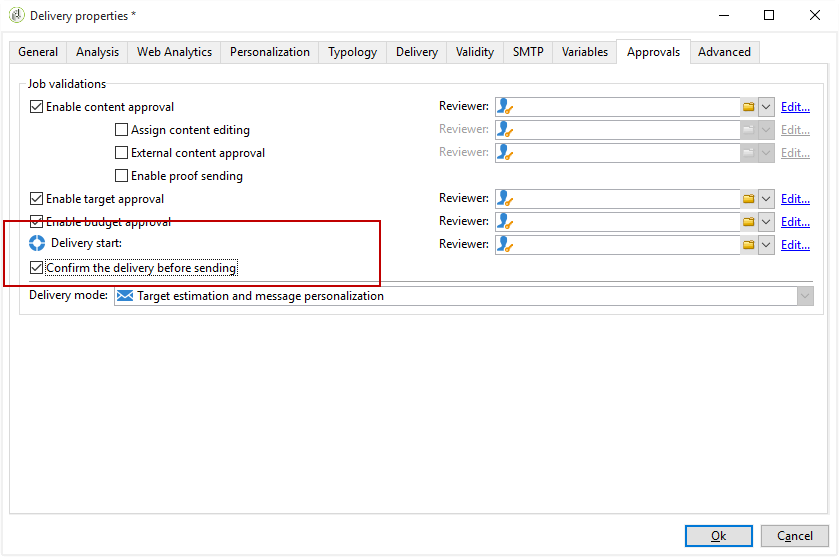

# E-mailverrijking met aangepaste datumvelden{#email-enrichment-with-custom-date-fields}

In dit voorbeeld willen we een e-mail met aangepaste gegevensvelden verzenden aan ontvangers die deze maand hun verjaardagen vieren. Het e-mailbericht bevat een coupon die een week voor en na hun verjaardagen geldig is.

We moeten ontvangers van een lijst die hun verjaardagen deze maand vieren, aanspreken met een **[!UICONTROL Split]** activiteit. Vervolgens gebruikt u de **[!UICONTROL Enrichment]** activiteit en fungeert het veld met aangepaste gegevens als geldigheidsdatums in de e-mail voor de speciale aanbieding van de klant.


U kunt dit voorbeeld maken door de volgende stappen toe te passen:

1. Sleep op het **[!UICONTROL Targeting and workflows]** tabblad van de campagne een **[!UICONTROL Read list]** activiteit naar de lijst met ontvangers.
1. De lijst die moet worden verwerkt, kan expliciet worden opgegeven, door een script worden berekend of dynamisch worden gelokaliseerd, afhankelijk van de geselecteerde opties en de hier gedefinieerde parameters.

   

1. Voeg een **[!UICONTROL Split]** activiteit toe om ontvangers te onderscheiden die hun verjaardagen deze maand zullen vieren van andere ontvangers.
1. Als je de lijst wilt splitsen, selecteer je in de **[!UICONTROL Filtering of selected records]** rubriek **[!UICONTROL Add a filtering condition on the inbound population]**. Klik vervolgens op **[!UICONTROL Edit]**.

   

1. Selecteer **[!UICONTROL Filtering conditions]** en klik op de **[!UICONTROL Edit expression]** knop om de maand van de verjaardag van de ontvanger te filteren.

   

1. Klik **[!UICONTROL Advanced Selection]** **[!UICONTROL Edit the formula using an expression]** en voeg dan de volgende uitdrukking toe: Maand (@geboorteDate).
1. Selecteer in de **[!UICONTROL Operator]** kolom de optie **[!UICONTROL equal to]**.
1. Filter de voorwaarde verder door de **[!UICONTROL Value]** maand van de huidige datum toe te voegen: Month(GetDate()).

   Hierdoor worden ontvangers gevraagd van wie de geboortemaand overeenkomt met de huidige maand.

   

1. Klik **[!UICONTROL Finish]**. Klik vervolgens op het **[!UICONTROL General]** tabblad van uw **[!UICONTROL Split]** activiteit op de **[!UICONTROL Generate complement]** categorie in de **[!UICONTROL Results]** categorie.

   Met het **[!UICONTROL Complement]** resultaat kunt u een leveringsactiviteit toevoegen of een lijst bijwerken. Hier hebben we zojuist een **[!UICONTROL End]** activiteit toegevoegd.

   

U moet nu uw **[!UICONTROL Enrichment]** activiteit vormen:

1. Voeg een **[!UICONTROL Enrichment]** activiteit na uw ondergroep toe om uw gebieden van de douanedatum toe te voegen.

   

1. Open je **[!UICONTROL Enrichment]** activiteit. Klik in de **[!UICONTROL Complementary information]** categorie op **[!UICONTROL Add data]**.

   

1. Selecteer **[!UICONTROL Data linked to the filtering dimension]** dan **[!UICONTROL Data of the filtering dimension]**.
1. Klik op de **[!UICONTROL Add]** knop.

   

1. Voeg een **[!UICONTROL Label]**. Klik vervolgens in de **[!UICONTROL Expression]** kolom op **[!UICONTROL Edit expression]**.

   

1. Eerst, moeten wij de week vóór de geboortedatum als begindatum **van de** Geldigheid met het volgende richten **[!UICONTROL Expression]**: `SubDays([target/@birthDate], 7)`.

   

1. Als u vervolgens de einddatum **van het aangepaste datumveld** Geldigheid wilt maken die de week na de geboortedatum als doel heeft, moet u het volgende toevoegen **[!UICONTROL Expression]**: `AddDays([target/@birthDate], 7)`.

   U kunt een label aan uw expressie toevoegen.

   

1. Klik **[!UICONTROL Ok]**. Uw verrijking is nu klaar.

Na je **[!UICONTROL Enrichment]** activiteit kunt je een levering toevoegen. In dit geval hebben we een e-maillevering toegevoegd om ontvangers een speciaal voorstel met geldigheidsdata te sturen naar klanten die deze maand hun verjaardagen vieren.

1. Sleep en zet een **[!UICONTROL Email delivery]** activiteit neer na uw **[!UICONTROL Enrichment]** activiteit.

   

1. Dubbelklik op uw **[!UICONTROL Email delivery]** activiteit om uw levering aan te passen.
1. Voeg een **[!UICONTROL Label]** object toe aan uw levering en klik op **[!UICONTROL Continue]**.
1. Klik **[!UICONTROL Save]** om uw e-maillevering te maken.
1. Schakel het **[!UICONTROL Approval]** tabblad in van de e-maillevering **[!UICONTROL Properties]** die **[!UICONTROL Confirm delivery before sending option]** is ingeschakeld.

   Start vervolgens de workflow om de uitgaande overgang te verrijken met de doelgegevens.

   

U kunt nu uw e-maillevering ontwerpen met de aangepaste datumvelden die in de **[!UICONTROL Enrichment]** activiteit zijn gemaakt.

1. Dubbelklik op uw **[!UICONTROL Email delivery]** activiteit.
1. Voeg uw doelextensies toe aan uw e-mail. Het zou binnen de volgende uitdrukking moeten zijn om het formaat van uw geldigheidsdata te vormen:

   ```
   <%=
           formatDate(targetData.alias of your expression,"%2D.%2M")  %>
   ```

1. Klik  . Selecteer **[!UICONTROL Target extension]** vervolgens de eerder gemaakte aangepaste geldigheidsdatums met de **[!UICONTROL Enrichment]** activiteit om uw extensie toe te voegen aan de formatDate-expressie.

   

1. Configureer uw e-mailinhoud naar wens.

   

1. Geef een voorbeeld van uw e-mail weer om te controleren of uw aangepaste datumvelden correct zijn geconfigureerd

   

Uw e-mail is nu klaar. Je kunt je proefdrukken verzenden en bevestigen dat je bent bezorgd om e-mails voor je verjaardag te verzenden.
