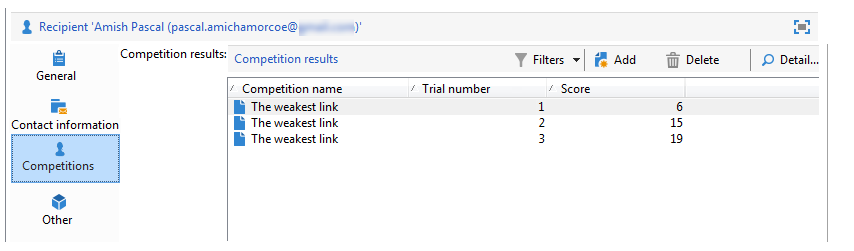
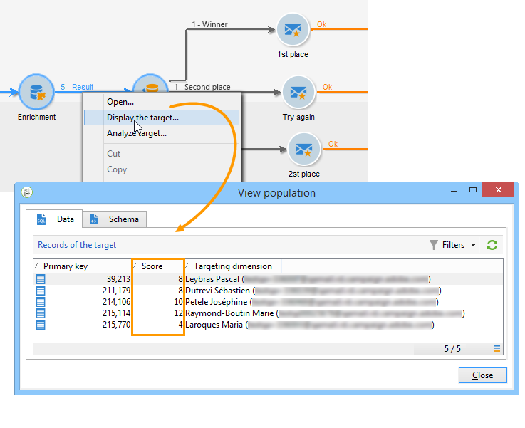

# Data verrijken{#enriching-data}

## Informatie over het verrijken van gegevens {#about-enriching-data}

In dit geval worden mogelijke toepassingen van de **[!UICONTROL Enrichment]**-activiteit in een doelworkflow beschreven. Raadpleeg voor meer informatie over het gebruik van de **[!UICONTROL Enrichment]**-activiteit: [Verrijking](../../workflow/using/enrichment.md).

Een gebruiksgeval op hoe te om een e-maillevering met douanedata te verrijken is ook beschikbaar in [deze sectie](../../workflow/using/email-enrichment-with-custom-date-fields.md).

De contactpersonen in de marketingdatabase worden via een webtoepassing uitgenodigd deel te nemen aan een wedstrijd. De resultaten van de wedstrijd worden teruggevonden in de tabel **[!UICONTROL Competition results]**. Deze lijst is verbonden met de contactlijst (**[!UICONTROL Recipients]**). De tabel **[!UICONTROL Competition results]** bevat de volgende velden:

* Mededingingsnaam (@game)
* Testnummer (@proefversie)
* Score (@score)

Een contactpersoon in de tabel **[!UICONTROL Recipients]** kan aan meerdere regels in de tabel **[!UICONTROL Competition results]** worden gekoppeld. Het verband tussen deze twee lijsten is van 1-n type. Hier volgt een voorbeeld van de resultatenlogs voor een ontvanger:

Het doel van dit gebruik is om persoonlijke leveringen te sturen naar mensen die, afhankelijk van hun hoogste scores, aan de meest recente wedstrijd hebben deelgenomen. De ontvanger met de hoogste score krijgt de eerste prijs, de ontvanger met de op één na hoogste score krijgt een troostprijs en alle anderen krijgen een boodschap die hen de volgende keer meer geluk wil wensen.

Voor het instellen van dit gebruiksgeval hebben we de volgende workflow voor doelversie gemaakt:

Voer de volgende stappen uit om de workflow te maken:

1. Twee **[!UICONTROL Query]** activiteiten en één **[!UICONTROL Intersection]** activiteit worden toegevoegd aan doelnieuwe abonnees die laatste de concurrentie zijn ingegaan.
1. Met de activiteit **[!UICONTROL Enrichment]** kunnen we gegevens toevoegen die in de tabel **[!UICONTROL Competition results]** zijn opgeslagen. Het veld **[!UICONTROL Score]** waarin de personalisatie van de levering plaatsvindt, wordt toegevoegd aan de werktabel van de workflow.
1. Met de tekstactiviteit **[!UICONTROL Split]** kunnen we subsets voor ontvangers maken op basis van scores.
1. Voor elke subset wordt een **[!UICONTROL Delivery]**-type-activiteit toegevoegd.

## Stap 1: Doelstelling {#step-1--targeting}

De eerste vraag laat ons toe om ontvangers te richten die aan het gegevensbestand binnen de laatste zes maanden werden toegevoegd.

De tweede vraag laat ons toe om de ontvangers te richten die aan de laatste concurrentie hebben deelgenomen.

Een **[!UICONTROL Intersection]** typeactiviteit wordt dan toegevoegd om de ontvangers te richten die binnen de laatste zes maanden aan het gegevensbestand worden toegevoegd en die de laatste concurrentie zijn ingegaan.

## Stap 2: Verrijking {#step-2--enrichment}

In dit voorbeeld willen we leveringen personaliseren volgens het veld **[!UICONTROL Score]** dat is opgeslagen in de tabel **[!UICONTROL Competition results]**. Deze lijst heeft een 1-n typeverhouding met de lijst van ontvangers. Met de activiteit **[!UICONTROL Enrichment]** kunnen we gegevens uit een tabel toevoegen die zijn gekoppeld aan de filterdimensie aan de werktabel van de workflow.

1. Selecteer **[!UICONTROL Add data]** in het bewerkingsscherm van de verrijkingsactiviteit, **[!UICONTROL Data linked to the filtering dimension]** en klik **[!UICONTROL Next]**.

   

1. Selecteer vervolgens de optie **[!UICONTROL Data linked to the filtering dimension]**, selecteer de tabel **[!UICONTROL Competition results]** en klik op **[!UICONTROL Next]**.

   

1. Voer een id en een label in en selecteer de optie **[!UICONTROL Limit the line count]** in het veld **[!UICONTROL Data collected]**. Selecteer in het veld **[!UICONTROL Lines to retrieve]** &#39;1&#39; als waarde. Voor elke ontvanger, zal de verrijkingsactiviteit één enkele lijn van **[!UICONTROL Competition results]** lijst aan de het werklijst van het werkschema toevoegen. Klik op **[!UICONTROL Next]**.

   

1. In dit voorbeeld willen we de hoogste score van de ontvanger terugkrijgen, maar alleen voor de laatste competitie. Hiervoor voegt u een filter toe aan het veld **[!UICONTROL Competition name]** om alle regels met betrekking tot vorige wedstrijden uit te sluiten. Klik op **[!UICONTROL Next]**.

   

1. Ga naar het **[!UICONTROL Sort]** scherm en klik **[!UICONTROL Add]** knoop, selecteer **[!UICONTROL Score]** gebied en controleer het vakje in **[!UICONTROL descending]** kolom om punten van de **[!UICONTROL Score]** gebieden in dalende orde te sorteren. Voor elke ontvanger voegt de verrijkingsactiviteit een regel toe die overeenkomt met de hoogste score voor de laatste game. Klik op **[!UICONTROL Next]**.

   

1. Dubbelklik in het venster **[!UICONTROL Data to add]** op het veld **[!UICONTROL Score]**. Voor elke ontvanger voegt de verrijkingsactiviteit alleen het veld **[!UICONTROL Score]** toe. Klik op **[!UICONTROL Finish]**.

   

Klik met de rechtermuisknop op de binnenkomende overgang van de verrijkingsactiviteit en selecteer **[!UICONTROL Display the target]**. De werktabel bevat de volgende gegevens:

Het gekoppelde schema is:

Verleng deze bewerking bij de uitgaande overgang van de verrijkingsactiviteit. We kunnen zien dat de gegevens met betrekking tot de scores van de ontvangers zijn toegevoegd. De hoogste score van elke ontvanger is hersteld.

Het overeenkomende schema is ook verrijkt.

## Stap 3: Splitsen en leveren {#step-3--split-and-delivery}

Om de ontvangers te sorteren op hun scores, wordt een **[!UICONTROL Split]** activiteit toegevoegd na de verrijking.

1. Een eerste (**Winner**) ondergroep is bepaald om de ontvanger met de hoogste score te omvatten. Hiervoor definieert u een beperking van het aantal records, past u een aflopende sortering toe op de score en beperkt u het aantal records tot 1.

   

1. De tweede (**Tweede plaats**) ondergroep omvat de ontvanger met de tweede hoogste score. De configuratie is het zelfde als voor de eerste ondergroep.

   

1. De derde (**losers**) ondergroep bevat alle andere ontvangers. Ga naar de **[!UICONTROL General]** tabel en controleer het vakje **[!UICONTROL Generate complement]** om alle ontvangers te richten die niet de twee hoogste scores bereikten.

   

1. Voeg een **[!UICONTROL Delivery]** typeactiviteit voor elke ondergroep toe, gebruikend een verschillend leveringsmalplaatje voor elk.

   

