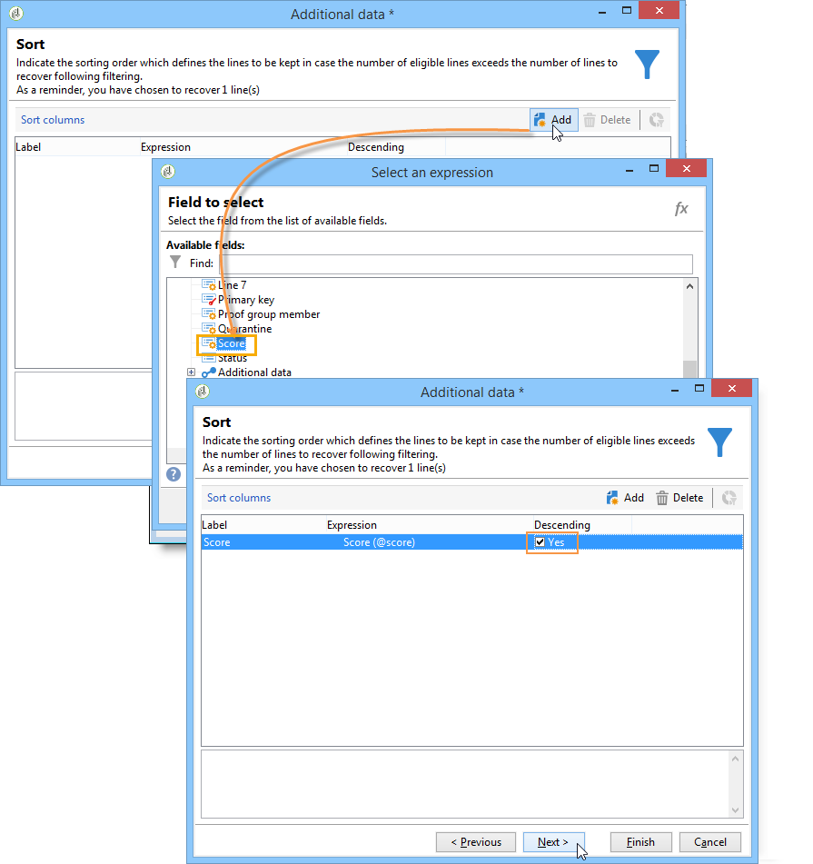

# Gegevens worden verrijkt{#enriching-data}

## Informatie over het verrijken van gegevens {#about-enriching-data}

In dit geval worden mogelijke toepassingen van de **[!UICONTROL Enrichment]** activiteit in een doelworkflow beschreven. Raadpleeg voor meer informatie over het gebruik van de **[!UICONTROL Enrichment]** activiteit: [Verrijking](../../workflow/using/enrichment.md).

Een gebruiksscenario voor het verrijken van een e-maillevering met aangepaste datums is ook beschikbaar in [deze sectie](../../workflow/using/email-enrichment-with-custom-date-fields.md).

De contactpersonen in de marketingdatabase worden via een webtoepassing uitgenodigd deel te nemen aan een wedstrijd. De resultaten van de mededinging worden in de **[!UICONTROL Competition results]** tabel teruggevorderd. Deze tabel is gekoppeld aan de tabel met contactpersonen (**[!UICONTROL Recipients]**). De **[!UICONTROL Competition results]** tabel bevat de volgende velden:

* Mededingingsnaam (@game)
* Testnummer (@proefversie)
* Score (@score)

Een contactpersoon die in de **[!UICONTROL Recipients]** tabel wordt gevonden, kan aan meerdere regels in de **[!UICONTROL Competition results]** tabel worden gekoppeld. Het verband tussen deze twee lijsten is van 1-n type. Hier volgt een voorbeeld van de resultatenlogs voor een ontvanger:

Het doel van dit gebruik is om persoonlijke leveringen te sturen naar mensen die, afhankelijk van hun hoogste scores, aan de meest recente wedstrijd hebben deelgenomen. De ontvanger met de hoogste score krijgt de eerste prijs, de ontvanger met de op één na hoogste score krijgt een troostprijs en alle anderen krijgen een boodschap die hen de volgende keer meer geluk wil wensen.

Voor het instellen van dit gebruiksgeval hebben we de volgende workflow voor doelversie gemaakt:

Voer de volgende stappen uit om de workflow te maken:

1. Twee **[!UICONTROL Query]** activiteiten en één **[!UICONTROL Intersection]** activiteit worden toegevoegd aan de nieuwe abonnees die het laatste examen hebben afgelegd.
1. Met de **[!UICONTROL Enrichment]** activiteit kunnen we gegevens toevoegen die in de **[!UICONTROL Competition results]** tabel zijn opgeslagen. Het **[!UICONTROL Score]** veld waarop de personalisatie van de levering plaatsvindt, wordt toegevoegd aan de werktabel van de workflow.
1. Met de **[!UICONTROL Split]** tekstactiviteit kunnen subsets voor ontvangers worden gemaakt op basis van scores.
1. Voor elke subset wordt een **[!UICONTROL Delivery]** tekstactiviteit toegevoegd.

## Stap 1: Doelstelling {#step-1--targeting}

De eerste vraag laat ons toe om ontvangers te richten die aan het gegevensbestand binnen de laatste zes maanden werden toegevoegd.

De tweede vraag laat ons toe om de ontvangers te richten die aan de laatste concurrentie hebben deelgenomen.

Een **[!UICONTROL Intersection]** typeactiviteit wordt dan toegevoegd om de ontvangers te richten die aan het gegevensbestand binnen de laatste zes maanden worden toegevoegd en die de laatste concurrentie zijn ingegaan.

## Stap 2: Verrijking {#step-2--enrichment}

In dit voorbeeld, willen wij leveringen volgens het **[!UICONTROL Score]** gebied personaliseren dat in de **[!UICONTROL Competition results]** lijst wordt opgeslagen. Deze lijst heeft een 1-n typeverhouding met de lijst van ontvangers. De **[!UICONTROL Enrichment]** activiteit laat ons toe om gegevens van een lijst toe te voegen verbonden aan de het filtreren dimensie aan de het werklijst van het werkschema.

1. Selecteer vervolgens in het bewerkingsscherm van de verrijkingsactiviteit **[!UICONTROL Add data]** en klik **[!UICONTROL Data linked to the filtering dimension]** op **[!UICONTROL Next]**.

   

1. Selecteer vervolgens de **[!UICONTROL Data linked to the filtering dimension]** optie, selecteer de **[!UICONTROL Competition results]** tabel en klik op **[!UICONTROL Next]**.

   

1. Voer een id en een label in en selecteer de **[!UICONTROL Limit the line count]** optie in het **[!UICONTROL Data collected]** veld. Selecteer in het **[!UICONTROL Lines to retrieve]** veld &#39;1&#39; als waarde. Voor elke ontvanger, zal de verrijkingsactiviteit één enkele lijn van de **[!UICONTROL Competition results]** lijst aan de het werklijst van het werkschema toevoegen. Klik op **[!UICONTROL Next]**.

   

1. In dit voorbeeld willen we de hoogste score van de ontvanger terugkrijgen, maar alleen voor de laatste competitie. Hiervoor voegt u een filter toe aan het **[!UICONTROL Competition name]** veld om alle regels uit te sluiten die betrekking hebben op eerdere vergelijkende onderzoeken. Klik op **[!UICONTROL Next]**.

   

1. Ga naar het **[!UICONTROL Sort]** scherm en klik op de **[!UICONTROL Add]** knop, selecteer het **[!UICONTROL Score]** veld en schakel het selectievakje in de **[!UICONTROL descending]** kolom in om items van de **[!UICONTROL Score]** velden in aflopende volgorde te sorteren. Voor elke ontvanger voegt de verrijkingsactiviteit een regel toe die overeenkomt met de hoogste score voor de laatste game. Klik op **[!UICONTROL Next]**.

   

1. Dubbelklik in het **[!UICONTROL Data to add]** venster op het **[!UICONTROL Score]** veld. Voor elke ontvanger voegt de verrijkingsactiviteit alleen het **[!UICONTROL Score]** veld toe. Klik op **[!UICONTROL Finish]**.

   

Klik met de rechtermuisknop op de binnenkomende overgang van de verrijkingsactiviteit en selecteer **[!UICONTROL Display the target]**. De werktabel bevat de volgende gegevens:

Het gekoppelde schema is:

Verleng deze bewerking bij de uitgaande overgang van de verrijkingsactiviteit. We kunnen zien dat de gegevens met betrekking tot de scores van de ontvangers zijn toegevoegd. De hoogste score van elke ontvanger is hersteld.

Het overeenkomende schema is ook verrijkt.

## Stap 3: Splitsen en leveren {#step-3--split-and-delivery}

Als u de ontvangers wilt sorteren op basis van hun scores, wordt een **[!UICONTROL Split]** activiteit toegevoegd na de verrijking.

1. Een eerste subset (**Winner**) is gedefinieerd om de ontvanger met de hoogste score te bevatten. Hiervoor definieert u een beperking van het aantal records, past u een aflopende sortering toe op de score en beperkt u het aantal records tot 1.

   

1. De tweede subset (**tweede plaats**) bevat de ontvanger met de op één na hoogste score. De configuratie is het zelfde als voor de eerste ondergroep.

   

1. De derde subset (**losers**) bevat alle andere ontvangers. Ga naar het **[!UICONTROL General]** tabblad en schakel het **[!UICONTROL Generate complement]** selectievakje in om alle ontvangers aan te wijzen die de twee hoogste scores niet hebben gehaald.

   

1. Voeg een **[!UICONTROL Delivery]** typeactiviteit voor elke ondergroep toe, gebruikend een verschillend leveringsmalplaatje voor elk.

   

