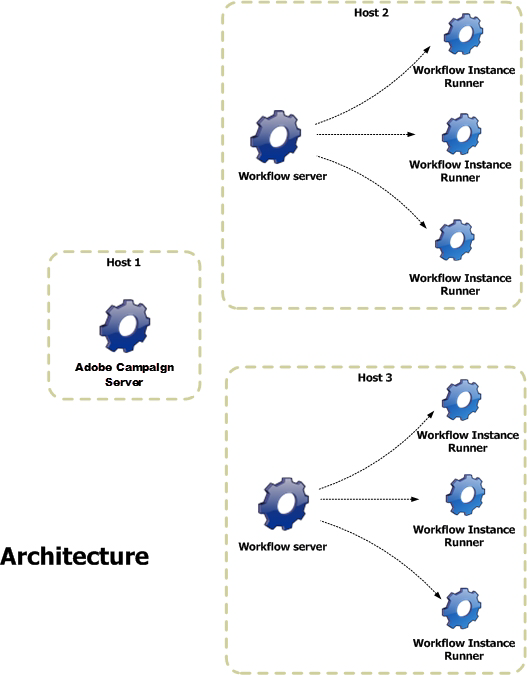

# Een workflow uitvoeren{#executing-a-workflow}

Richtlijnen voor het oplossen van problemen met betrekking tot de uitvoering van workflows zijn beschikbaar in [deze sectie](../../production/using/workflow-execution.md).

## Een workflow starten {#starting-a-workflow}

Een workflow wordt altijd handmatig gestart. Wanneer begonnen, kan het echter inactief afhankelijk van de informatie blijven die via een planner wordt gespecificeerd (zie [Planner](../../workflow/using/scheduler.md)) of activiteit het plannen.

Acties die betrekking hebben op het uitvoeren van de workflow (starten, stoppen, pauzeren, enz.) zijn **asynchrone** processen: de bestelling wordt opgenomen en is van kracht zodra de server beschikbaar is om deze toe te passen.

Met de werkbalk kunt u de uitvoering van de workflow starten en volgen.

De lijst met opties in het **[!UICONTROL Actions]** menu en in het snelmenu dat met de rechtermuisknop wordt geopend, wordt hieronder beschreven.

### Werkbalk Handelingen {#actions-toolbar}

De werkbalkknoppen worden in deze [sectie](../../campaign/using/marketing-campaign-deliveries.md#building-the-main-target-in-a-workflow)beschreven. Met de **[!UICONTROL Actions]** knop hebt u toegang tot extra opties voor het uitvoeren van geselecteerde workflows. U kunt ook het **[!UICONTROL File > Actions]** menu gebruiken of met de rechtermuisknop op een workflow klikken en **[!UICONTROL Actions]** selecteren.


* **[!UICONTROL Start]**

   Met deze actie kunt u de uitvoering van een workflow starten: Als een werkstroom **voltooid** is, **wordt Bewerkt** of **Gepauzeerd** , verandert de status in **Gestart**. De workflow-engine handelt vervolgens de uitvoering van deze workflow af. Als de werkstroom is gepauzeerd, wordt deze hervat, anders wordt de werkstroom van het begin gestart en worden de initiële activiteiten geactiveerd.

   De aanvang is een asynchroon proces: Het verzoek wordt opgeslagen en zo snel mogelijk verwerkt door een workflowserver.

* **[!UICONTROL Pause]**

   Met deze handeling wordt de status van de workflow ingesteld op **Gepauzeerd**. Er worden geen activiteiten geactiveerd totdat de werkstroom wordt hervat; de lopende bewerkingen worden echter niet gepauzeerd .

* **[!UICONTROL Stop]**

   Met deze handeling wordt een workflow gestopt die momenteel wordt uitgevoerd. De status van de instantie is ingesteld op **Voltooid**. Bewerkingen die worden uitgevoerd, worden indien mogelijk gestopt. Importeren en SQL-query&#39;s worden onmiddellijk geannuleerd.

   Stoppen is een asynchroon proces. Het verzoek is geregistreerd en vervolgens worden bewerkingen door de workflowserver of servers geannuleerd. Het stoppen van een werkstroominstantie kan daarom tijd in beslag nemen, vooral als de werkstroom op meerdere servers wordt uitgevoerd, die elk de controle moeten krijgen om de actieve taken te annuleren.

* **[!UICONTROL Restart]**

   Deze actie stopt en start de workflow opnieuw. Doorgaans kunt u sneller opnieuw opstarten. Het is ook nuttig om opnieuw beginnen te automatiseren wanneer het tegenhouden een bepaalde hoeveelheid tijd neemt: De reden hiervoor is dat de opdracht Stoppen niet beschikbaar is wanneer de workflow wordt gestopt.

   De **[!UICONTROL Start / Pause / Stop / Restart]** acties zijn ook beschikbaar via de uitvoeringspictogrammen op de werkbalk. Zie deze [sectie](../../campaign/using/marketing-campaign-deliveries.md#creating-a-targeting-workflow)voor meer informatie.

* **[!UICONTROL Purge history]**

   Met deze handeling kunt u de historie van de workflow wissen. Raadpleeg voor meer informatie de logboeken [leegmaken](../../workflow/using/monitoring-workflow-execution.md#purging-the-logs).

* **[!UICONTROL Start in simulation mode]**

   Met deze optie kunt u de workflow starten in de simulatiemodus in plaats van in de echte modus. Dit betekent dat wanneer u deze modus inschakelt, alleen activiteiten worden uitgevoerd die geen invloed hebben op de database of het bestandssysteem (bijvoorbeeld **[!UICONTROL Query]**, **[!UICONTROL Union]**, **[!UICONTROL Intersection]**, enz.). Activiteiten die wel van invloed zijn (bv. **[!UICONTROL Export]**, **[!UICONTROL Import]**, enz.) en de volgende opdrachten (in dezelfde vertakking) niet worden uitgevoerd.

* **[!UICONTROL Execute pending tasks now]**

   Met deze handeling kunt u alle lopende taken zo snel mogelijk starten. Als u een specifieke taak wilt starten, klikt u met de rechtermuisknop op de desbetreffende activiteit en selecteert u **[!UICONTROL Execute pending task(s) now]**.

* **[!UICONTROL Unconditional stop]**

   Met deze optie wijzigt u de workflowstatus in **[!UICONTROL Finished]**. Deze handeling mag alleen als laatste redmiddel worden gebruikt als het normale stopproces na enkele minuten mislukt. Gebruik de onvoorwaardelijke stop alleen als u zeker weet dat er geen werkstroomtaken worden uitgevoerd.

   >[!CAUTION]
   >
   >Deze optie is gereserveerd voor professionele gebruikers.

* **[!UICONTROL Save as template]**

   Met deze actie maakt u een nieuw werkstroomsjabloon op basis van de geselecteerde workflow. U moet de map opgeven waarin deze wordt opgeslagen (in het **[!UICONTROL Folder]** veld).

   De **[!UICONTROL Mass update of selected lines]** en de **[!UICONTROL Merge selected lines]** opties zijn algemene platformopties beschikbaar in alle **[!UICONTROL Actions]** menu&#39;s. Zie deze [sectie](../../platform/using/updating-data.md)voor meer informatie.

### Klikken met rechtermuisknop {#right-click-menu}

Wanneer een of meer workflowactiviteiten zijn geselecteerd, kunt u met de rechtermuisknop klikken om op uw selectie te reageren.


De volgende opties zijn beschikbaar in het klikmenu met de rechtermuisknop:

**[!UICONTROL Open]**: met deze optie hebt u toegang tot de eigenschappen van de activiteit.

**[!UICONTROL Display logs:]** met deze optie kunt u het logboek voor taakuitvoering weergeven voor de geselecteerde activiteit. Zie Logboeken [weergeven](../../workflow/using/monitoring-workflow-execution.md#displaying-logs).

**[!UICONTROL Execute pending task(s) now:]** met deze actie kunt u taken die in behandeling zijn zo snel mogelijk starten.

**[!UICONTROL Workflow restart from a task:]** met deze optie kunt u de workflow opnieuw starten met de resultaten die eerder voor deze activiteit zijn opgeslagen.

**[!UICONTROL Cut/Copy/Paste/Delete:]** Met deze opties kunt u activiteiten knippen, kopiëren, plakken en verwijderen.

**[!UICONTROL Copy as bitmap:]** met deze optie kunt u een screenshot maken van alle activiteiten.

**[!UICONTROL Normal execution / Enable but do not execute / Do not enable:]** deze opties zijn ook beschikbaar op het **[!UICONTROL Advanced]** tabblad van de eigenschappen activity . Ze worden in detail beschreven in [Executie](../../workflow/using/advanced-parameters.md#execution).

**[!UICONTROL Save / Cancel:]** Hiermee kunt u de wijzigingen in een workflow opslaan of annuleren.

>[!NOTE]
>
>U kunt een groep activiteiten selecteren en er een van deze opdrachten op toepassen.

Het contextmenu wordt ook beschreven in deze [sectie](../../campaign/using/marketing-campaign-deliveries.md#executing-a-workflow).

## Levenscyclus van werkstroom {#workflow-life-cycle}

De workflowcyclus bestaat uit drie hoofdstappen.

* **Wordt bewerkt**

   Dit is de eerste ontwerpfase: Als er een nieuwe workflow wordt gemaakt, wordt de status ervan bewerkt. De workflow wordt nog niet door de server afgehandeld en kan zonder risico worden gewijzigd.

* **Gestart**

   Zodra de eerste ontwerpfase is voltooid, kan de workflow worden gestart. In deze fase, wordt de instantie behandeld door de server en de individuele taken worden uitgevoerd. De workflow kan nog steeds met bepaalde voorzorgen worden aangepast.

* **Voltooid**

   Een workflow is &#39;voltooid&#39; wanneer er geen taken meer worden uitgevoerd of wanneer een operator de instantie expliciet heeft gestopt.

De activiteiten **Start** en **Levering** worden bijvoorbeeld beschreven terwijl de activiteit **Goedkeuring** in de onderstaande workflow knippert.


Dit betekent dat de eerste twee activiteiten met succes zijn uitgevoerd en dat de goedkeuring in uitvoering is, d.w.z. dat zij is gecreëerd maar nog niet is voltooid.

De tekens **574 -Ok** boven de overgang na de **leveringsactiviteit** betekenen dat de voorbereiding van de levering gericht is op 574 ontvangers en dat de bewerking is voltooid. Deze informatie, die aan de overgangen wordt toegevoegd wanneer zij worden uitgevoerd, wordt berekend door de activiteiten die gegevens verwerken.

De workflow wordt gestart en er wordt gewacht tot een operator die behoort tot de groep die is opgegeven in de activiteit **Goedkeuring** , een beslissing neemt. De tot de groep behorende exploitanten die een e-mailadres of mobiel telefoonnummer hebben, worden op de hoogte gesteld.

Het beheer van de exploitant wordt gedetailleerd in deze [sectie](../../platform/using/access-management.md).

Raadpleeg [deze sectie](../../workflow/using/monitoring-workflow-execution.md)voor meer informatie over hoe u de workflows kunt controleren.

## Levenscyclus gegevens {#data-life-cycle}

### Werktabel {#work-table}

In werkstromen, worden de gegevens die van één activiteit aan een andere worden vervoerd opgeslagen in een tijdelijke het werklijst.

Deze gegevens kunnen worden weergegeven en geanalyseerd door met de rechtermuisknop op de juiste overgang te klikken.


Selecteer hiertoe het relevante menu:

* Het doel weergeven

   Dit menu toont de beschikbare gegevens over de doelpopulatie evenals de structuur van de het werklijst (**[!UICONTROL Schema]** tabel).

   

   Raadpleeg [Worktables en workflowschema](../../workflow/using/monitoring-workflow-execution.md#worktables-and-workflow-schema)voor meer informatie.

* Het doel analyseren

   In dit menu hebt u toegang tot de wizard voor beschrijvende analyse, waarmee u statistieken en rapporten over de overgangsgegevens kunt produceren.

   Zie deze [sectie](../../reporting/using/using-the-descriptive-analysis-wizard.md)voor meer informatie.

De doelgegevens worden gewist terwijl de workflow wordt uitgevoerd. Alleen de laatste werktabel is toegankelijk. U kunt het werkschema vormen zodat alle het werklijsten toegankelijk blijven: Controleer de **[!UICONTROL Keep the result of interim populations between two executions]** optie in de werkschemaeigenschappen.

Wij raden u echter aan deze optie niet te activeren als er grote hoeveelheden gegevens zijn.


### Doelgegevens {#target-data}

De gegevens die in de werktabel van de workflow zijn opgeslagen, zijn toegankelijk in de velden voor personalisatie.

Hiermee kunt u gegevens gebruiken die via een lijst zijn verzameld of die zijn gebaseerd op antwoorden op een enquête in een levering. Hiervoor gebruikt u de volgende syntaxis:

```
%= targetData.FIELD %
```

**[!UICONTROL Target extension]** (targetData) type verpersoonlijkingselementen zijn niet beschikbaar voor het richten van werkschema&#39;s. Het leveringsdoel moet in het werkschema worden gebouwd en in de binnenkomende overgang van de levering worden gespecificeerd.

Als u leveringsproeven wilt tot stand brengen, moet het proefdrukdoel op de **[!UICONTROL Address substitution]** wijze worden gebouwd zodat de verpersoonlijkingsgegevens kunnen worden ingegaan. Zie deze [sectie](../../delivery/using/steps-defining-the-target-population.md#using-address-substitution-in-proof)voor meer informatie.

In het volgende voorbeeld, gaan wij een lijst van informatie over klanten verzamelen, die in een gepersonaliseerd e-mail moet worden gebruikt.

Voer de volgende stappen uit:

1. Maak een workflow voor het verzamelen van informatie, pas deze aan met de gegevens die al in de database staan en start vervolgens een levering.

   

   In ons voorbeeld ziet de bestandsinhoud er als volgt uit:

   ```
   Music,First name,Last name,Account,CD/DVD,Card
   Pop,David,BLAIR,4323,CD,0
   Rock,Daniel,ARCARI,3222,DVD,1
   Disco,Uma,ALTON,0488,DVD,0
   Jazz,Paul,BOLES,6475,CD,1
   Jazz,David,BOUKHARI,0841,DVD,1
   [...]
   ```

   Voer de volgende stappen uit om het bestand te laden:

   

1. Configureer de **[!UICONTROL Enrichment]** tekstactiviteit om de verzamelde gegevens te combineren met de gegevens die al in de Adobe Campagne-database staan.

   Hier is de afstemmingssleutel het rekeningnummer:

   

1. Configureer vervolgens de **[!UICONTROL Delivery]**: het wordt gecreeerd gebaseerd op een malplaatje, en de ontvangers worden gespecificeerd door de binnenkomende overgang.

   

   >[!CAUTION]
   >
   >Alleen gegevens in de overgang mogen worden gebruikt om de levering aan te passen. **Het type van targetData** verpersoonlijkingsgebieden zijn slechts beschikbaar voor de binnenkomende bevolking van de **[!UICONTROL Delivery]** activiteit.

1. In het leveringsmalplaatje, gebruik de gebieden die in het werkschema worden verzameld.

   U doet dit door velden voor **[!UICONTROL Target extension]** typepersonalisatie in te voegen.

   

   Hier willen we het favoriete muziekgenre en mediatype (CD of DVD) van de klant invoegen, zoals vermeld in het bestand dat tijdens de workflow wordt verzameld.

   Als plus gaan we een coupon toevoegen voor houders van een getrouwde kaart, dat wil zeggen ontvangers voor wie de waarde van de &#39;Kaart&#39; gelijk is aan 1.

   

   **[!UICONTROL Target extension]** (targetData) typegegevens worden opgenomen in leveringen gebruikend de zelfde kenmerken zoals alle verpersoonlijkingsgebieden. Ze kunnen ook worden gebruikt in het onderwerp, koppelingslabels of de koppelingen zelf.

   Berichten die aan verzamelde ontvangers worden gericht zullen de volgende gegevens bevatten:

   

## Goedkeuringen definiëren {#defining-approvals}

Met goedkeuringen kunnen operatoren beslissingen nemen over een workflow of de voortzetting van de uitvoering ervan bevestigen.

Een bericht wordt verzonden naar een groep exploitanten en het werkschema wacht op een reactie alvorens te hervatten. De workflow wordt niet gestopt en andere bewerkingen kunnen plaatsvinden. Er kunnen bijvoorbeeld meerdere gelijktijdige goedkeuringen in behandeling zijn.

Een goedkeuring kan meerdere opties bevatten die de operator kan kiezen. Het is echter mogelijk het aantal keuzen tot één te beperken om een uit te voeren taak aan een exploitant voor te leggen, zoals het uitvoeren van het richten. De exploitant kan dan antwoorden zodra de taak wordt uitgevoerd (het proces dan hervat). In het volgende voorbeeld worden deze typen goedkeuringen geïllustreerd:


Bij vluchtuitvoeringen zijn alle stadia die goedkeuring vereisen, gebaseerd op hetzelfde beginsel.


In deze [sectie](../../campaign/using/marketing-campaign-approval.md#checking-and-approving-deliveries)vindt u voorbeelden van goedkeuring.

Een operator kan op twee manieren reageren: valideren met de webpagina die is gekoppeld in het e-mailbericht of via de console.

>[!NOTE]
>
>Zodra de reactie wordt bewaard kan het niet worden gewijzigd.

### E-mails verzenden {#sending-emails}

Het is mogelijk om een goedkeuringsbericht te ontvangen die een verbinding met een Web-pagina bevat waarmee het mogelijk is te antwoorden. Voor de beoogde exploitant om een goedkeuringse-mail te ontvangen, moet het exploitant e-mailadres volledig zijn. Als dit niet het geval is, moet de exploitant de console gebruiken om te antwoorden

Het beheer van de exploitant wordt gedetailleerd in deze [sectie](../../platform/using/access-management.md).

Goedkeuringse-mails worden voortdurend verzonden. De standaardleveringssjabloon is **[!UICONTROL notifyAssignee]**: Deze wordt opgeslagen in de **[!UICONTROL Administration > Campaign management > Technical delivery templates]** map. Dit scenario kan worden aangepast en het wordt ook aanbevolen een kopie te maken en sjablonen te wijzigen voor elke activiteit.

Leveringen die met deze sjabloon zijn gemaakt, worden opgeslagen in de **[!UICONTROL Administration > Production > Objects created automatically > Technical deliveries > Workflow notifications]** map.

### Goedkeuring via de console {#approval-via-the-console}

Bij bewerkingen worden elementen die moeten worden goedgekeurd, weergegeven op het campagnemdashboard.

Voor technische workflows zijn de taken die de gebruiker kan goedkeuren toegankelijk vanuit de boomstructuur in de **[!UICONTROL Administration > Production > Objects created automatically > Pending approvals]** map.


### Groepen {#groups}

Een goedkeuring wordt toegekend aan een groep operatoren, één exploitant of een reeks operatoren die via een filtervoorwaarde zijn geselecteerd.

1. Voor de eenvoudigste vorm van goedkeuring, wordt de taak gebeëindigd zodra een exploitant antwoordt. Elke andere exploitant die probeert te reageren, wordt op de hoogte gebracht dat iemand het al heeft gedaan.
1. Raadpleeg [Meerdere goedkeuringen](#multiple-approval)voor meerdere goedkeuringen.

De groepen van marktdeelnemers voor goedkeuringen moeten worden aangewezen als rollen of functies in plaats van als benoemde personen. Een groep ‘Campagne budget’ verdient bijvoorbeeld de voorkeur boven &#39;Harry&#39;s group&#39;. We raden aan ten minste twee personen in een groep te hebben die een taak kunnen goedkeuren. Op deze manier, als één afwezig is, kan de andere antwoorden.

### Verlopen {#expirations}

Verlopen zijn specifieke overgangen die worden gebruikt in verschillende soorten activiteiten, en met name in goedkeuringen. Een vervaldatum kan worden gebruikt om een actie na een bepaald tijdsverloop te activeren als er geen reactie is, of om de werkstroom voort te zetten (en bijvoorbeeld een goedkeuring toe te wijzen aan een andere groep).

Op het tweede tabblad in de eigenschappen voor activiteitengoedkeuring kunt u een of meer vervaldatums definiëren. In feite kunt u meerdere vervaltypen definiëren.


Als u een nieuwe vervaldatum wilt toevoegen, klikt u **[!UICONTROL Add]** op. Er wordt een overgang toegevoegd aan elk van de gemaakte vervaldatums. U kunt:

* de typische parameters rechtstreeks wijzigen door op een cel in de lijst te klikken (of door op F2 te drukken);
* U kunt de expressie ook bewerken door op de **[!UICONTROL Detail...]** knop te klikken.

>[!NOTE]
>
>Het is niet nodig een volgorde voor de vervaldata vast te stellen, aangezien deze in chronologische volgorde worden verwerkt.

De **[!UICONTROL Do not terminate the task]** optie laat de goedkeuring actief wanneer de vertraging wordt overschreden. In deze modus kunt u herinneringen beheren terwijl de goedkeuring actief blijft: operatoren kunnen nog steeds reageren. Deze optie is standaard uitgeschakeld. Dit betekent dat de taak bij het verlopen als voltooid wordt beschouwd en dat de operatoren niet langer mogen reageren.

U kunt vier typen vervaldatums maken:

* **Vertraging na taakstart**: De vervaldatum wordt berekend door een bepaalde tijdsduur toe te voegen aan de datum waarop de goedkeuring wordt geactiveerd.
* **Vertraging na een bepaalde datum**: De vervaldatum wordt berekend door een tijdsduur toe te voegen aan een datum die u opgeeft.
* **Vertraging vóór een bepaalde datum**: De vervaldatum wordt berekend door een tijdsduur af te trekken van een datum die u opgeeft.
* **Vervaldatum berekend door script**: De vervaldatum wordt berekend met behulp van JavaScript.

   In het volgende voorbeeld wordt een vervaldatum berekend 24 uur voordat de levering wordt gestart (aangeduid door **vars.deliveryId**):

   ```
   var delivery = nms.delivery.get(vars.deliveryId)
   var expiration = delivery.scheduling.contactDate
   var oneDay = 1000*60*60*24
   expiration.setTime(expiration.getTime() - oneDay)
   return expiration
   ```

### Meerdere goedkeuringen {#multiple-approval}

Meervoudige goedkeuring is een mechanisme waarmee alle goedkeuringsexploitanten kunnen reageren. Voor elke respons wordt een overgang geactiveerd.

Meervoudige goedkeuring is handig voor stem- of enquêtemechanismen. U kunt antwoorden tellen en hun resultaat na een bepaalde periode verwerken door een deadline toe te voegen.

### Vereiste rechten {#required-rights}

De exploitanten in een groep moeten ten minste de volgende rechten hebben om op een goedkeuringsverzoek te kunnen reageren:

* Schrijfmachtigingen voor workflow.
* U kunt machtigingen voor lezen en schrijven voor de map met de taken die u wilt goedkeuren.

De groep Workflowuitvoering heeft deze rechten. Een exploitant die aan deze groep wordt toegevoegd heeft de rechten om op een goedkeuringsverzoek te antwoorden.

## Architectuur {#architecture}

Workflows worden afgehandeld door een specifieke module. Deze module kan op meerdere servers worden gestart om de verwerkingsbelasting te delen.



* Het runwf-proces (Workflow Instance Runner) voert alle taken van een bepaalde workflowinstantie uit. Wanneer er geen uit te voeren taken voorlopig zijn, wordt het &quot;passief&quot;, d.w.z. het bewaart zijn status in het gegevensbestand, dan houdt op.
* De wfserver-module (Workflow Server) bewaakt de huidige workflowinstanties. Als er een taak moet worden uitgevoerd, maakt deze module een proces om de bijbehorende instantie te activeren (of opnieuw te activeren).

Wanneer een exploitant een actie op een werkschema (begin, einde, pauze, enz.) uitvoert, wordt de actie niet onmiddellijk uitgevoerd door de &quot;nlserver&quot;module, maar in plaats daarvan geplaatst in een rij om door de werkschemamodule te worden verwerkt.
