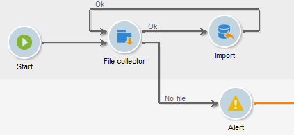

# Bestandsverzamelaar{#file-collector}

De **Bestandsverzamelaar** controleert de aankomst van een of meer bestanden in een map en activeert de overgang ervan voor elk ontvangen bestand. Voor elke gebeurtenis bevat een **[!UICONTROL filename]** variabele de volledige naam van het ontvangen bestand. De verzamelde bestanden worden naar een andere map verplaatst voor archiveringsdoeleinden en om ervoor te zorgen dat ze maar één keer worden geteld.

Standaard is de bestandscollector een permanente taak waarmee de aanwezigheid van bestanden wordt getest op de tijdstippen die in de planning zijn opgegeven.

De bestanden moeten zich op de server bevinden waarop de wfserver-module die voor deze workflow verantwoordelijk is, wordt uitgevoerd. Als meerdere wfserver-modules op één instantie worden geïmplementeerd, moet de affiniteit van de activiteiten die deze bestanden gebruiken of de algemene affiniteit van de workflow worden opgegeven.

## Eigenschappen {#properties}

Op het eerste tabblad van de **[!UICONTROL File collector]** activiteit kunt u de bronmap selecteren en, indien nodig, de verzamelde bestanden filteren. De andere tabbladen worden beschreven in [Binnenkomende e-mails](../../workflow/using/inbound-emails.md) (**[!UICONTROL Schedule]** en **[!UICONTROL Expiry]** tabbladen).

1. **Bestanden downloaden**

   * **[!UICONTROL Directory]**

      Map met de bestanden die moeten worden gedownload. Deze map moet vooraf op de server worden gemaakt: als het niet bestaat , zal een fout worden opgeheven .

   * **[!UICONTROL Filter]**

      Alleen bestanden die overeenkomen met dit filter worden in aanmerking genomen. De andere bestanden in de map worden genegeerd. Als het filter leeg is, worden alle bestanden in de map in aanmerking genomen. Voorbeelden van filters: ***.zip**, **import-*.txt**.

   * **[!UICONTROL Stop as soon as a file has been processed]**

      Als deze optie is ingeschakeld, wordt de taak beëindigd na ontvangst van het eerste bestand. Als de map meerdere bestanden bevat die overeenkomen met het filter, wordt er slechts één bestand in aanmerking genomen. Deze optie garandeert dat slechts één gebeurtenis wordt verzonden. Het in aanmerking genomen bestand is het eerste in de lijst in alfabetische volgorde.

      Als er voor een niet-geplande activiteit geen bestand wordt gevonden dat overeenkomt met het filter in de opgegeven map en als de **[!UICONTROL Process file nonexistence]** optie niet is ingeschakeld, wordt een fout gegenereerd.

   * **[!UICONTROL Execution schedule]**

      Hiermee bepaalt u de frequentie van de controle op de aanwezigheid van het bestand via de parameters van het **[!UICONTROL Schedule]** tabblad.

1. **Foutafhandeling**

   De volgende twee opties zijn beschikbaar:

   * **[!UICONTROL Process file nonexistence]**

      Met deze optie wordt telkens een speciale overgang gestart wanneer er geen bestand wordt gevonden dat overeenkomt met het filter in de opgegeven map.

      Als de taak niet is gepland, wordt deze overgang slechts eenmaal geactiveerd.

   * **[!UICONTROL Processing errors]**

      Met deze optie wordt een speciale overgang weergegeven die moet worden geactiveerd wanneer een fout wordt gegenereerd. In dit geval verandert de werkstroom niet in de foutstatus en gaat de uitvoering verder

      Fouten waarmee rekening wordt gehouden, zijn fouten in het bestandssysteem (het bestand kan niet worden verplaatst, de map kan niet worden geopend, enz.).

      Deze optie verwerkt geen fouten met betrekking tot activiteitsconfiguratie, d.w.z. ongeldige waarden.

1. **Historiatie**

   Raadpleeg de volgende **[!UICONTROL File historization]** stap: [Webdownload](../../workflow/using/web-download.md).

De volgorde van de bestandsverwerking kan niet worden bepaald. Als u een set bestanden opeenvolgend wilt verwerken, gebruikt u de **[!UICONTROL Stop as soon as a file has been processed]** optie en maakt u een lus. In dit geval worden de bestanden in alfabetische volgorde verwerkt. Met de **[!UICONTROL Process file nonexistence]** optie kunt u de herhaling voltooien.

## Uitvoerparameters {#output-parameters}

* bestandsnaam: Volledige bestandsnaam. Dit is de bestandsnaam nadat deze naar de historiemap is verplaatst. Het pad is dus anders, maar de naam is ook anders als er al een ander bestand met dezelfde naam in de map staat. De extensie blijft behouden.
