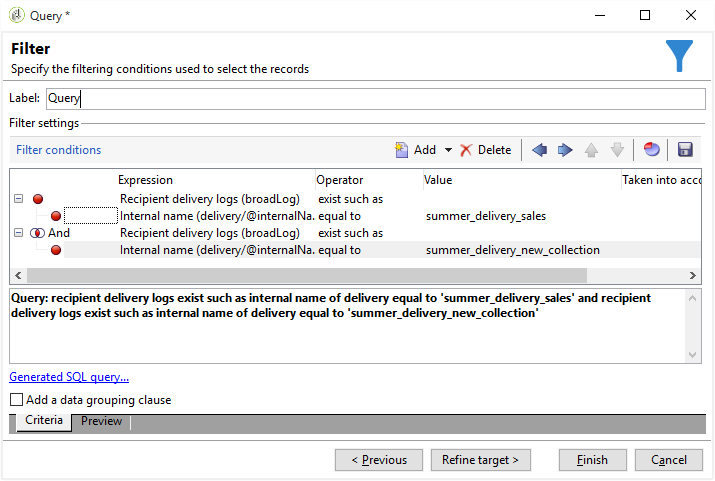

# Gedupliceerde ontvangers filteren {#filtering-duplicated-recipients}

In dit voorbeeld willen we ontvangers filteren die twee of meer in een levering verschijnen om dubbele profielen te herstellen.

U kunt dit voorbeeld maken door de volgende stappen toe te passen:

1. Sleep een **[!UICONTROL Query]** activiteit naar een werkstroom en open de activiteit.
1. Klik **[!UICONTROL Edit query]** en plaats de doel en het filtreren afmetingen aan **[!UICONTROL Recipients]**.

   

1. Bepaal de volgende filtervoorwaarde aan doelontvanger die in het leveringslogboek bestaat. Kies **Ontvanger leveringslogboek (broadlog)** in de kolom **Uitdrukking** , kies **bestaan zoals** in de kolom **Exploitant** .

   

1. Bepaal de volgende filtervoorwaarde om uw levering te richten. Kies **[!UICONTROL Internal name]** in de kolom Expressie en **[!UICONTROL equal to]** in de kolom Operator.
1. Voeg in de waardekolom de interne naam van de beoogde levering toe.

   

1. Herhaal dezelfde bewerkingen met een **[!UICONTROL AND]** operator om andere leveringen als doel in te stellen.

   

Uw uitgaande overgang bevat de dubbele ontvangers die in de leveringen als doel zijn ingesteld.
