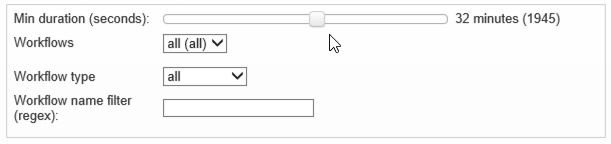

# Workflow HeatMap {#workflow-heatmap}

De Adobe Campagne Workflow HeatMap bestaat uit een grafische voorstelling met kleurcodes van alle workflows die momenteel worden uitgevoerd. Het is alleen beschikbaar voor de Instance Administrators.

In [deze pagina](https://helpx.adobe.com/campaign/kb/acc-maintenance.html)worden extra manieren weergegeven om de verschillende campagneprocessen te controleren.

## Over de workflow HeatMap {#about-the-workflow-heatmap}

Door een snel overzicht te geven van het aantal gelijktijdige workflows, stelt de Workflow HeatMap de beheerders van het Adobe Campagneplatform in staat de belasting op de instantie te controleren en de workflows dienovereenkomstig te plannen.

Meer bepaald, helpt het de platformbeheerders om:

* Gelijktijdige workflows bekijken en begrijpen
* Workflows filteren op duur om te zien welke workflows problemen kunnen tegenkomen
* Filteren van activiteiten op duur om te zien welke activiteiten problemen kunnen tegenkomen
* Gemakkelijk individuele werkschema&#39;s en alle verwante activiteiten (met hun duur) vinden
* Zoeken op type workflow ([technische workflows](../../workflow/using/building-a-workflow.md#technical-workflows) of [campagneworkflows](../../workflow/using/building-a-workflow.md#campaign-workflows))
* Een specifieke workflow zoeken die moet worden geanalyseerd

>[!NOTE]
>
>Naast de Heatmap **van het** Werkschema, kunt u een werkschema tot stand brengen dat u de status van een reeks werkschema&#39;s zal laten controleren en terugkomende berichten naar supervisors zal verzenden. Raadpleeg de [desbetreffende sectie](../../workflow/using/supervising-workflows.md)voor meer informatie hierover.

Het gebruiken van het Werkschema HeatMap vereist om een goed inzicht in de volgende concepten te hebben: [Workflows](../../workflow/using/about-workflows.md), [Activiteiten](../../workflow/using/about-activities.md) en best practices voor [workflows](../../workflow/using/workflow-best-practices.md).

De Workflow HeatMap is standaard beschikbaar in Adobe Campaign vanaf versie 18.10. Als u een build tussen 8700 en 8977 (18.10) hebt, kunt u ook van deze mogelijkheid profiteren. Als u het corresponderende pakket wilt aanvragen, neemt u contact op met de [klantenservice](https://support.neolane.net/) van Adobe en volgt u de instructies van [deze pagina](https://helpx.adobe.com/campaign/kb/install-workflow-heatmap-package.html) om te begrijpen hoe u het pakket kunt installeren.

Wanneer u voor het eerst toegang krijgt tot Worklow HeatMap, wordt het volgende pop-upvenster weergegeven. Met deze overeenkomst kunnen gegevens worden overgebracht en opgeslagen in de Verenigde Staten, zodat Adobe Campaign:

* controleren instanties om eventuele prestatieproblemen te onderzoeken.
* gegevens verzamelen voor afwijkingsdetectie.

De gegevensoverdracht is alleen beschikbaar voor gebruikers die verbinding maken met Adobe Campagne met hun Adobe-id.

Er zijn drie opties beschikbaar:

* **[!UICONTROL Accept]** : Door deze overeenkomst te accepteren, machtigt u Adobe Campaign om uw gegevens te verzamelen en naar de Verenigde Staten over te brengen om u te kunnen helpen in geval van afwijkende detecties.
* **[!UICONTROL Refuse]** : Door de overeenkomst te weigeren, worden uw gegevens niet overgedragen, maar kunt u nog wel Workflowoverzicht gebruiken.
* **[!UICONTROL Do not show this message again]** : Door te klikken **[!UICONTROL Do not show this message again]** , zal het pop-up venster ophouden tonen wanneer het toegang tot van het Werkschema Heatmap maar nog beschikbaar bij de **[!UICONTROL Term of use]** knoop.

Deze keuze is niet definitief, u kunt deze altijd wijzigen door op de **[!UICONTROL Term of use]** knop te klikken.

## HeatMap gebruiken {#using-the-heatmap}

>[!NOTE]
>
>Alleen gebruikers met beheerrechten hebben toegang tot de HeatMap van de Campagne-werkstroom.

1. Ga naar **[!UICONTROL Monitoring]** en klik op de **[!UICONTROL Workflow HeatMap]** koppeling om de **[!UICONTROL Campaign Workflow HeatMap]** pagina weer te geven.

   

1. Klik op de kalender om een dag te selecteren.

   Standaard geeft de pagina de werkstroomactiviteit voor de huidige dag weer. U kunt deze wijzigen en elke dag uit het verleden selecteren.

   >[!NOTE]
   >
   >Alleen de workflows die niet door de **[!UICONTROL Database cleanup]** workflow zijn verwijderd, zijn zichtbaar. Raadpleeg [deze sectie](../../production/using/database-cleanup-workflow.md)voor meer informatie over de workflow voor het opschonen van databases.\
   >Door gebrek, is de de tijdzone van de Werkstroom HeatMap die voor de huidige beheerdergebruiker wordt bepaald. U kunt deze bijvoorbeeld wijzigen als u zich niet in hetzelfde gebied bevindt als de marketinggebruikers waarmee u werkt.

1. Klik op de **[!UICONTROL Filters]** knop.

   

1. Gebruik de schuifregelaar om de minimale duur in te stellen van 0 seconden tot 1 uur. Hierdoor kunt u alleen werkstromen doorzoeken die langer dan een bepaald aantal seconden of minuten duren.

   

1. U kunt ook een specifieke workflow kiezen in de **[!UICONTROL Workflows]** lijst.

   

   >[!NOTE]
   >
   >Het **[!UICONTROL Min duration]** filter wordt toegepast. Als u geen specifieke workflow kunt vinden, stelt u de minimale duur in op 0, zodat alle workflows in de lijst worden weergegeven.

1. U kunt ook filteren op het volgende **[!UICONTROL Workflow type]** :

   * **[!UICONTROL Technical]** : Alleen [out-of-the-box-technische workflows](../../workflow/using/building-a-workflow.md#technical-workflows) en [gegevensbeheerworkflows](../../workflow/using/targeting-data.md#data-management) worden weergegeven.
   * **[!UICONTROL Marketing]** : Alleen workflows die zijn gekoppeld aan een marketingcampagne, ook wel [campagneworkflows](../../workflow/using/building-a-workflow.md#campaign-workflows)genoemd, worden weergegeven.

1. Als u een specifieke workflow op naam wilt doorzoeken, kunt u ook het **[!UICONTROL Workflow name filter]** veld gebruiken.

   

1. Als u enkele workflows hebt bewerkt in de tussenliggende tijd, klikt u op de **[!UICONTROL Reload data]** knop om de gegevens die in het raster worden weergegeven, te vernieuwen.

## HeatMap lezen {#reading-the-heatmap}

De Campagne Workflow HeatMap is een raster dat van linksboven naar rechtsonder kan worden gelezen, zodat de &#39;hot zones&#39; kunnen worden gevonden met een groen tot rood kleurgecodeerd bereik.

* De donkerdere rode cellen komen overeen met de periodes waarin een groot aantal workflows tegelijkertijd wordt uitgevoerd.
* De grijze cellen komen overeen met periodes waarin geen workflow wordt uitgevoerd.

Als u wilt weten hoe de kleurcode wordt toegepast en hoe u door de HeatMap kunt navigeren, klikt u op de **[!UICONTROL Help]** knop.

Elke rij vertegenwoordigt een uur van de dag en elke cel vertegenwoordigt 5 minuten van dat uur.

In het raster worden alle workflows weergegeven die tegelijkertijd worden uitgevoerd voor elk van deze periodes van 5 minuten.

In het onderstaande voorbeeld worden tussen 8.00 uur en 8.05 uur drie workflows uitgevoerd (ongeacht de individuele duur):

1. Klik op een gekleurde cel om de details weer te geven van alle gelijktijdige workflows die tijdens deze periode worden uitgevoerd.

   

   Voor elke werkstroom worden alle activiteiten in de werkstroom vermeld, met hun duur.

1. Klik op de werkstroom-id of naam om een werkstroom rechtstreeks te openen.
1. Klik op de **[!UICONTROL Campaign Workflow HeatMap]** knop om terug te gaan naar de **[!UICONTROL Home]** weergave.

## Gebruik hoofdletters/kleine letters: het gebruiken van HeatMap om acties te voeren {#use-cases--using-the-heatmap-to-take-actions}

Er zijn twee belangrijke gevallen waar het de werkschema HeatMap van de Campagne nuttig kan zijn.

### Het aantal gelijktijdige workflows verminderen {#reducing-the-number-of-concurrent-workflows}

Als beheerder van de Campagne, kan het Werkschema HeatMap u helpen om de lading op de instantie te begrijpen en bestaande of nieuwe werkschema&#39;s op aangewezen tijden te plannen.

1. Klik in de **[!UICONTROL Campaign Workflow HeatMap]** weergave op de **[!UICONTROL Filters]** knop.
1. Stel de duur in op een paar seconden of een paar minuten.
1. Sluit de kortste werkstromen uit die niet significant zijn door het duurfilter te verhogen.

   

1. Onderzoek de resultaten om de lading op de instantie te begrijpen en neem aangewezen acties:

   * Als er prestatieproblemen optreden en er een of meer rode cellen in het raster worden weergegeven, kunt u de begintijd van verschillende workflows wijzigen. Vraag de marketinggebruikers om de werkstromen handmatig van bezige (&quot;hot&quot;) perioden naar meer beschikbare tijdsleuven te verplaatsen. Dit moet de dag een stabiel niveau van activiteit handhaven.
   * Om pieken te vermijden en de instantie te verhinderen overbelasting, bekijk HeatMap alvorens nieuwe werkschema&#39;s te plannen en de beste tijd te kiezen. Overweeg tijdsleuven die overeenkomen met grijze of groene cellen in het raster om nieuwe workflows te starten.

### Langlopende workflows zoeken die invloed hebben op de prestaties {#finding-long-running-workflows-that-impact-performance}

Als Campagnebeheerder, helpt het Werkschema HeatMap u om de langste werkschema&#39;s te vinden die de activiteit kunnen vertragen.

1. Klik in de **[!UICONTROL Campaign Workflow HeatMap]** weergave op de **[!UICONTROL Filters]** knop.
1. Stel de duur in op 1 uur.

   

1. Neem meer resultaten op door het **[!UICONTROL Min duration]** filter te verlagen.
1. Onderzoek de resultaten om de langste werkschema&#39;s te vinden, die potentieel meer invloed op de server en gegevensbestandmiddelen (cpu, RAM, netwerk, IOPS, etc.) kunnen hebben.
1. Voer passende maatregelen uit:

   * Adviseer marketinggebruikers om de langste workflows te splitsen om de verwerkingstijd te verminderen.
   * Start een diepgaande analyse van specifieke workflows en specifieke activiteiten (zoals JavaScript, importeren, exporteren, enzovoort) om de problemen te isoleren en eenvoudiger op te lossen.

## Voorbeeld: Het gebruiken van HeatMap om werkschemaplanning te verbeteren {#example--using-the-heatmap-to-improve-workflow-planning}

In het onderstaande voorbeeld ziet u hoe de planning efficiënter kan zijn en hoe de prestaties kunnen worden verbeterd wanneer u de Adobe Campagne Workflow HeatMap gebruikt.

In dit geval klagen veel gebruikers over workflowprestaties. U moet controleren wat de activiteit vertraagt en hoe te om het probleem op te lossen.

1. Ga naar **[!UICONTROL Monitoring]** en klik op de **[!UICONTROL Workflows]** koppeling om de **[!UICONTROL Campaign Workflow HeatMap]** pagina weer te geven.
1. Stel het **[!UICONTROL Min duration]** filter in op 5 minuten.
1. Stel het **[!UICONTROL Workflow type]** filter in op **[!UICONTROL Marketing]** .
1. Neem het volgende in acht vanaf het HeatMap-raster:

   

   * De vijftig langdurige (meer dan 5 minuten) campagneworkflows worden uitgevoerd om 10.00 uur.
   * De meesten van hen hebben een hangende staat (door gebrek, wordt de gelijktijdig grens geplaatst aan 20).
   * De werkstromen in behandeling moeten elke dag handmatig opnieuw worden gestart.
   * De prestaties zijn laag.

1. In plaats van vijftig workflows te hebben die om 10.00 uur beginnen, verdeel de werkstromen&#39; beginnende tijden gelijkmatig over de rest van de dag.
1. Ga terug naar de **[!UICONTROL Campaign Workflow HeatMap]** pagina en klik op de **[!UICONTROL Reload data]** knop.
1. Neem nu het volgende in acht:

   

   * Slechts achttien langdurige campagneworkflows worden nog steeds om 10.00 uur uitgevoerd.
   * Er zijn geen workflows meer in behandeling (de limiet voor gelijktijdige uitvoering is nog steeds ingesteld op 20).
   * De werkstroombegintijden worden gelijkmatig over de dag verdeeld.
   * Geen gebruikers klagen meer over prestatieproblemen.
