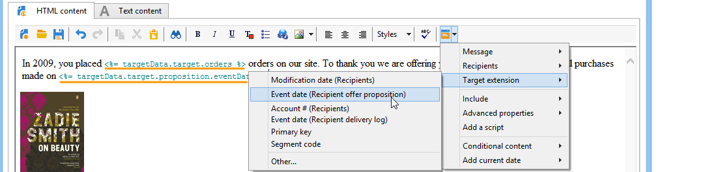
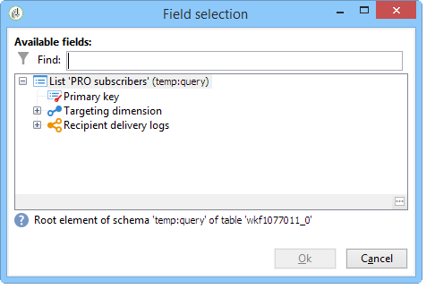

# Werkstroomgegevens gebruiken{#how-to-use-workflow-data}

## De database bijwerken {#updating-the-database}

Alle verzamelde gegevens kunnen worden gebruikt om de database bij te werken, of in leveringen. U kunt bijvoorbeeld de personalisatiemogelijkheden voor berichtinhoud verrijken (het aantal contracten in het bericht opnemen, het gemiddelde winkelwagentje van het afgelopen jaar opgeven, enzovoort) of een gedetailleerde bevolkingsgerichtheid (verzend een bericht aan contractmedehouders, richt de 1.000 beste abonnees aan online diensten, enz.). Deze gegevens kunnen ook worden geëxporteerd of gearchiveerd in een lijst.

### Lijsten en directe updates {#lists-and-direct-updates}

De gegevens van de Adobe Campaign-database en de bestaande lijsten kunnen worden bijgewerkt met behulp van twee speciale activiteiten:

* Met de **[!UICONTROL List update]** activiteit kunt u werktabellen opslaan in een gegevenslijst.

   U kunt een bestaande lijst selecteren of maken. In dit geval worden de naam en mogelijk de recordmap berekend.

   

   Zie [Lijstupdate](../../workflow/using/list-update.md).

* De **[!UICONTROL Update data]** activiteit voert een massa update van de gebieden in het gegevensbestand uit.

   Zie Gegevens [bijwerken voor meer informatie](../../workflow/using/update-data.md).

### Abonnementsbeheer/Abonnementsbeheer {#subscription-unsubscription-management}

Raadpleeg [Abonnementenservices](../../workflow/using/subscription-services.md)voor informatie over het abonneren en het opzeggen van ontvangers voor een informatieservice via een workflow.

## Verzenden via een workflow {#sending-via-a-workflow}

### Leveringsactiviteit {#delivery-activity}

De leveringsactiviteit is gedetailleerd in [Levering](../../workflow/using/delivery.md).

### Verrijking en gerichtheid van leveringen {#enriching-and-targeting-deliveries}

Leveringen kunnen gegevens uit workflows verwerken om de inhoud aan te passen of binnen het kader van de selectie van doelgroepen.

Zo kunt u in het kader van een directe postbezorging de aanvullende gegevens, die zijn ontleend aan gegevensmanipulatie die in de workflow is uitgevoerd, opnemen in het extractiebestand:


Naast de gebruikelijke verpersoonlijkingsgebieden, kunt u verpersoonlijkingsgebieden van werkschemafasen aan de leveringsinhoud toevoegen. De extra gegevens die in de werkschemaactiviteiten worden bepaald kunnen in de leveringstovenaar, zoals aangetoond in het hieronder voorbeeld worden gehouden en worden toegankelijk gemaakt, voor het bepalen van de naam van het outputdossier binnen het kader van direct postlevering:


De gegevens in de workflowtabel worden aangeduid met de naam: het wordt altijd samengesteld uit de **targetData** verbinding. Raadpleeg de [doelgegevens](../../workflow/using/executing-a-workflow.md#target-data)voor meer informatie hierover.

In het kader van de e-maillevering kunnen personaliseringsgebieden ook gegevens gebruiken van doeluitbreiding die in de het richten werkschemasfases wordt uitgevoerd, zoals aangetoond in het hieronder voorbeeld:



Als een segmentcode in een het richten activiteit wordt gespecificeerd, wordt het toegevoegd aan een specifieke kolom van de werkschemalijst en zal samen met de verpersoonlijkingsgebieden worden aangeboden. Als u alle aanpassingsvelden wilt weergeven, klikt u op de **[!UICONTROL Target extension > Other...]** koppeling die toegankelijk is via de aanpassingsknop.



## Gegevens exporteren {#exporting-data}

### Een bestand zoeken of versleutelen {#zipping-or-encrypting-a-file}

Met Adobe Campaign kunt u gecomprimeerde of gecodeerde bestanden exporteren. Wanneer u een exportbewerking definieert aan de hand van een **[!UICONTROL Data extraction (file)]** activiteit, kunt u een nabewerkingsbewerking definiëren om het bestand te zip of te coderen.

Om dit te kunnen doen:

* Als uw installatie van Adobe Campaign wordt gehost door Adobe: Stuur een verzoek naar [Support](https://support.neolane.net) om de benodigde hulpprogramma&#39;s op de server te installeren.
* Als de Adobe-campagne op locatie is geïnstalleerd: Installeer het hulpprogramma dat u wilt gebruiken (bijvoorbeeld: GPG, GZIP) en de benodigde sleutels (coderingssleutel) op de toepassingsserver.

Vervolgens kunt u opdrachten of code gebruiken, zoals:

```
function encryptFile(file) {  
  var systemCommand = “gpg --encrypt --recipient  recipientToEncryptTo ” + file;  
  var result = execCommand(systemCommand, true); 
}
```

Wanneer u een bestand importeert, kunt u het ook ontsleutelen of ontsleutelen. Zie Een bestand [decoderen of decoderen voordat het wordt verwerkt](../../workflow/using/importing-data.md#unzipping-or-decrypting-a-file-before-processing).
