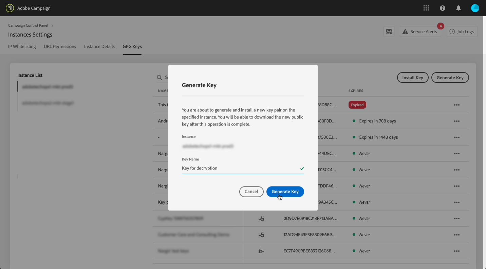

# Data importeren{#importing-data}

>[!CAUTION]
>
>Houd tijdens het importeren van gegevens rekening met de beperkingen voor SFTP-opslag, databaseopslag en actief profiel zoals vastgelegd in uw Adobe Campaign-contract.

## Gegevens verzamelen {#how-to-collect-data}

### Gegevens uit een lijst gebruiken: Leeslijst {#using-data-from-a-list--read-list}

De gegevens die in een werkstroom worden verzonden, kunnen afkomstig zijn van lijsten waarin de gegevens vooraf zijn voorbereid en gestructureerd.

Deze lijst is mogelijk rechtstreeks gemaakt in Adobe Campaign of geïmporteerd door de optie **[!UICONTROL Import a list]**. Voor meer op deze optie, verwijs naar deze [pagina](../../platform/using/generic-imports-and-exports.md).

Raadpleeg [Lijst lezen](../../workflow/using/read-list.md) voor meer informatie over het gebruik van de activiteit in de lijst met lezen in een workflow.

### Gegevens laden uit een bestand {#loading-data-from-a-file}

De gegevens die in een werkstroom worden verwerkt, kunnen uit een gestructureerd bestand worden geëxtraheerd, zodat het bestand in Adobe Campaign kan worden geïmporteerd.

Een beschrijving van de activiteit van de ladingsgegevens kan in [het laden van gegevens (dossier)](../../workflow/using/data-loading--file-.md) sectie worden gevonden.

Voorbeeld van gestructureerd bestand dat moet worden geïmporteerd:

```
lastname;firstname;birthdate;email;crmID
Smith;Hayden;23/05/1989;hayden.smith@example.com;124365
Mars;Daniel;17/11/1987;dannymars@example.com;123545
Smith;Clara;08/02/1989;hayden.smith@example.com;124567
Durance;Allison;15/12/1978;allison.durance@example.com;120987
```

## Aanbevolen procedures bij het importeren van gegevens {#best-practices-when-importing-data}

Voorzichtig zijn en het volgen van de weinige hieronder gedetailleerde eenvoudige regels zullen veel helpen om gegevensconsistentie binnen het gegevensbestand te verzekeren en gemeenschappelijke fouten tijdens gegevensbestandupdate of gegevensuitvoer te vermijden.

### Importsjablonen {#using-import-templates} gebruiken

De meeste importworkflows moeten de volgende activiteiten bevatten: **[!UICONTROL Data loading (file)]**, **[!UICONTROL Enrichment]**, **[!UICONTROL Split]**, **[!UICONTROL Deduplication]**, **[!UICONTROL Update data]**.

Door het gebruik van importsjablonen is het heel handig om vergelijkbare importbewerkingen voor te bereiden en te zorgen voor consistentie van de gegevens in de database. Leer hoe u werkstroomsjablonen maakt in de sectie [Workflowsjablonen](../../workflow/using/building-a-workflow.md#workflow-templates).

In vele projecten, wordt de invoer gebouwd zonder **[!UICONTROL Deduplication]** activiteit omdat de dossiers die in het project worden gebruikt geen duplicaten hebben. Soms worden duplicaten weergegeven van het importeren van verschillende bestanden. De-duplicatie is dan moeilijk. Daarom is een deduplicatiestap een goede voorzorgsmaatregel in alle importworkflows.

Ga niet uit van de veronderstelling dat de inkomende gegevens consistent en correct zijn, of dat de afdeling van IT of de supervisor van Adobe Campaign het zal behandelen. Houd tijdens het project rekening met het opschonen van gegevens. U kunt gegevens dedupliceren, op elkaar afstemmen en de consistentie behouden bij het importeren van gegevens.

Een voorbeeld van een importsjabloon is beschikbaar in de sectie [Een terugkerende import](#setting-up-a-recurring-import) instellen.

### Vlakke bestandsindelingen {#using-flat-file-formats} gebruiken

De meest efficiënte indeling voor importeren is platte bestanden. Vlakke bestanden kunnen in de bulkmodus op databaseniveau worden geïmporteerd.

Bijvoorbeeld:

* Scheidingsteken: tab of puntkomma
* Eerste regel met kopteksten
* Geen scheidingsteken voor tekenreeks
* Datumnotatie: YYYY/MM/DD HH:mm:SS

Adobe Campaign kan XML-bestanden niet importeren met behulp van standaard importactiviteiten. U kunt XML-bestanden importeren met JavaScript, maar alleen met kleine volumes: minder dan 10.000 records per bestand.

### Compressie en codering {#using-compression-and-encryption} gebruiken

Gebruik indien mogelijk gecomprimeerde bestanden voor importeren en exporteren.

In Linux is het mogelijk om een bestand uit te pakken en tegelijkertijd te importeren via een opdrachtregel. Bijvoorbeeld:

```
zcat nl6/var/vp/import/filename.gz
```

Het is ook een goede praktijk om dossiers te coderen die over het netwerk worden verzonden als het onveilig is. Hiervoor kan GPG worden gebruikt.

### Gegevens in batch laden uit bestanden {#loading-data-in-batch-from-files}

Het laden van gegevens in partij van een dossier is effectiever dan het laden van één lijn tegelijkertijd en in real time (bijvoorbeeld via de dienst van het Web).

De invoer die de diensten van het Web gebruikt is niet efficiënt. U kunt het beste bestanden gebruiken als dat mogelijk is.

Het roepen van de externe diensten van het Web om profielen in real time te verrijken is ook gekend om prestatiesproblemen en geheugenlekken te veroorzaken, omdat het op lijnniveau werkt.

Als u gegevens moet invoeren, is het beter om het in partij te doen, gebruikend een werkschema, dan in echt - tijd, gebruikend een toepassing van het Web of de dienst van het Web.

### Gegevensbeheer {#using-data-management} gebruiken

Het laden in de iteratieve modus (regel voor regel) met JavaScript moet worden beperkt tot kleine volumes.

Gebruik voor een betere efficiëntie altijd de **[!UICONTROL Data Loading (File)]**-activiteit in workflows voor gegevensbeheer.

### Importeren in Deltamodus {#importing-in-delta-mode}

Regelmatige invoer moet plaatsvinden in de deltamodus. Dit betekent dat alleen gewijzigde of nieuwe gegevens telkens naar Adobe Campaign worden verzonden in plaats van naar de hele tabel.

Volledige invoer mag alleen voor eerste lading worden gebruikt.

Importeer gegevens met gegevensbeheer in plaats van met JavaScript.

### Consistentie {#maintaining-consistency} behouden

Om de consistentie van de gegevens in de Adobe Campaign-database te waarborgen, volgt u de volgende beginselen:

* Als de geïmporteerde gegevens overeenkomen met een referentietabel in Adobe Campaign, moet de tabel in de workflow overeenkomen met die tabel. Records die niet overeenkomen, moeten worden afgewezen.
* Zorg ervoor dat de geïmporteerde gegevens altijd **&quot;genormaliseerd&quot;** (e-mail, telefoonnummer, direct-mailadres) zijn en dat deze normalisatie betrouwbaar is en in de loop der jaren niet zal veranderen. Als dit niet het geval is, zullen sommige duplicaten waarschijnlijk in het gegevensbestand verschijnen, en aangezien Adobe Campaign geen hulpmiddelen verstrekt om &quot;vage&quot;aanpassing te doen, zal het zeer moeilijk zijn om hen te beheren en te verwijderen.
* Transactionele gegevens moeten een afstemmingssleutel hebben en in overeenstemming zijn met de bestaande gegevens om het creëren van duplicaten te voorkomen.
* **Verwante bestanden op volgorde** importeren.

   Als het importeren uit meerdere bestanden bestaat die van elkaar afhankelijk zijn, moet de workflow ervoor zorgen dat de bestanden in de juiste volgorde worden geïmporteerd. Wanneer een bestand mislukt, worden de andere bestanden niet geïmporteerd.

* **U kunt gegevens dedupliceren**, combineren en de consistentie behouden wanneer u ze importeert.

## Hoofdlettergebruik: terugkerende importbewerkingen {#setting-up-a-recurring-import} instellen

Het gebruik van een importsjabloon is de beste manier als u regelmatig bestanden met dezelfde structuur moet importeren.

In dit voorbeeld ziet u hoe u een workflow instelt die opnieuw kan worden gebruikt voor het importeren van profielen die afkomstig zijn van een CRM in de Adobe Campaign-database. Raadpleeg deze [sectie](../../workflow/using/about-activities.md) voor meer informatie over alle mogelijke instellingen voor elke activiteit.

1. Creeer een nieuw werkschemamalplaatje van **[!UICONTROL Resources > Templates > Workflow templates]**.
1. Voeg de volgende activiteiten toe:

   * **[!UICONTROL Data loading (file)]**: Definieer de verwachte structuur van het bestand met de gegevens die u wilt importeren.
   * **[!UICONTROL Enrichment]**: De geïmporteerde gegevens afstemmen op de databasegegevens.
   * **[!UICONTROL Split]**: Maak filters om records op een andere manier te verwerken, afhankelijk van de vraag of ze met elkaar in overeenstemming kunnen worden gebracht.
   * **[!UICONTROL Deduplication]**: Dupliceer de gegevens uit het binnenkomende bestand voordat deze in de database worden ingevoegd.
   * **[!UICONTROL Update data]**: Werk de database bij met de geïmporteerde profielen.

   

1. Configureer de **[!UICONTROL Data Loading (file)]**-activiteit:

   * Definieer de verwachte structuur door een voorbeeldbestand te uploaden. Het voorbeeldbestand mag slechts een paar regels bevatten, maar alle kolommen die nodig zijn voor het importeren. Controleer en bewerk de bestandsindeling om te controleren of het type van elke kolom correct is ingesteld: tekst, datum, geheel getal, enz. Bijvoorbeeld:

      ```
      lastname;firstname;birthdate;email;crmID
      Smith;Hayden;23/05/1989;hayden.smith@mailtest.com;123456
      ```

   * Selecteer **[!UICONTROL Upload a file from the local machine]** in de sectie **[!UICONTROL Name of the file to load]** en laat het veld leeg. Telkens wanneer een nieuwe werkstroom van dit malplaatje wordt gecreeerd, kunt u hier het dossier specificeren u wilt, zolang het aan de bepaalde structuur beantwoordt.

      U kunt alle opties gebruiken, maar u moet de sjabloon dienovereenkomstig aanpassen. Als u bijvoorbeeld **[!UICONTROL Specified in the transition]** selecteert, kunt u een **[!UICONTROL File Transfer]**-activiteit toevoegen voordat u het bestand ophaalt dat u wilt importeren vanaf een FTP-/SFTP-server. Met S3- of SFTP-verbinding kunt u ook segmentgegevens importeren naar Adobe Campaign met het Adobe Real-Time Customer Data-platform. Raadpleeg voor meer informatie deze [documentatie](https://docs.adobe.com/content/help/en/experience-platform/rtcdp/destinations/destinations-cat/adobe-destinations/adobe-campaign-destination.html).

      

1. Configureer de **[!UICONTROL Enrichment]**-activiteit. Het doel van deze activiteit in dit verband is de identificatie van de binnenkomende gegevens.

   * Selecteer **[!UICONTROL Enrichment]** op het tabblad &lt;a0/> en definieer een koppeling tussen de geïmporteerde gegevens en de ontvangers voor dimensie. **[!UICONTROL Add data]** In dit voorbeeld wordt het aangepaste veld **CRM ID** gebruikt om de verbindingsvoorwaarde te maken. Gebruik het veld of de combinatie van velden die u nodig hebt, zolang u unieke records kunt identificeren.
   * Laat op het tabblad **[!UICONTROL Reconciliation]** de optie **[!UICONTROL Identify the document from the working data]** uitgeschakeld.

   

1. Configureer de **[!UICONTROL Split]**-activiteit om onderling afgestemde ontvangers in één overgang en ontvangers op te halen die niet in overeenstemming konden worden gebracht, maar die voldoende gegevens in een tweede overgang hebben.

   De overgang met onderling verzochte ontvangers kan dan worden gebruikt om het gegevensbestand bij te werken. De overgang met onbekende ontvangers kan dan worden gebruikt om nieuwe ontvankelijke ingangen in het gegevensbestand tot stand te brengen als een minimumreeks informatie in het dossier beschikbaar is.

   Ontvangers die niet in overeenstemming kunnen worden gebracht en niet genoeg gegevens hebben, worden in een complementaire uitgaande overgang geselecteerd en kunnen in een afzonderlijk bestand worden geëxporteerd of eenvoudig worden genegeerd.

   * Selecteer **[!UICONTROL Use the additional data only]** als filterinstelling op het tabblad **[!UICONTROL General]** van de activiteit en zorg ervoor dat **[!UICONTROL Targeting dimension]** automatisch wordt ingesteld op **[!UICONTROL Enrichment]**.

      Controleer de optie **[!UICONTROL Generate complement]** om te kunnen zien of kan om het even welk verslag niet in het gegevensbestand worden opgenomen. Indien nodig kunt u de aanvullende gegevens verder verwerken: bestand exporteren, lijst bijwerken, enz.

   * In de eerste ondergroep van **[!UICONTROL Subsets]** tabel, voeg een het filtreren voorwaarde op de binnenkomende bevolking toe om slechts verslagen te selecteren waarvoor de ontvankelijke primaire sleutel niet gelijk aan 0 is. Op deze manier worden gegevens uit het bestand die in overeenstemming zijn met ontvangers uit de database, geselecteerd in die subset.

      

   * Voeg een tweede subset toe die onverzochte records selecteert die voldoende gegevens bevatten om in de database te worden ingevoegd. Bijvoorbeeld: e-mailadres, voornaam en achternaam.

      Subsets worden verwerkt in hun aanmaakvolgorde. Dit houdt in dat wanneer deze tweede subset wordt verwerkt, alle records die al in de database bestaan al in de eerste subset zijn geselecteerd.

      

   * Alle verslagen die niet in de eerste twee subsets worden geselecteerd worden geselecteerd in **[!UICONTROL Complement]**.

1. Vorm de **[!UICONTROL Update data]** activiteit die na de eerste uitgaande overgang van de **[!UICONTROL Split]** eerder gevormde activiteit wordt gevestigd.

   * Selecteer **[!UICONTROL Update]** als **[!UICONTROL Operation type]** omdat de binnenkomende overgang alleen ontvangers bevat die al in de database aanwezig zijn.
   * Selecteer **[!UICONTROL Record identification]** in de sectie &lt;a0/> en definieer een sleutel tussen de doeldimensie en de koppeling die wordt gemaakt in **[!UICONTROL Enrichment]**. **[!UICONTROL Using reconciliation keys]** In dit voorbeeld wordt het aangepaste veld **CRM ID** gebruikt.
   * Geef in de sectie **[!UICONTROL Fields to update]** de velden van de afmeting ontvangers op die moeten worden bijgewerkt met de waarde van de corresponderende kolom in het bestand. Als de namen van de bestandskolommen identiek of bijna identiek zijn aan de namen van de afmetingsvelden van de ontvangers, kunt u de toverknop gebruiken om de verschillende velden automatisch aan te passen.

      

1. Vorm de **[!UICONTROL Deduplication]** activiteit die na de overgang wordt gevestigd die onverzoende ontvangers bevat:

   * Selecteer **[!UICONTROL Edit configuration]** en plaats het richten afmeting aan het tijdelijke schema dat van **[!UICONTROL Enrichment]** activiteit van het werkschema wordt geproduceerd.

      

   * In dit voorbeeld wordt het e-mailveld gebruikt om unieke profielen te zoeken. U kunt elk veld gebruiken waarvan u zeker weet dat het is ingevuld en deel uitmaakt van een unieke combinatie.
   * Selecteer **[!UICONTROL Deduplication method]** in het scherm &lt;a0/> en controleer de optie **[!UICONTROL Disable automatic filtering of 0 ID records]** om ervoor te zorgen dat records met een primaire sleutel gelijk aan 0 (die alle records van deze overgang moeten zijn) niet worden uitgesloten.**[!UICONTROL Advanced parameters]**

   

1. Vorm **[!UICONTROL Update data]** activiteit die na **[!UICONTROL Deduplication]** eerder gevormde activiteit wordt gevestigd.

   * Selecteer **[!UICONTROL Insert]** als **[!UICONTROL Operation type]** aangezien de binnenkomende overgang slechts ontvangers bevat die niet in het gegevensbestand aanwezig zijn.
   * Selecteer **[!UICONTROL Record identification]** in de sectie &lt;a0/> en kies de **[!UICONTROL Recipients]**-dimensie.**[!UICONTROL Directly using the targeting dimension]**
   * Geef in de sectie **[!UICONTROL Fields to update]** de velden van de afmeting ontvangers op die moeten worden bijgewerkt met de waarde van de corresponderende kolom in het bestand. Als de namen van de bestandskolommen identiek of bijna identiek zijn aan de namen van de afmetingsvelden van de ontvangers, kunt u de toverknop gebruiken om de verschillende velden automatisch aan te passen.

      

1. Na de derde overgang van de **[!UICONTROL Split]** activiteit, voeg **[!UICONTROL Data extraction (file)]** activiteit en **[!UICONTROL File transfer]** activiteit toe als u spoor van gegevens wilt houden die niet in het gegevensbestand worden opgenomen. Configureer die activiteiten om de kolom die u nodig hebt te exporteren en om het bestand over te brengen naar een FTP- of SFTP-server waar u het bestand kunt ophalen.
1. Voeg een **[!UICONTROL End]** activiteit toe en sla het werkschemamalplaatje op.

De sjabloon kan nu worden gebruikt en is beschikbaar voor elke nieuwe workflow. Alles is dan nodig om het bestand op te geven dat de gegevens bevat die in de **[!UICONTROL Data loading (file)]**-activiteit moeten worden geïmporteerd.


## Een bestand decoderen of uitpakken voordat het wordt verwerkt{#unzipping-or-decrypting-a-file-before-processing}

### Voorverwerkingsstadia {#about-pre-processing-stages}

Met Adobe Campaign kunt u gecomprimeerde of gecodeerde bestanden importeren. Voordat ze kunnen worden gelezen in een [activiteit voor het laden van gegevens (bestand)](../../workflow/using/data-loading--file-.md), kunt u een voorbewerking definiëren voor decoderen of decoderen van het bestand.

Om dit te kunnen doen:

1. Gebruik [Controlebord](https://docs.adobe.com/content/help/en/control-panel/using/instances-settings/gpg-keys-management.html#decrypting-data) om een openbaar/privé zeer belangrijk paar te produceren.

   >[!NOTE]
   >
   >Het Configuratiescherm is beschikbaar voor alle klanten die op AWS worden gehost (behalve voor klanten die hun marketinginstanties op locatie hosten).

1. Als uw installatie van Adobe Campaign wordt gehost door Adobe, neemt u contact op met de klantenservice van Adobe om de benodigde hulpprogramma&#39;s op de server te installeren.
1. Als de installatie van Adobe Campaign op locatie plaatsvindt, installeert u het hulpprogramma dat u wilt gebruiken (bijvoorbeeld: GPG, GZIP) en de benodigde sleutels (coderingssleutel) op de toepassingsserver.

Vervolgens kunt u de gewenste voorverwerkingsopdrachten in uw workflows gebruiken:

1. Voeg en vorm een **[!UICONTROL File transfer]** activiteit in uw werkschema toe.
1. Voeg een **[!UICONTROL Data loading (file)]** activiteit toe en bepaal het dossierformaat.
1. Schakel de optie **[!UICONTROL Pre-process the file]** in.
1. Geef de voorverwerkingsopdracht op die u wilt toepassen.
1. Voeg andere activiteiten toe om gegevens die uit het bestand komen te beheren.
1. Sla de workflow op en voer deze uit.

In het onderstaande gebruiksgeval wordt een voorbeeld gegeven.

**Verwante onderwerpen:**

* [Activiteit](../../workflow/using/data-loading--file-.md) bij laden van gegevens (bestand).
* [Een bestand](../../workflow/using/how-to-use-workflow-data.md#zipping-or-encrypting-a-file) bekijken of versleutelen.

### Hoofdlettergebruik: Gegevens importeren die zijn versleuteld met een toets die is gegenereerd door Configuratiescherm {#use-case-gpg-decrypt}

In dit geval, zullen wij een werkschema bouwen om gegevens in te voeren die in een extern systeem zijn gecodeerd, gebruikend een sleutel die in het Controlebord wordt geproduceerd.

 [Ontdek deze functie in video](#video)

De volgende stappen worden uitgevoerd:

1. Gebruik het Configuratiescherm om een sleutelpaar (openbaar/privé) te genereren. Gedetailleerde stappen zijn beschikbaar in [documentatie van het Configuratiescherm](https://docs.adobe.com/content/help/en/control-panel/using/instances-settings/gpg-keys-management.html#decrypting-data).

   * De openbare sleutel zal met het externe systeem worden gedeeld, dat het zal gebruiken om de gegevens te coderen om naar Campagne te verzenden.
   * De persoonlijke sleutel wordt door Campaign Classic gebruikt om de inkomende gecodeerde gegevens te decoderen.

   

1. In het externe systeem gebruikt u de openbare sleutel die u van het Configuratiescherm hebt gedownload om de gegevens te coderen die u naar Campaign Classic wilt importeren.

1. In Campaign Classic, bouwt een werkschema om de gecodeerde gegevens in te voeren en het te decrypteren gebruikend de privé sleutel die via het Controlebord is geïnstalleerd. Hiervoor maken we als volgt een workflow:

   

   * **[!UICONTROL File transfer]** activiteit: Hiermee wordt het bestand van een externe bron naar Campaign Classic overgedragen. In dit voorbeeld willen we het bestand overbrengen van een SFTP-server.
   * **[!UICONTROL Data loading (file)]** activiteit: Laadt de gegevens van het dossier in het gegevensbestand en decrypteert het gebruikend de privé sleutel die in het Controlebord wordt geproduceerd.

1. Open de **[!UICONTROL File transfer]** activiteit dan specificeer de externe rekening waarvan u het gecodeerde .gpg dossier wilt invoeren.

   

   De globale concepten op hoe te om de activiteit te vormen zijn beschikbaar in [deze sectie](../../workflow/using/file-transfer.md).

1. Open de **[!UICONTROL Data loading (file)]** activiteit, dan vorm het op uw behoeften. De globale concepten op hoe te om de activiteit te vormen zijn beschikbaar in [deze sectie](../../workflow/using/data-loading--file-.md).

   Voeg een voorbewerkingsstadium aan de activiteit toe, om de inkomende gegevens te decrypteren. Om dit te doen, selecteer **[!UICONTROL Pre-process the file]** optie, dan kopieer-kleef dit decryptiebevel in het **[!UICONTROL Command]** gebied:

   `gpg --batch --passphrase passphrase --decrypt <%=vars.filename%>`

   

   >[!CAUTION]
   >
   >In dit voorbeeld, gebruiken wij passphrase die door gebrek door Controlebord wordt gebruikt, dat &quot;passphrase&quot;is.
   >
   >Als u in het verleden al GPG-sleutels op uw exemplaar hebt geïnstalleerd via een verzoek van de klantenservice, is de passphrase mogelijk gewijzigd en is deze standaard anders.

1. Klik **[!UICONTROL OK]** om de activiteitenconfiguratie te bevestigen.

1. U kunt de workflow nu uitvoeren. Nadat de decodering is uitgevoerd, kunt u in de werkstroomlogboeken controleren of de decodering is uitgevoerd en of de gegevens uit het bestand zijn geïmporteerd.

   

### Video over zelfstudie {#video}

In deze video wordt getoond hoe u een GPG-sleutel kunt gebruiken voor het decoderen van gegevens.

>[!VIDEO](https://video.tv.adobe.com/v/36482?quality=12)

Er zijn [hier](https://experienceleague.adobe.com/docs/campaign-classic-learn/tutorials/overview.html?lang=nl) extra Campaign Classic hoe kan ik-video&#39;s beschikbaar.
