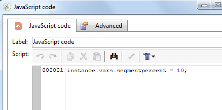

# JavaScript-scripts en -sjablonen{#javascript-scripts-and-templates}

Met scripts kunt u waarden berekenen, gegevens uitwisselen tussen verschillende taken in het proces en specifieke bewerkingen uitvoeren met SOAP-aanroepen.

Scripts zijn alomtegenwoordig in een workflowdiagram:

* Alle activiteiten hebben initialisatiescripts. Een initialisatiescript wordt uitgevoerd wanneer de activiteit wordt geactiveerd en kan worden gebruikt om variabelen te initialiseren en de eigenschappen te wijzigen.
* De activiteit van de code van &#39;JavaScript&#39; wordt eenvoudig gebruikt om een manuscript uit te voeren.
* De activiteit van de &quot;Test&quot;evalueert uitdrukkingen JavaScript om de aangewezen overgang te activeren.
* De meeste tekstvelden zijn JavaScript-sjablonen: JavaScript-expressies kunnen worden opgenomen tussen &lt;%= en %>. Deze velden bevatten een knop waarmee een vervolgkeuzelijst wordt geopend waarmee u expressies kunt invoeren.

   

## Objecten blootgesteld {#objects-exposed}

JavaScripts die in de context van een werkstroom worden uitgevoerd, hebben toegang tot een reeks extra globale objecten.

* **instantie**: Vertegenwoordigt de workflow die wordt uitgevoerd. Het schema van dit object is **xtk:workflow**.
* **taak**: Vertegenwoordigt de taken die worden uitgevoerd. Het schema van dit object is **xtk:workflowTask**.
* **gebeurtenis**: Vertegenwoordigt de gebeurtenissen die de uit te voeren taak activeerden. Het schema van dit object is **xtk:workflowEvent**. Dit voorwerp wordt niet geïnitialiseerd voor **AND-join** typeactiviteiten die van veelvoudige overgangen zijn geactiveerd.
* **gebeurtenissen**: Vertegenwoordigt de lijst met gebeurtenissen die de huidige taak hebben geactiveerd. Het schema van dit object is **xtk:workflowEvent**. Deze lijst bevat gewoonlijk één element maar kan verscheidene voor **AND-join** typeactiviteiten bevatten die op verscheidene overgangen gebaseerd zijn geactiveerd.
* **activiteit**: Vertegenwoordigt het model van de taak die wordt uitgevoerd. Het schema van dit object is afhankelijk van het type activiteit. Dit object kan worden gewijzigd door het initialisatiescript, in andere scripts kunnen wijzigingen met onbepaalbare effecten worden toegepast.

De eigenschappen die voor deze objecten beschikbaar zijn, kunnen in een vervolgkeuzelijst worden weergegeven door op de knop rechts van de scriptwerkbalk te klikken.

>[!CAUTION]
>
>De eigenschappen van deze objecten zijn alleen-lezen, behalve de subeigenschappen van de eigenschap vars.
>  
>De meeste van deze eigenschappen worden alleen bijgewerkt na het uitvoeren van een elementaire taak of wanneer de instantie is gepassioneerd. De waarden die worden gelezen, komen niet noodzakelijkerwijs overeen met de huidige status, maar met de vorige status.

**Voorbeeld**

In dit voorbeeld, en in de volgende voorbeelden, creeer een werkschema dat een **JavaScript codeactiviteit** en een activiteit van het **Eind** zoals aangetoond in het volgende diagram omvat.


Dubbelklik op de **JavaScript-codeactiviteit** en voeg het volgende script in:

```
logInfo("Label: " + instance.label)
logInfo("Start date: " + task.creationDate)
```

De **[!UICONTROL logInfo(message)]** functie voegt een bericht in het logbestand in.

Klik **[!UICONTROL OK]** om de aanmaakwizard te sluiten en start de workflow met de actieknoppen in de rechterbovenhoek van de lijst met workflows. Raadpleeg het logbestand aan het einde van de uitvoering. Er moeten twee berichten worden weergegeven die overeenkomen met het script: de ene geeft het label van de workflow weer, de andere geeft de datum weer waarop het script is geactiveerd.

## Variabelen {#variables}

De variabelen zijn de vrije eigenschappen van de objecten **[!UICONTROL instance]**, **[!UICONTROL task]** en **[!UICONTROL event]** objecten. De JavaScript-typen die voor deze variabelen zijn geautoriseerd, zijn **[!UICONTROL string]** en **[!UICONTROL number]****[!UICONTROL Date]**.

### Instantievariabelen {#instance-variables}

De instantievariabelen (**[!UICONTROL instance.vars.xxx]**) zijn vergelijkbaar met algemene variabelen.  Ze worden door alle activiteiten gedeeld.

### Taakvariabelen {#task-variables}

De taakvariabelen (**[!UICONTROL task.vars.xxx]**) zijn vergelijkbaar met lokale variabelen.  Ze worden alleen gebruikt door de huidige taak. Deze variabelen worden gebruikt door permanente activiteiten om gegevens te bewaren en worden soms gebruikt om gegevens tussen de verschillende manuscripten van een zelfde activiteit uit te wisselen.

### Gebeurtenisvariabelen {#event-variables}

Met de gebeurtenisvariabelen (**[!UICONTROL vars.xxx]**) kunt u gegevens uitwisselen tussen de elementaire taken van een workflowproces. Deze variabelen worden doorgegeven door de taak die de actieve taak heeft geactiveerd. Het is mogelijk deze te wijzigen en nieuwe te definiëren. Deze worden vervolgens doorgegeven aan de volgende activiteiten.

In het geval van **AND-join** type activiteiten, worden de variabelen samengevoegd maar als één variabele tweemaal wordt bepaald, is er een conflict en de waarde blijft onbepaald.

Dit zijn de meest gebruikte variabelen, en zij zouden in voorkeur aan instantievariabelen moeten worden gebruikt.

Bepaalde gebeurtenisvariabelen worden door de verschillende activiteiten gewijzigd of gelezen. Dit zijn allemaal tekenreeksvariabelen. Met een exportbewerking wordt bijvoorbeeld de **[!UICONTROL vars.filename]** variabele ingesteld met de volledige naam van het bestand dat zojuist is geëxporteerd. Al deze gelezen of gewijzigde variabelen worden gedocumenteerd in [Informatie over activiteiten](../../workflow/using/about-activities.md), in de secties **Invoerparameters** en **Output parameters** van de activiteiten.

### Voorbeelden {#example}

**Voorbeeld 1**

In dit voorbeeld wordt een instantievariabele gebruikt om dynamisch het gesplitste percentage te berekenen dat op een populatie moet worden toegepast.

1. Maak een workflow en voeg een activiteit Start toe.

1. Voeg een JavaScript-codeactiviteit toe en configureer deze om een instantievariabele te definiëren.

   Bijvoorbeeld: `instance.vars.segmentpercent = 10;`

   

1. Voeg een activiteit van de Vraag en doelontvangers volgens uw behoeften toe.

1. Voeg een gesplitste activiteit toe en vorm het om een willekeurige steekproef van de inkomende bevolking uit te voeren. U kunt het gewenste percentage kiezen. Deze wordt in dit voorbeeld op 50% ingesteld.

   Dit percentage wordt dynamisch bijgewerkt dankzij de eerder gedefinieerde instantievariabele.

   

1. Definieer een JS-voorwaarde in de sectie Initialisatiescript op het tabblad Geavanceerd van de activiteit Splitsen. De voorwaarde JS selecteert het willekeurige steekproefpercentage van de eerste overgang die uit de Gesplitste activiteit komt en werkt het aan een waarde bij die door de eerder gecreeerd instantievariabele wordt geplaatst.

   ```activity.transitions.extractOutput[0].limiter.percent = instance.vars.segmentpercent;```

   

1. Zorg ervoor dat de aanvulling in een afzonderlijke overgang van de Gesplitste activiteit wordt geproduceerd en voeg de activiteiten van het Eind na elk van de uitgaande overgangen toe.

1. Sla de workflow op en voer deze uit. De dynamische sampling wordt toegepast volgens de instantievariabele.

   

**Voorbeeld 2**

1. Neem de workflow van het vorige voorbeeld en vervang het script van de **JavaScript Code** -activiteit door het volgende script:

   ```
   instance.vars.foo = "bar1"
   vars.foo = "bar2"
   task.vars.foo = "bar3"
   ```

1. Voeg het volgende manuscript aan het initialisatiescript van de activiteit van het **Eind** toe:

   ```
   logInfo("instance.vars.foo = " + instance.vars.foo)
   logInfo("vars.foo = " + vars.foo)
   logInfo("task.vars.foo = " + task.vars.foo)
   ```

1. Begin het werkschema, en bekijk dan het logboek.

   ```
   Workflow finished
   task.vars.foo = undefined
   vars.foo = bar2
   instance.vars.foo = bar1
   Starting workflow (operator 'admin')
   ```

In dit voorbeeld wordt getoond dat de activiteit na **JavaScript-code** de instantievariabelen en gebeurtenisvariabelen benadert, maar dat de taakvariabelen van buitenaf niet toegankelijk zijn (&#39;undefined&#39;).

### Instantievariabelen aanroepen in een query {#calling-an-instance-variable-in-a-query}

Nadat u een instantievariabele hebt opgegeven in een activiteit, kunt u deze opnieuw gebruiken in een workflowquery.

Als u dus een variabele **instance.vars.xxx = &quot;yyy&quot;** in een filter wilt aanroepen, typt u **$ (instance/vars/xxx)**.

Bijvoorbeeld:

1. Maak een instantievariabele die de interne naam van een levering definieert via de **[!UICONTROL JavaScript code]**: **instance.vars.deliveryIN = &quot;DM42&quot;**.

   

1. Creeer een vraag het waarvan richten en het filtreren dimensies de ontvangers zijn. In de voorwaarden, specificeer dat u alle ontvangers zou willen vinden die de levering werden verzonden die door de variabele wordt gespecificeerd.

   Ter herinnering, deze informatie wordt opgeslagen in de leveringslogboeken.

   Voer **[!UICONTROL Value]** $ (instance/vars/@deliveryIN) **in om naar de instantievariabele in de** kolom te verwijzen.

   Het werkschema zal de ontvangers van de levering terugkeren DM42.

   

## Geavanceerde functies {#advanced-functions}

Naast de standaard JavaScript-functies zijn er speciale functies beschikbaar voor het bewerken van bestanden, het lezen of wijzigen van gegevens in de database of het toevoegen van berichten aan het logbestand.

### Dagboek {#journal}

**[!UICONTROL logInfo(message)]** in de bovenstaande voorbeelden nader toegelicht. Deze functie voegt een informatiebericht aan het dagboek toe.

**[!UICONTROL logError(message)]** voegt een foutbericht toe aan het logbestand. Het script onderbreekt de uitvoering en de workflow verandert in de status van een fout (de instantie wordt standaard gepauzeerd).

## Initialisatiescript {#initialization-script}

Onder bepaalde voorwaarden kunt u een eigenschap van een activiteit wijzigen op het moment van uitvoering.

De meeste eigenschappen van activiteiten kunnen dynamisch worden berekend met behulp van een JavaScript-sjabloon of omdat de workfloweigenschappen expliciet toestaan dat de waarde door een script wordt berekend.

Voor andere eigenschappen moet u het initialisatiescript echter gebruiken. Dit script wordt geëvalueerd voordat de taak wordt uitgevoerd. De **[!UICONTROL activity]** variabele verwijst naar de activiteit die overeenkomt met de taak. De eigenschappen van deze activiteit kunnen worden gewijzigd en zullen slechts deze taak beïnvloeden.
