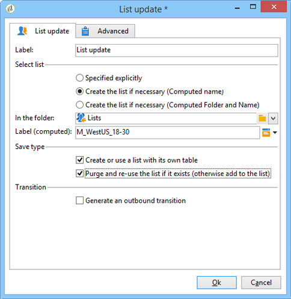

# Lijstupdate{#list-update}

In een **List-updateactiviteit** wordt de populatie die in de overgang is opgegeven, opgeslagen in een lijst met ontvangers.

U kunt de lijst selecteren in de lijst met bestaande groepen.

Deze kan ook worden gemaakt met behulp van de opties **[!UICONTROL Create the list if necessary (Computed name)]** en **[!UICONTROL Create the list if necessary (Computed Folder and Name)]** . Met deze opties kunt u het label van uw keuze selecteren om een lijst te maken en later de map waarin deze wordt opgeslagen. Het label kan ook automatisch worden gegenereerd door dynamische velden of een script in te voegen. De verschillende dynamische velden zijn beschikbaar in het pop-upmenu rechts van het label.

Als de lijst al bestaat, worden ontvangers toegevoegd aan de bestaande inhoud, tenzij u de **[!UICONTROL Purge the list if it exists (otherwise add to the list)]** optie inschakelt. In dit geval wordt de inhoud van de lijst vóór de update verwijderd.

Als u wilt dat de gemaakte of bijgewerkte lijst een andere tabel gebruikt dan de tabel voor ontvangers, controleert u de **[!UICONTROL Create or use a list with its own table]** optie.

Als u deze optie wilt gebruiken, moeten de desbetreffende specifieke tabellen zijn geconfigureerd in uw Adobe Campagne-exemplaar.

Over het algemeen betekent het opslaan van een doel in een lijst het einde van een workflow. Door gebrek, heeft de **[!UICONTROL List update]** activiteit daarom geen uitgaande overgang. Schakel de **[!UICONTROL Generate an outbound transition]** optie in om er een toe te voegen.

## Voorbeeld: Lijstupdate {#example--list-update}

In het volgende voorbeeld volgt de activiteit van de lijstupdate een vraag die mannen meer dan 30 richt die in Frankrijk wonen. De lijst wordt eerst gemaakt op basis van de resultaten van de query. Het zal dan worden bijgewerkt telkens als het van het werkschema wordt gelanceerd. Het kan bijvoorbeeld regelmatig worden gebruikt voor gerichte promotieaanbiedingen voor campagnes.

1. Voeg **[!UICONTROL list update activity]** direct na een vraag toe dan open het omhoog om het uit te geven.

   Raadpleeg [Query](../../workflow/using/query.md)voor meer informatie over het maken van een query in een workflow.

1. U kunt een label voor de activiteit selecteren.
1. Selecteer de **[!UICONTROL Create the list if necessary (Calculated name)]** optie om te tonen dat de lijst zal worden gecreeerd zodra het eerste werkschema is uitgevoerd, dan bijgewerkt met de volgende uitvoeringen.
1. Selecteer de map waarin u de lijst wilt opslaan.
1. Voer een label in voor de lijst. U kunt dynamische velden invoegen om automatisch de naam te genereren uit de lijst. In dit voorbeeld heeft de lijst dezelfde naam als de query om de inhoud ervan gemakkelijk te kunnen identificeren.
1. Laat de **[!UICONTROL Purge the list if it exists (otherwise add to the list)]** optie ingeschakeld om ontvangers te verwijderen die niet voldoen aan de doelcriteria en om de nieuwe criteria in de lijst in te voegen.
1. Laat de **[!UICONTROL Create or use a list with its own table]** optie ook ingeschakeld.
1. Laat de **[!UICONTROL Generate an outbound transition]** optie uitgeschakeld.
1. Klik **[!UICONTROL Ok]** en start de workflow.

   

   De lijst met overeenkomende ontvangers wordt vervolgens gemaakt of bijgewerkt.

Raadpleeg voor meer informatie de video [Een lijst met ontvangers](https://docs.campaign.adobe.com/doc/AC/en/Videos/Videos.html) maken.

## Invoerparameters {#input-parameters}

* tableName
* schema

Hiermee wordt de populatie aangegeven die in de groep moet worden opgeslagen.

## Uitvoerparameters {#output-parameters}

* groupId

Groep-id.
