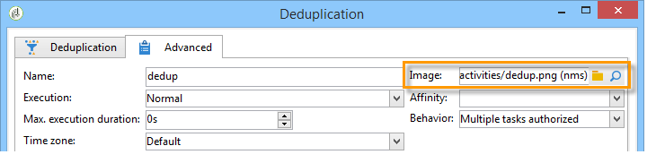

# Activiteitenafbeeldingen beheren{#managing-activity-images}

U kunt de afbeeldingen wijzigen die worden gebruikt in de diagrammen van de verschillende workflows. Zij moeten echter wel aan bepaalde voorwaarden voldoen. Hier volgen de fasen van de implementatie:

* Als u de achtergrondafbeelding wilt wijzigen, selecteert u de gewenste doelworkflow en klikt u op het **[!UICONTROL Properties]** tabblad.

   

   Als u de afbeelding wilt selecteren die u wilt gebruiken, klikt u op het **[!UICONTROL Select link]** pictogram rechts van het **[!UICONTROL Background image]** veld.

   >[!NOTE]
   >
   >De breedte in pixels van de achtergrondafbeelding moet een veelvoud van 4 zijn.

   

   Met het **[!UICONTROL Edit link]** pictogram kunt u de geselecteerde afbeelding bekijken.

* Als u de afbeelding wilt wijzigen die aan een activiteit is gekoppeld, dubbelklikt u op het object en klikt u op het **[!UICONTROL Advanced]** tabblad.

   Als u de afbeelding wilt selecteren die u wilt gebruiken, klikt u op het **[!UICONTROL Select link]** pictogram rechts van het **[!UICONTROL Image]** veld.

   

   Met het **[!UICONTROL Edit link]** pictogram kunt u de geselecteerde afbeelding bekijken.

   

>[!NOTE]
>
>De afbeeldingen die in het **[!UICONTROL Administration > Configuration > Images]** knooppunt van de structuur zijn opgeslagen, kunnen worden geselecteerd.
>  
>Afbeeldingen moeten de PNG-indeling hebben, met 48 x 48 pixels, 16 miljoen kleuren en een transparante achtergrond.

