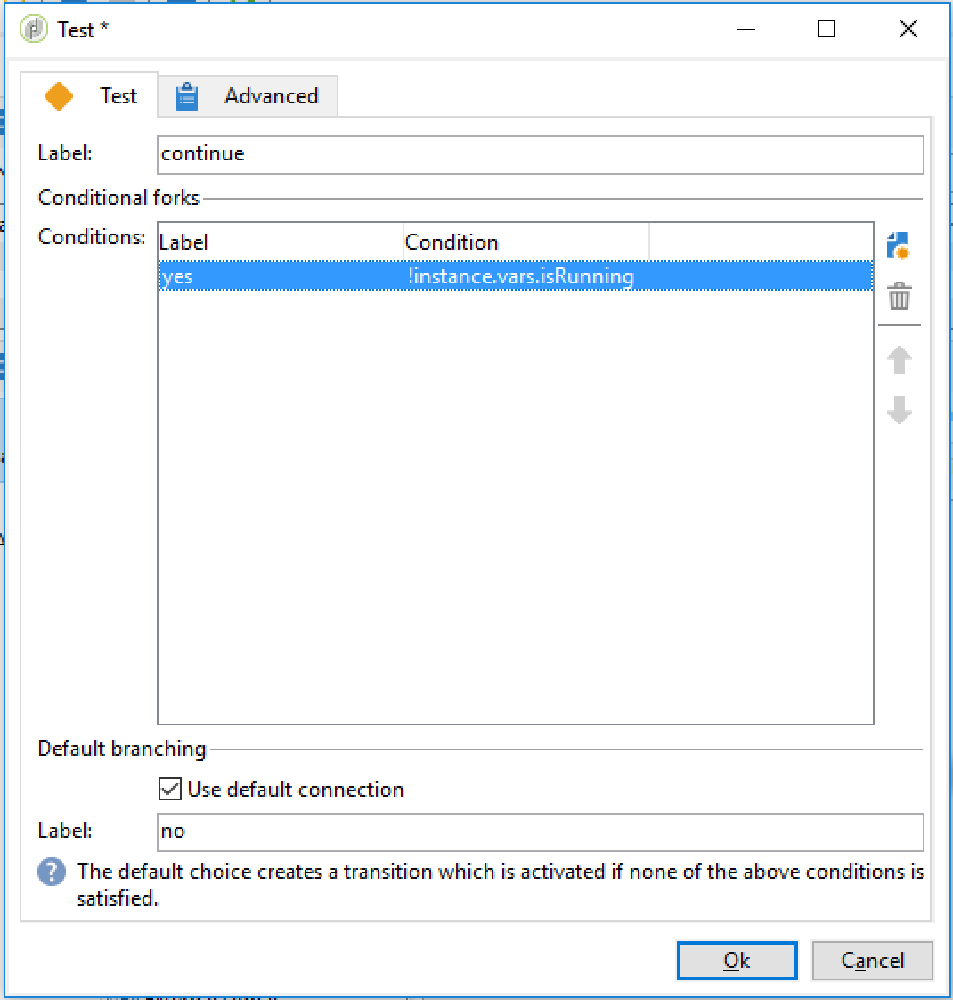

# Workflowuitvoering controleren {#monitoring-workflow-execution}

Deze sectie geeft informatie over hoe te om de uitvoering van uw werkschema&#39;s te controleren.

Een gebruiksgeval op hoe te om een werkschema tot stand te brengen dat u de status van een reeks werkschema&#39;s laat controleren die &quot;gepauzeerd&quot;zijn, &quot;tegengehouden&quot;of &quot;met fouten&quot;is ook beschikbaar in [deze sectie](../../workflow/using/supervising-workflows.md#supervising-workflows).

Bovendien kunnen beheerders van de instantie **Audittrail** gebruiken om activiteiten en laatste wijzigingen te controleren die aan werkschema&#39;s, de staat van uw werkschema&#39;s worden gedaan. Raadpleeg voor meer informatie de [toegewezen sectie](../../production/using/audit-trail.md).

Aanvullende manieren om de verschillende campagneprocessen te controleren worden weergegeven op [deze pagina](../../production/using/monitoring-guidelines.md).

## Voortgang {#displaying-progress} weergeven

U kunt de uitvoering controleren door de voortgang weer te geven met het juiste pictogram op de werkbalk.

Met het pictogram **[!UICONTROL Display progress information]** kunt u de status en het activiteitenresultaat weergeven in het uitvoeringsscherm.


Als deze optie is geselecteerd, worden uitgevoerde activiteiten in blauw weergegeven, knipperende activiteiten in behandeling, worden waarschuwingen in oranje weergegeven en fouten in rood. Met deze optie geeft u ook het resultaat weer van activiteiten bij de uitgaande overgang, gevolgd door het label van het resultaat zoals gedefinieerd in de eigenschappen activity en de duur van de taak als deze langer is dan één seconde


## Logbestanden {#displaying-logs} weergeven

Het logbestand bevat de geschiedenis of audittrail van de workflow. Hiermee worden alle gebruikersacties, alle uitgevoerde bewerkingen en aangetroffen fouten geregistreerd. U kunt:

* Selecteer de tab **[!UICONTROL Tracking]** in het detail. Deze lijst bevat alle workflowberichten.

   

* Filter de logboekberichten door activiteit. Klik hiertoe op **[!UICONTROL Display the tasks and the log]** op de werkbalk boven het diagram om de tabbladen **[!UICONTROL Log]** en **[!UICONTROL Tasks]** onder het diagram weer te geven. Selecteer een activiteit om alle verwante berichten te bekijken. Deze lijst bevat alle berichten als er geen activiteit is geselecteerd.

   

   >[!NOTE]
   >
   >Klik op de achtergrond van het diagram om de selectie van alle elementen op te heffen.

* Alleen die berichten weergeven die zijn gekoppeld aan een bepaalde taak. Om dit te doen, selecteer **[!UICONTROL Tasks]** tabel, en selecteer dan een activiteit in het diagram om de lijst te beperken. Dubbelklik op een taak om de informatie weer te geven; het laatste tabblad in het venster bevat het logboek.

   

   Met de knop **[!UICONTROL Details...]** kunt u alle aanvullende informatie over de uitvoering van de activiteit weergeven. U kunt bijvoorbeeld de validatieoperator weergeven en, indien van toepassing, de opmerking die ze tijdens de goedkeuring hebben ingevoerd, zoals in het volgende voorbeeld:

   

>[!NOTE]
>
>Het logbestand wordt niet gewist wanneer een workflow opnieuw wordt gestart. Alle berichten worden bewaard. Als u de berichten van een vorige uitvoering wilt verwijderen, moet u de geschiedenis wissen.

Het logboek toont de chronologische lijst van uitvoeringsberichten met betrekking tot het richten van werkschemaactiviteiten.

* Logboek van een doelgerichte campagne

   Zodra een het richten campagne is uitgevoerd, klik **[!UICONTROL Tracking]** lusje om het uitvoerspoor te bekijken.

   

   Alle campagneberichten worden getoond: uitgevoerde campagnes en waarschuwingen of fouten.

* Logboek van een activiteit

   U kunt het uitvoeringslogboek en de details van elke activiteit ook bekijken. Er zijn twee manieren om dit te doen:

   1. Selecteer de doelactiviteit en klik op het pictogram **[!UICONTROL Display the tasks and the log]**.

      

      In de onderste sectie van het diagram ziet u twee tabbladen: Logboek en taken.

      De activiteiten die binnen het diagram worden geselecteerd handelen als filters op het logboek en de taaklijst.

      

   1. Klik met de rechtermuisknop op de doelactiviteit en selecteer **[!UICONTROL Display logs]**.

      

      Het logboek wordt getoond in een afzonderlijk venster.

## De logbestanden {#purging-the-logs} leegmaken

Workflowgeschiedenis wordt niet automatisch gewist: alle berichten worden standaard gehouden. De geschiedenis kan worden gewist via het **[!UICONTROL File > Actions]** menu of door de **[!UICONTROL Actions]** knoop te klikken die in de toolbar boven de lijst wordt gevestigd. Selecteer **[!UICONTROL Purge history]**. De opties die beschikbaar zijn in het menu **[!UICONTROL Actions]** worden beschreven in het gedeelte [Handelingen werkbalk](../../workflow/using/starting-a-workflow.md).


## Werktabellen en workflowschema {#worktables-and-workflow-schema}

De workflow geeft worktables weer die via bepaalde activiteiten kunnen worden gemanipuleerd. Met Adobe Campaign kunt u via gegevensbeheeractiviteiten de kolommen van workflows aanpassen, hernoemen en verrijken, bijvoorbeeld om ze aan te passen aan de nomenclatuur afhankelijk van de behoeften van de klant, om aanvullende informatie te verzamelen over de co-begunstigde van een contract, enz.

Het is ook mogelijk om verbindingen tussen diverse het werkdimensies tot stand te brengen en afmetingsveranderingen te bepalen. Voor elk contract dat bijvoorbeeld in de database is opgenomen, richt u zich tot de hoofdhouder en gebruikt u de gegevens van de medehouder in de aanvullende informatie.

De werktabellen van de workflow worden automatisch verwijderd wanneer de workflow wordt gepassiveerd. Als u een werktabel wilt behouden, slaat u deze op in een lijst via de activiteit **[!UICONTROL List update]** (zie [Lijstupdate](../../workflow/using/list-update.md)).

## Fouten {#managing-errors} beheren

Wanneer een fout optreedt, wordt de werkstroom gepauzeerd en wordt de activiteit uitgevoerd wanneer de fout optrad met rood. In het werkschemaoverzicht (**[!UICONTROL Monitoring]** universum > **[!UICONTROL Workflows]** verbinding) kunt u werkschema&#39;s met slechts fouten tonen, zoals hieronder getoond.


In de Verkenner van Adobe Campaign, toont de werkschemalijst een **[!UICONTROL Failed]** kolom door gebrek.


Wanneer een workflow een fout bevat, worden de operatoren die tot de groep voor workflowtoezicht behoren, via e-mail op de hoogte gebracht, zolang hun e-mailadres in hun profiel wordt vermeld. Deze groep is geselecteerd in het veld **[!UICONTROL Supervisor(s)]** van de workfloweigenschappen.


De meldingsinhoud wordt geconfigureerd in de standaardsjabloon **[!UICONTROL Workflow manager notification]**: Deze sjabloon is geselecteerd op het tabblad **[!UICONTROL Execution]** van de workfloweigenschappen. Het bericht bevat de naam van de foutworkflow en de betreffende taak.

Voorbeeld van melding:


Met de koppeling hebt u toegang tot de Adobe Campaign-console in de webmodus en kunt u werken aan de foutworkflow nadat u zich hebt aangemeld.


U kunt de workflow zodanig configureren dat deze niet wordt onderbroken en verder wordt uitgevoerd in het geval van fouten. Hiervoor bewerkt u de workflow **[!UICONTROL Properties]** en selecteert u in de sectie **[!UICONTROL Error management]** de optie **[!UICONTROL Ignore]** in het veld **[!UICONTROL In case of error]**. Vervolgens kunt u opgeven hoeveel opeenvolgende fouten kunnen worden genegeerd voordat het proces wordt gepauzeerd.

In dit geval wordt de fouttaak afgebroken. Deze modus is vooral geschikt voor workflows die zijn ontworpen om de campagne later weer te geven (periodieke acties).


>[!NOTE]
>
>U kunt deze configuratie afzonderlijk toepassen voor elke activiteit. Hiervoor bewerkt u de eigenschappen van de activiteit en selecteert u de modus voor foutbeheer op het tabblad **[!UICONTROL Advanced]**.

Raadpleeg de [toegewezen sectie](../../production/using/workflow-execution.md) voor meer informatie over het oplossen van problemen bij de uitvoering van workflows.

## Fouten verwerken {#processing-errors}

Met betrekking tot activiteiten wordt met de optie **[!UICONTROL Process errors]** een specifieke overgang weergegeven die wordt ingeschakeld als een fout wordt gegenereerd. In dit geval gaat de workflow niet naar de foutmodus en gaat de uitvoering verder.

Fouten waarmee rekening wordt gehouden, zijn fouten in het bestandssysteem (het bestand kan niet worden verplaatst, de map kan niet worden geopend, enz.).

Deze optie verwerkt geen fouten met betrekking tot activiteitsconfiguratie, d.w.z. ongeldige waarden. Fouten met betrekking tot een onjuiste configuratie maken deze overgang niet mogelijk (map bestaat niet, enz.).

Als een werkstroom wordt gepauzeerd (handmatig of automatisch na een fout), start de knop **[!UICONTROL Start]** de werkstroomuitvoering opnieuw op de plaats waar deze is gestopt. De foutieve activiteit (of gepauzeerde activiteit) wordt opnieuw uitgevoerd. De vorige activiteiten worden niet opnieuw uitgevoerd.

Als u alle workflowactiviteiten opnieuw wilt uitvoeren, gebruikt u de knop **[!UICONTROL Restart]**.

Als u activiteiten wijzigt die al werden uitgevoerd, worden de wijzigingen niet in aanmerking genomen wanneer de werkstroom opnieuw wordt uitgevoerd.

Als u niet-uitgevoerde activiteiten wijzigt, wordt hiermee rekening gehouden wanneer de werkstroom opnieuw wordt uitgevoerd.

Als u gepauzeerde activiteiten wijzigt, kunnen de wijzigingen niet correct worden doorgevoerd wanneer de workflow opnieuw wordt gestart.

Indien mogelijk raden we u aan de workflow opnieuw te starten nadat u wijzigingen hebt aangebracht.

## Instantietoezicht {#instance-supervision}

Op de pagina **[!UICONTROL Instance supervision]** kunt u de Adobe Campaign-serveractiviteit weergeven en een lijst met workflows en leveringen met fouten weergeven.

Ga naar het **[!UICONTROL Monitoring]** universum en klik op de **[!UICONTROL General view]** koppeling om deze pagina te openen.


Klik op de koppeling **[!UICONTROL Workflows]** om alle workflows weer te geven. Gebruik de vervolgkeuzelijst om de workflows op het platform weer te geven op basis van hun status.


Klik op de koppeling in een workflow met fouten om deze te openen en het bijbehorende logboek weer te geven.


## Meerdere uitvoeringen voorkomen {#preventing-simultaneous-multiple-executions}

In één workflow kunnen meerdere uitvoeringen tegelijkertijd worden uitgevoerd. In sommige gevallen moet u dit voorkomen.

Bijvoorbeeld, kunt u een planner hebben die de werkschemauitvoering elk uur teweegbrengt, maar soms neemt de uitvoering van het volledige werkschema meer dan een uur. U kunt de uitvoering overslaan als de workflow al wordt uitgevoerd.

Als u een signaalactiviteit aan het begin van het werkschema hebt kunt u het signaal willen overslaan als het werkschema loopt.

Het algemene beginsel is als volgt:


De oplossing is een instantievariabele te gebruiken. Instantievariabelen worden gedeeld door alle parallelle uitvoeringen van de workflows.

Hier volgt een eenvoudige testworkflow:


De **[!UICONTROL Scheduler]** activeert elke minuut een gebeurtenis. De volgende **[!UICONTROL Test]** activiteit gaat **isRunning** instantievariabele testen om te beslissen al dan niet om de uitvoering voort te zetten:



>[!NOTE]
>
>**** isRunningis een veranderlijke naam die voor dit voorbeeld wordt gekozen. Dit is geen ingebouwde variabele.

De activiteit direct na **[!UICONTROL Test]** in de **yes** tak moet de instantievariabele in zijn **Initialisatiescript** plaatsen:

```
instance.vars.isRunning = true
```

De allerlaatste activiteit in de **yes** tak moet de variabele aan vals in zijn **Initialisatiescript** terugkeren:

```
instance.vars.isRunning = false
```

Let op:

* U kunt de huidige waarde van de instantievariabele controleren via het **tabblad Variabelen** in de workflow **Eigenschappen**.
* Instantievariabelen worden opnieuw ingesteld wanneer u een workflow opnieuw start.
* In JavaScript is een ongedefinieerde waarde in een test false, zodat de instantievariabele ook kan worden getest voordat deze is geïnitialiseerd.
* U kunt de activiteiten controleren die niet wegens dit mechanisme door een registrereninstructie aan het initialisatiescript van &quot;geen&quot;beëindigend worden verwerkt toe te voegen.

   ```
   logInfo("Workflow already running, parallel execution not allowed.");
   ```

In deze rubriek wordt een gebruiksgeval weergegeven: [Gegevensupdates coördineren](../../workflow/using/coordinating-data-updates.md).

## Databaseonderhoud {#database-maintenance}

Workflows gebruiken veel werktabellen die ruimte verbruiken en het hele platform vertragen als het niet wordt onderhouden. Raadpleeg voor meer informatie over databaseonderhoud deze [sectie](../../production/using/tables-to-maintain.md).

Met de **Database opschonen**-workflow die toegankelijk is via het knooppunt **Beheer > Productie > Technische workflows** kunt u verouderde gegevens verwijderen om exponentiële groei van de database te voorkomen. De workflow wordt automatisch geactiveerd zonder tussenkomst van de gebruiker. Zie deze [sectie](../../production/using/database-cleanup-workflow.md).

U kunt ook specifieke technische workflows maken om overbodige gegevensverbruikende ruimte te wissen. Zie deze [sectie](../../production/using/application-objects.md) en deze [pagina](#purging-the-logs).

## Afhandeling van gepauzeerde workflows {#handling-of-paused-workflows}

Als een werkstroom wordt gepauzeerd, worden de werktabellen standaard niet gewist. Vanaf build 8880 worden workflows die al te lang in een pauzestatus zijn gepauzeerd, automatisch gestopt en worden hun werktabellen gewist. Dit gedrag wordt als volgt geactiveerd:

* De werkschema&#39;s die sinds meer dan 7 dagen zijn gepauzeerd verschijnen als waarschuwing in het controledashboard (en controle API) en een bericht wordt verzonden naar de supervisorgroep.
* Dit gebeurt elke week wanneer de technische workflow **[!UICONTROL cleanupPausedWorkflows]** wordt geactiveerd. Raadpleeg [deze sectie](../../workflow/using/delivery.md) voor meer informatie over de workflow.
* Na 4 meldingen (dat wil zeggen een maand in de pauzestatus) wordt de workflow onvoorwaardelijk beëindigd. Er wordt een logboek weergegeven in de workflow nadat het is gestopt. De tabellen worden gewist bij de volgende uitvoeringsworkflow **[!UICONTROL cleanup]**

Deze periodes kunnen via de optie NmsServer_PausedWorkflowPeriod worden gevormd.

Workflowtoezichthouders worden op de hoogte gesteld. De maker en laatste gebruiker die de workflow heeft gewijzigd, wordt ook op de hoogte gesteld. Beheerders ontvangen de meldingen niet.

## Workflows filteren op basis van hun status {#filtering-workflows-status}

Met de Campaign Classic-interface kunt u de uitvoeringsstatus van alle workflows op uw instantie controleren met behulp van vooraf gedefinieerde **views**. Als u deze weergaven wilt openen, opent u het knooppunt **[!UICONTROL Administration]** / **[!UICONTROL Audit]** / **[!UICONTROL Workflows Status]**.

De volgende weergaven zijn beschikbaar:

* **[!UICONTROL Running]**: geeft een overzicht van alle actieve workflows.
* **[!UICONTROL Paused]**: geeft een overzicht van alle gepauzeerde workflows.
* **[!UICONTROL Failed]**: geeft alle mislukte workflows weer.
* **[!UICONTROL Start Pending]**: maakt een lijst van alle werkschema&#39;s die wachten om door het operationMgt proces te worden begonnen. Deze weergave is alleen beschikbaar bij het pakket **Marketingcampagnes** (zie [Standaardpakketten voor campagne installeren](../../installation/using/installing-campaign-standard-packages.md)).


Deze weergaven zijn standaard toegankelijk in de map **[!UICONTROL Audit]**. U kunt ze echter wel opnieuw maken op de locatie die u kiest in de mappenstructuur. Op deze manier zijn ze beschikbaar voor standaardgebruikers zonder beheerrechten.

Dit doet u als volgt:

1. Klik met de rechtermuisknop op de map waaraan u de weergave wilt toevoegen.
1. Selecteer in **[!UICONTROL Add new folder]** / **[!UICONTROL Administration]** de weergave die u wilt toevoegen.
1. Zodra de omslag aan de boom wordt toegevoegd, zorg ervoor u het als mening vormt, zodat het alle werkschema&#39;s toont, wat hun oorsprongomslag is.Voor meer op hoe te om meningen te vormen, verwijs naar [deze sectie](../../platform/using/access-management.md#adding-folders-and-creating-views).

Naast deze weergaven kunt u ook mappen met filters instellen waarmee u de lijst met workflows kunt filteren op basis van hun uitvoeringsstatus. Dit doet u als volgt:

1. Open een werkstroommap en selecteer vervolgens het menu **[!UICONTROL Filters]** / **[!UICONTROL Advanced filter]**.
1. Configureer het filter zodanig dat het veld **[!UICONTROL @status]** van de workflow gelijk is aan de status van uw keuze.
1. Sla het filter op en geef het een naam. Deze functie is dan rechtstreeks beschikbaar in de lijst met filters.


Raadpleeg de volgende secties voor meer informatie:

* [Geavanceerde filters maken](../../platform/using/creating-filters.md#creating-an-advanced-filter)
* [Filters opslaan](../../platform/using/creating-filters.md#saving-a-filter)
