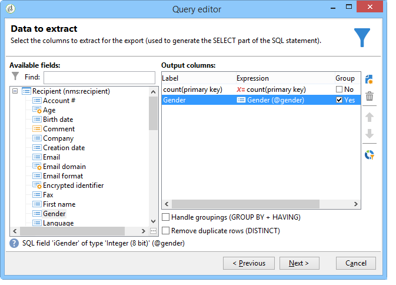

# Complexe computerverwerking uitvoeren {#performing-aggregate-computing}

In dit voorbeeld willen we het aantal ontvangers dat in Londen woont, op basis van geslacht tellen.

* Welke tabel moet worden geselecteerd?

   De tabel met ontvangers (**nms:ontvanger**)

* Welke gebieden in de outputkolom zouden moeten worden geselecteerd?

   Primaire sleutel (met telling) en Geslacht

* Op welke voorwaarden is de informatie gefilterd?

   Gebaseerd op de ontvangers die in Londen wonen

U kunt dit voorbeeld maken door de volgende stappen toe te passen:

1. Definieer in **[!UICONTROL Data to extract]** dit geval een telling voor de primaire sleutel (zoals in het vorige voorbeeld). Voeg het **[!UICONTROL Gender]** veld toe aan de uitvoerkolom. Schakel de **[!UICONTROL Group]** optie in de **[!UICONTROL Gender]** kolom in. Op deze manier worden de ontvangers gegroepeerd op geslacht.

   

1. Klik in het **[!UICONTROL Sorting]** venster op **[!UICONTROL Next]**: hier is geen sortering nodig .
1. Gegevensfiltering configureren. Hier wilt u de selectie beperken tot contacten die in Londen wonen.

   

   >[!NOTE]
   >
   >Waarden zijn hoofdlettergevoelig. Als de waarde &#39;Londen&#39; in de voorwaarde wordt ingevoerd zonder een hoofdletter en de lijst met ontvangers het woord &#39;Londen&#39; met een hoofdletter bevat, zal de zoekopdracht mislukken.

1. Klik in het **[!UICONTROL Data formatting]** venster op **[!UICONTROL Next]**: voor dit voorbeeld is geen opmaak vereist.
1. Klik in het voorvertoningsvenster op **[!UICONTROL Launch data preview]**.

   Er zijn drie verschillende waarden voor elke soort naar geslacht: **2** voor vrouwen, **1** voor mannen en **0** als het geslacht onbekend is. In dit voorbeeld bevat de lijst 10 vrouwen, 16 mannen en 2 mensen wier geslacht onbekend is.

   
