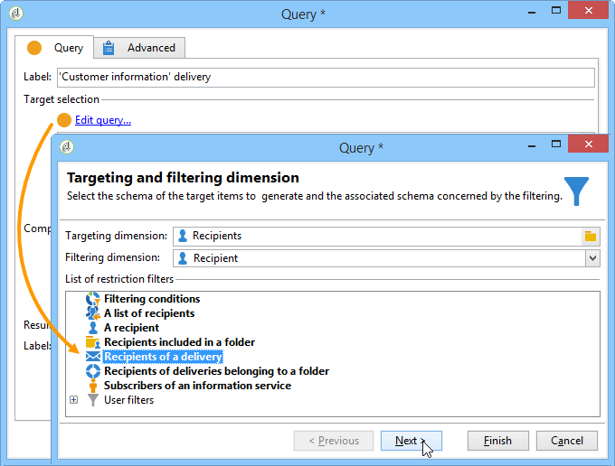
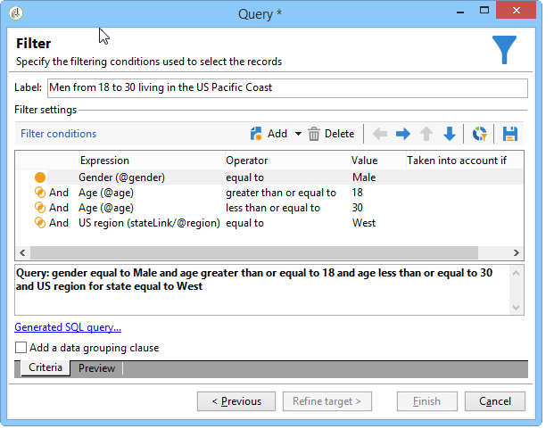
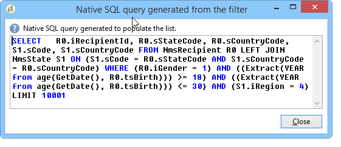

# Query{#query}

## Een query maken {#creating-a-query}

Met een query kunt u een doel selecteren op basis van criteria. U kunt een segmentcode aan het vraagresultaat associëren en extra gegevens opnemen in het.
Voor meer informatie over vraagsteekproeven, verwijs naar deze [deze sectie](../../workflow/using/querying-recipient-table.md).

>[!NOTE]
>
>Query-activiteiten zijn niet compatibel met CLOB-velden wanneer u Oracle gebruikt.

Raadpleeg Gegevens [toevoegen voor meer informatie over het gebruik en het beheer van aanvullende gegevens](#adding-data).

Met de **[!UICONTROL Edit query...]** koppeling kunt u het doeltype, de beperkingen en de selectiecriteria voor de bevolking als volgt definiëren:

1. Selecteer het richten en het filtreren dimensie. Standaard is het doel geselecteerd bij de ontvangers. De lijst met restrictiefilters is gelijk aan de lijst die wordt gebruikt voor het opgeven van doelen.

   De doelgerichte dimensie valt samen met het soort element waaraan wij zullen werken, bijvoorbeeld de bevolking die voor de operatie in aanmerking komt.

   De filterdimensie maakt het mogelijk deze elementen te verzamelen, bijvoorbeeld informatie over de doelpersoon (contracten, volledige en definitieve schikkingen, enz.).

   Voor meer op dit, verwijs naar het [richten van en het filtreren dimensies](../../workflow/using/building-a-workflow.md#targeting-and-filtering-dimensions).

   

   Een vraag kan op gegevens van de binnenkomende overgang worden gebaseerd, indien nodig, door te selecteren **[!UICONTROL Temporary schema]** wanneer het kiezen van het richten en het filtreren dimensies.

   

1. Definieer de populaties met de wizard. De velden die moeten worden ingevoerd, kunnen verschillen afhankelijk van het type doel. U kunt een voorvertoning van de doelpopulatie met uw huidige criteria weergeven via het **[!UICONTROL Preview]** tabblad.

   Raadpleeg deze [sectie](../../platform/using/filtering-options.md)voor meer informatie over het maken en gebruiken van filters of query&#39;s.

   

1. Als u **[!UICONTROL Filtering conditions]** in stap 1 of met de optie **[!UICONTROL Filters]** > **[!UICONTROL Advanced filter...]** hebt geselecteerd, moet u later handmatig filtercriteria toevoegen.

   U kunt ook voorwaarden voor gegevensgroepering toevoegen door het desbetreffende vak in te schakelen. Om dit te doen, moet de het filtreren afmeting aan de het richten van vraag afmeting verschillend zijn. Zie deze [sectie](../../workflow/using/querying-using-grouping-management.md)voor meer informatie over groeperen.

   U kunt meer criteria ook toevoegen door de bouwer van de Uitdrukking te gebruiken en het te combineren met de logische opties EN, OF, en BEHALVE. Vervolgens kunt u een voorbeeld bekijken van de combinatie **[!UICONTROL Corresponding SQL query...]** van criteria. Zie deze [sectie](../../platform/using/defining-filter-conditions.md#building-expressions)voor meer informatie.

   Sla het filter op als u het later opnieuw wilt gebruiken.

   

## Gegevens toevoegen {#adding-data}

In de aanvullende kolommen kunt u aanvullende informatie over de doelpopulatie verzamelen, bijvoorbeeld contractnummers, abonnementen op nieuwsbrieven of oorsprong. Deze gegevens kunnen worden opgeslagen in de Adobe Campagne-database of in een externe database.

Met de **[!UICONTROL Add data...]** koppeling kunt u de aanvullende gegevens selecteren die u wilt verzamelen.

Selecteer eerst het type gegevens dat u wilt toevoegen:

* Selecteer deze optie **[!UICONTROL Data linked to the filtering dimension]** om de gegevens in de Adobe Campagne-database te selecteren.
* Selecteer **[!UICONTROL External data]** om gegevens uit een externe database toe te voegen. Deze optie is alleen beschikbaar als u de optie **Federated Data Access** hebt aangeschaft. Raadpleeg [Toegang tot een externe database (FDA)](../../workflow/using/accessing-an-external-database--fda-.md)voor meer informatie hierover.
* Selecteer de **[!UICONTROL An offer proposition]** optie om een reeks kolommen toe te voegen die u de beste die voorstel laten opslaan door de aanbiedingsmotor wordt geproduceerd. Deze optie is alleen beschikbaar als u de module **Interactie** hebt aangeschaft.

Als er geen optionele module op het platform is geïnstalleerd, wordt dit werkgebied niet weergegeven. U wordt rechtstreeks naar de volgende fase geleid.

Gegevens toevoegen uit de Adobe Campagne-database:

1. Selecteer het type gegevens dat u wilt toevoegen. Dit kunnen gegevens zijn die tot de het filtreren afmeting of gegevens behoren die in verbonden lijsten worden opgeslagen.

   

1. Als de gegevens tot de het filtreren dimensie van de vraag behoren, selecteer eenvoudig het in de lijst van beschikbare gebieden om het in de outputkolommen te tonen.

   

   U kunt toevoegen:

   * Een veld dat wordt berekend op basis van gegevens van de doelpopulatie of een geaggregeerd (aantal lopende aankopen in de laatste maand, gemiddeld bedrag van een ontvangstbewijs enz.). Ga bijvoorbeeld naar Gegevens selecteren.
   * Een nieuw veld, gemaakt met de **[!UICONTROL Add]** knop rechts van de lijst met uitvoerkolommen.

      U kunt ook een verzameling gegevens toevoegen, zoals een lijst met contracten, de laatste vijf leveringen, enzovoort. Verzamelingen komen overeen met velden die meerdere waarden kunnen hebben voor hetzelfde profiel (1-N relatie). Zie Aanvullende gegevens bewerken voor meer informatie.

Een verzameling gegevens toevoegen die verband houden met een doelgroep:

1. Selecteer in de eerste stap van de wizard de **[!UICONTROL Data linked to the filtering dimension]** optie:
1. Selecteer de tabel met de gegevens die u wilt verzamelen en klik op **[!UICONTROL Next]**.

   

1. Geef indien nodig het aantal elementen van de verzameling op dat u wilt behouden door een van de waarden in het **[!UICONTROL Data collected]** veld te selecteren. Standaard worden alle regels van de collectie hersteld en gefilterd volgens de voorwaarden die in de volgende stap zijn opgegeven.

   * Als één enkel element van de inzameling met de het filtreren voorwaarden voor deze inzameling samenvalt, selecteer **[!UICONTROL Single row]** op het **[!UICONTROL Data collected]** gebied.

      >[!IMPORTANT]
      >
      >Deze wijze optimaliseert de SQL vraag die dankzij een directe verbinding op de inzamelingselementen wordt geproduceerd.
      >
      >Als niet aan de oorspronkelijke voorwaarde wordt voldaan, kan het resultaat onjuist zijn (ontbrekende of overlappende lijnen).

   * Als u meerdere regels wilt herstellen (**[!UICONTROL Limit the line count]**), kunt u opgeven hoeveel regels moeten worden verzameld.
   * Indien de verzamelde kolommen aggregaten bevatten, bijvoorbeeld het aantal gedeclareerde fouten, de gemiddelde uitgaven op een locatie, enz. U kunt de **[!UICONTROL Aggregates]** waarde gebruiken.
   

1. Geef de subselectie van de verzameling op. Bijvoorbeeld: alleen aankopen in de afgelopen 15 dagen.

   

1. Als u de **[!UICONTROL Limit the line count]** optie hebt geselecteerd, definieert u de volgorde waarin de verzamelde gegevens moeten worden gefilterd. Zodra het aantal verzamelde lijnen meer dan het aantal lijnen is dat u specificeerde om te houden, staat de het filtreren orde u toe om te specificeren welke lijnen te houden.

## Voorbeeld: Afstemmen op eenvoudige attributen voor ontvangers {#example--targeting-on-simple-recipient-attributes}

In het volgende voorbeeld probeert de query mannen tussen 18 en 30 jaar te identificeren die in Frankrijk wonen. Deze query wordt gebruikt in een workflow die als doel heeft deze bijvoorbeeld tot een exclusieve aanbieding te maken.

>[!NOTE]
>
>Extra vraagsteekproeven worden voorgesteld in [deze sectie](../../workflow/using/querying-recipient-table.md).

1. Geef de query een naam en selecteer de **[!UICONTROL Edit query...]** koppeling.
1. Selecteer dit **[!UICONTROL Filtering conditions]** in de lijst met beschikbare filtertypen.
1. Voer de verschillende criteria voor het voorgestelde doel in. De volgende criteria worden gecombineerd met de optie AND. Om in de selectie te worden opgenomen, moeten de ontvangers aan de volgende vier voorwaarden voldoen:

   * Ontvangers met de titel &quot;Mr.&quot; (kan ook worden gevonden in het veld **Genderkwesties** en door **Mannelijk** als waarde te selecteren).
   * Ontvangers jonger dan 30 jaar.
   * Ontvangers ouder dan 18 jaar.
   * Ontvangers die in Frankrijk wonen.
   

   U kunt de SQL bekijken die uw criteria combineert:

   

1. U kunt controleren of uw criteria correct zijn door op het relevante tabblad een voorvertoning weer te geven van de ontvangers die overeenkomen met uw query:

   

1. Sla de filters op zodat u ze later weer kunt gebruiken door op **[!UICONTROL Finish]** > **[!UICONTROL OK]** te klikken.
1. Ga door met het bewerken van uw workflow door er andere activiteiten aan toe te voegen. Zodra het is gelanceerd en de vorige vraagstap gebeëindigd, zal het aantal gevonden ontvangers worden getoond. U kunt meer details tonen gebruikend het muis pop-up menu (klik de overgang met de rechtermuisknop aan > **[!UICONTROL Display the target...]**).

   

## Uitvoerparameters {#output-parameters}

* tableName
* schema
* recCount

Deze reeks van drie waarden identificeert de bevolking die door de vraag wordt gericht. **[!UICONTROL tableName]** is de naam van de lijst die de doelherkenningstekens registreert, **[!UICONTROL schema]** is het schema van de bevolking (gewoonlijk nms:ontvanger) en **[!UICONTROL recCount]** is het aantal elementen in de lijst.

Deze waarde is het schema van de het werklijst. Deze parameter is geldig voor alle overgangen met **[!UICONTROL tableName]** en **[!UICONTROL schema]**.

## Uw query&#39;s optimaliseren {#optimizing-queries}

In de onderstaande sectie vindt u tips en trucs voor het optimaliseren van query&#39;s die op Adobe Campagne worden uitgevoerd, zodat de werkbelasting voor de database wordt beperkt en de gebruikerservaring wordt verbeterd.

### Verbindingen en indexen {#joins-and-indexes}

* De efficiënte vragen baseren zich op indexen.
* Gebruik een index voor alle verbindingen.
* Het bepalen van verbindingen op het schema zal bepalen toetreedt voorwaarden. De gekoppelde tabel moet een unieke index hebben op de primaire sleutel en de samenvoeging moet zich in dit veld bevinden.
* Verbindingen uitvoeren door sleutels op numerieke gebieden in plaats van koordgebieden te bepalen.
* Vermijd het uitvoeren van buitenste verbindingen. Gebruik waar mogelijk de Nul-id-record om de functie voor buitenste verbindingen te bereiken.
* Gebruik het correcte gegevenstype voor verbindingen.

   Zorg ervoor dat de `where` component van hetzelfde type is als het veld.

   Een algemene fout is: `iBlacklist='3'` waarbij `iBlacklist` het een numeriek veld is en `3` een tekstwaarde.

   Zorg ervoor u weet wat het uitvoeringsplan van uw vraag zal zijn. Vermijd volledig lijstaftasten, vooral voor vragen in real time of dichtbij vragen in real time die elke minuut lopen.

Voor meer op dit, verwijs naar[de modelbeste praktijken](https://helpx.adobe.com/campaign/kb/acc-data-model-best-practices.html) van Gegevens en de secties van de [afbeelding](../../configuration/using/database-mapping.md) van het Gegevensbestand.

### Functies {#functions}

* Houd rekening met functies als `Lower(...)`. Wanneer de functie Lower wordt gebruikt, wordt de Index niet gebruikt.
* Controleer query&#39;s met de ‘soortgelijke’ instructie of de ‘bovenste’ of ‘onderste’ instructies zorgvuldig. Pas &quot;Upper&quot;op de gebruikersinput, niet op het gegevensbestandgebied toe.

   Zie [deze sectie](../../platform/using/defining-filter-conditions.md#list-of-functions)voor meer informatie over functies.

### Afmetingen filteren {#filtering-dimensions}

Gebruik de het filtreren dimensie van de vraag in plaats van het gebruiken van &quot;bestaat zoals&quot;exploitant.

In query&#39;s zijn &#39;bestaat zoals&#39;-voorwaarden in filters niet efficiënt. Ze zijn het equivalent van een subquery in SQL:

`select iRecipientId from nmsRecipient where iRecipientId IN (select iRecipientId from nmsBroadLog where (...))`

De beste praktijken moeten in plaats daarvan de het filtreren afmeting van de vraag gebruiken:

Het equivalent van de het filtreren afmeting in SQL is de binnenpartij:

`select iRecipientId from nmsRecipient INNER JOIN nmsBroadLog ON (...)`

Raadpleeg [deze sectie](../../workflow/using/building-a-workflow.md#targeting-and-filtering-dimensions)voor meer informatie over filterafmetingen.

### Architectuur {#architecture}

* Bouw een ontwikkelingsplatform met gelijkaardige volumes, parameters, en architectuur als productieplatform.
* Gebruik dezelfde waarden voor de ontwikkelings- en productieomgeving. Gebruik zoveel mogelijk hetzelfde:

   * Besturingssysteem
   * Versie,
   * gegevens,
   * toepassing,
   * Volumes.
   >[!NOTE]
   >
   >Een functie die in een ontwikkelomgeving werkt, werkt mogelijk niet in een productieomgeving waarin de gegevens verschillend kunnen zijn. Probeer de belangrijkste verschillen vast te stellen om risico&#39;s te anticiperen en oplossingen voor te bereiden.

* Maak configuraties die overeenkomen met de doelvolumes. Voor grote volumes zijn specifieke configuraties vereist. Een configuratie die voor 100.000 ontvangers werkte kan niet voor 10.000.000 ontvangers werken.

   Bedenk hoe het systeem wordt geschaald wanneer het live gaat. Enkel omdat iets op kleine schaal werkt, betekent dat niet dat het geschikt zal zijn met grotere volumes. De tests moeten worden uitgevoerd met volumes die vergelijkbaar zijn met het productievolume. U zou ook het effect van veranderingen in volumes (aantal vraag, grootte van het gegevensbestand) bij piekuren, piekdagen, en over het leven van het project moeten evalueren.
