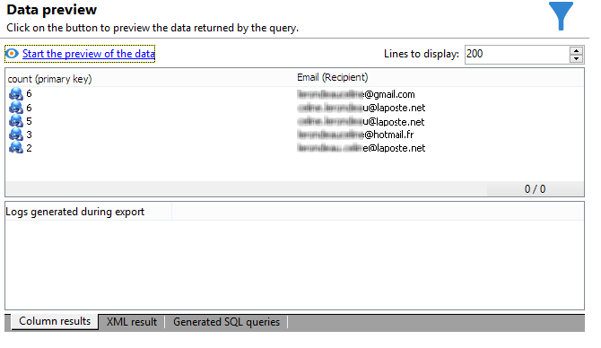
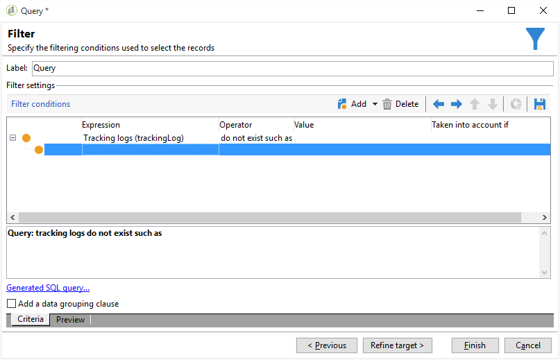

# Leveringsgegevens opvragen {#querying-delivery-information}

## Aantal klikken voor een specifieke levering {#number-of-clicks-for-a-specific-delivery}

In dit voorbeeld, kijken wij terug het aantal klikken voor een specifieke levering. Deze kliks worden geregistreerd dankzij ontvankelijke die logboeken volgen over een bepaalde periode worden genomen. De ontvanger wordt geïdentificeerd via zijn e-mailadres. Deze query gebruikt de **[!UICONTROL Recipient tracking logs]** tabel.

* Welke tabel moet worden geselecteerd?

   De tabel voor bijhouden van het logboek van ontvangers (**[!UICONTROL nms:trackingLogRcp]**)

* Velden die moeten worden geselecteerd voor uitvoerkolommen?

   Primaire sleutel (met aantal) en E-mail

* Op basis van welke criteria wordt de informatie gefilterd?

   Een specifieke periode en een element van het leveringsetiket

Voer de volgende stappen uit om dit voorbeeld uit te voeren:

1. Open het schema **[!UICONTROL Generic query editor]** en selecteer het **[!UICONTROL Recipient tracking logs]** schema.

   

1. In het **[!UICONTROL Data to extract]** venster willen we een aggregaat maken om informatie te verzamelen. Hiervoor voegt u de primaire sleutel toe (boven het hoofdelement): **[!UICONTROL Recipient tracking logs]** Het bijhouden van het aantal logbestanden wordt uitgevoerd in dit **[!UICONTROL Primary key]** veld. De bewerkte expressie wordt **[!UICONTROL x=count(primary key)]** gebruikt. De som van de verschillende trackinglogboeken wordt aan één e-mailadres gekoppeld.

   Dit doet u als volgt:

   * Klik op het **[!UICONTROL Add]** pictogram rechts van het **[!UICONTROL Output columns]** veld. Selecteer de **[!UICONTROL Formula type]** optie in het **[!UICONTROL Edit the formula using an expression]** venster en klik op **[!UICONTROL Next]**. Klik in het **[!UICONTROL Field to select]** venster op **[!UICONTROL Advanced selection]**.

      

   * Voer in het **[!UICONTROL Formula type]** venster een proces uit op de statistische functie. Dit proces zal een primaire zeer belangrijke telling zijn.

      Selecteer **[!UICONTROL Process on an aggregate function]** in de **[!UICONTROL Aggregate]** sectie en klik **[!UICONTROL Count]**.

      

      Klik **[!UICONTROL Next]**.

   * Selecteer het **[!UICONTROL Primary key (@id)]** veld. De **[!UICONTROL count (primary key)]** outputkolom wordt gevormd.

      

1. Selecteer het andere veld dat in de uitvoerkolom moet worden weergegeven. Open in de **[!UICONTROL Available fields]** kolom het **[!UICONTROL Recipient]** knooppunt en kies **[!UICONTROL Email]**. Schakel het **[!UICONTROL Group]** selectievakje in om de trackinglogboeken te **[!UICONTROL Yes]** groeperen op e-mailadres: deze groep verbindt elk logboek aan zijn ontvanger.

   

1. Vorm kolomsortering zodat de actiefste ontvangers (met de meeste het volgen logboeken) eerst worden getoond. Controleer **[!UICONTROL Yes]** in de **[!UICONTROL Descending sort]** kolom.

   

1. Vervolgens filtert u de logboeken die u interesseert, dat wil zeggen de logboeken die jonger zijn dan twee weken en die betrekking hebben op leveranties.

   Dit doet u als volgt:

   * Gegevensfiltering configureren. Selecteer **[!UICONTROL Filter conditions]** vervolgens **[!UICONTROL Next]** en klik op deze knop.

      

   * Herstel het volgen logboeken over een bepaalde periode voor een specifieke levering. Er zijn drie filtervoorwaarden nodig: twee datumvoorwaarden om de zoekperiode in te stellen tussen twee weken vóór de huidige datum en de dag vóór de huidige datum; en een andere voorwaarde om de zoekopdracht te beperken tot een bepaalde levering.

      In het **[!UICONTROL Target element]** venster, vorm de datum beginnend waarvan het volgen logboeken in overweging zullen worden genomen. Klik **[!UICONTROL Add]**. Er wordt een voorwaardelijn weergegeven. Bewerk de **[!UICONTROL Expression]** kolom door op de **[!UICONTROL Edit expression]** functie te klikken. Kies in het **[!UICONTROL Field to select]** venster **[!UICONTROL Date (@logDate)]**.

      

      Selecteer de **[!UICONTROL greater than]** operator. Klik in de **[!UICONTROL Value]** kolom **[!UICONTROL Edit expression]** en selecteer in het **[!UICONTROL Formula type]** venster **[!UICONTROL Process on dates]**. Tot slot, in **[!UICONTROL Current date minus n days]**, ga &quot;15&quot;in.

      Klik **[!UICONTROL Finish]**.

      

   * Als u de einddatum van de zoekopdracht in het trackinglogboek wilt selecteren, maakt u een tweede voorwaarde door op **[!UICONTROL Add]** te klikken. Kies **[!UICONTROL Expression]** nogmaals in de **[!UICONTROL Date (@logDate)]** kolom.

      Selecteer de **[!UICONTROL less than]** operator. Klik in de **[!UICONTROL Value]** kolom op **[!UICONTROL Edit expression]**. Ga voor datumverwerking naar het **[!UICONTROL Formula type]** venster en voer &quot;1&quot; in **[!UICONTROL Current date minus n days]**.

      Klik **[!UICONTROL Finish]**.

      

      Nu willen wij de derde filtervoorwaarde, d.w.z. het leveringsetiket vormen dat onze vraag betrekking heeft.

   * Klik op de **[!UICONTROL Add]** functie om een andere filtervoorwaarde te maken. Klik in de **[!UICONTROL Expression]** kolom op **[!UICONTROL Edit expression]**. Kies in het **[!UICONTROL Field to select]** venster **[!UICONTROL Label]** de **[!UICONTROL Delivery]** node.

      Klik **[!UICONTROL Finish]**.

      

      Zoek naar een levering die het woord &quot;verkoop&quot;bevat. Aangezien u niet zijn nauwkeurige etiket herinnert, kunt u de **[!UICONTROL contains]** exploitant kiezen en &quot;verkoop&quot;in de **[!UICONTROL Value]** kolom ingaan.

      

1. Klik **[!UICONTROL Next]** tot u aan het **[!UICONTROL Data preview]** venster krijgt: hier is geen opmaak nodig .
1. Klik in het **[!UICONTROL Data preview]** venster **[!UICONTROL Start the preview of the data]** om het aantal trackinglogboeken voor elke ontvanger van de levering weer te geven.

   Het resultaat wordt in aflopende volgorde weergegeven.

   

   Het hoogste aantal logboeken voor een gebruiker is 6 voor deze levering. Vijf verschillende gebruikers hebben het bezorgingsbericht geopend of op een van de koppelingen in het e-mailbericht geklikt.

## Ontvangers die geen levering hebben geopend {#recipients-who-did-not-open-any-delivery}

In dit voorbeeld willen we ontvangers filteren die de afgelopen 7 dagen geen e-mail hebben geopend.

U kunt dit voorbeeld maken door de volgende stappen toe te passen:

1. Sleep een **[!UICONTROL Query]** activiteit naar een werkstroom en open de activiteit.
1. Klik **[!UICONTROL Edit query]** en plaats de doel en het filtreren afmetingen aan **[!UICONTROL Recipients]**.

   

1. Selecteer **[!UICONTROL Filtering conditions]** en klik op **[!UICONTROL Next]**.
1. Klik op de **[!UICONTROL Add]** knop en selecteer **[!UICONTROL Tracking logs]**.
1. Stel de **[!UICONTROL Operator]** van de **[!UICONTROL Tracking logs]** expressie in op **[!UICONTROL Do not exist such as]**.

   

1. Voeg nog een expressie toe. Selecteer **[!UICONTROL Type]** in de **[!UICONTROL URL]** categorie.
1. Stel vervolgens het **[!UICONTROL Operator]** in op **[!UICONTROL equal to]** en **[!UICONTROL Value]** op **[!UICONTROL Open]**.

   

1. Voeg nog een expressie toe en selecteer **[!UICONTROL Date]**. **[!UICONTROL Operator]** moet worden ingesteld op **[!UICONTROL on or after]**.

   

1. Klik op de **[!UICONTROL Edit expression]** knop in het **[!UICONTROL Value]** veld om de waarde in te stellen die 7 dagen in beslag is genomen.
1. Selecteer in de **[!UICONTROL Function]** categorie **[!UICONTROL Current date minus n days]** het aantal dagen dat u als doel wilt instellen en voeg het aantal dagen toe. Hier willen we ons richten op de laatste 7 dagen.

   

De uitgaande overgang bevat ontvangers die de afgelopen 7 dagen geen e-mail hebben geopend.

Als u daarentegen ontvangers wilt filteren die ten minste één e-mail hebben geopend, moet uw query er als volgt uitzien. Let op: in dit geval **[!UICONTROL Filtering dimension]** moet de waarde worden ingesteld op **[!UICONTROL Tracking logs (Recipients)]**.

## Ontvangers die een levering hebben geopend {#recipients-who-have-opened-a-delivery}

In het volgende voorbeeld ziet u hoe u zich kunt richten op profielen die de levering in de afgelopen twee weken hebben geopend:

1. Als u profielen wilt aanwijzen die een levering hebben geopend, moet u trackinglogboeken gebruiken. ze worden opgeslagen in een gekoppelde tabel: Selecteer eerst deze tabel in de vervolgkeuzelijst van het **[!UICONTROL Filtering dimension]** veld, zoals hieronder wordt weergegeven:

   

1. Klik met betrekking tot filtervoorwaarden op het **[!UICONTROL Edit expression]** pictogram van de criteria in de subboomstructuur van de trackinglogboeken. Selecteer het **[!UICONTROL Date]** veld.

   

   Klik **[!UICONTROL Finish]** om de selectie te bevestigen.

   Selecteer de **[!UICONTROL Greater than]** operator om alleen de trackinglogboeken van minder dan twee weken oud te herstellen.

   

   Klik vervolgens op het **[!UICONTROL Edit expression]** pictogram in de **[!UICONTROL Value]** kolom om de toe te passen berekeningsformule te definiëren. Selecteer de **[!UICONTROL Current date minus n days]** formule en typ 15 in het verwante veld.

   

   Klik op de **[!UICONTROL Finish]** knop van het formulevenster. Klik in het filtervenster op het **[!UICONTROL Preview]** tabblad om de criteria voor het aanwijzen van doelen te controleren.

   

## Het gedrag van ontvangers filteren na levering {#filtering-recipients--behavior-folllowing-a-delivery}

In een werkstroom kunt u met de **[!UICONTROL Query]** vakken en **[!UICONTROL Split]** vakken een gedrag selecteren dat volgt op een eerdere levering. Deze selectie wordt uitgevoerd via het **[!UICONTROL Delivery recipient]** filter.

* Doel van het voorbeeld

   In een leveringswerkstroom zijn er verschillende manieren om een eerste e-mailcommunicatie te volgen. Bij dit type bewerking wordt het **[!UICONTROL Split]** vak gebruikt.

* Context

   Er wordt een aanbod voor de zomersport verzonden. Vier dagen na de levering worden twee andere leveringen verzonden. Een daarvan is &quot;watersportaanbod&quot;, de andere is een follow-up van de eerste &quot;Zomersportaanbieding&quot;.

   De levering &quot;Watersportaanbod&quot; wordt verzonden naar ontvangers die bij de eerste levering op de link &quot;Watersport&quot; hebben geklikt. Deze kliks tonen aan dat de ontvanger in het onderwerp geinteresseerd is. Het heeft zin om ze naar soortgelijke aanbiedingen te sturen. Ontvangers die niet op het zomersportaanbod hebben geklikt, krijgen echter weer dezelfde inhoud.

De volgende stappen tonen u hoe te om de **[!UICONTROL Split]** doos te vormen door twee verschillende gedrag te integreren:

1. Voeg het **[!UICONTROL Split]** vak in de workflow in. Deze doos zal de ontvangers van de eerste levering in de volgende twee leveringen verdelen. De onderbreking komt voor gebaseerd op de het filtreren voorwaarden verbonden aan ontvankelijk gedrag tijdens de eerste levering.

   

1. Open het **[!UICONTROL Split]** vak. Voer op het **[!UICONTROL General]** tabblad een label in: **Splitsen op basis van bijvoorbeeld gedrag** .

   

1. Definieer op het **[!UICONTROL Subsets]** tabblad de eerste gesplitste vertakking. Voer bijvoorbeeld het label **Klikken** voor deze vertakking in.
1. Selecteer de **[!UICONTROL Add a filtering condition on the incoming population]** optie. Klik **[!UICONTROL Edit]**.
1. Dubbelklik in het **[!UICONTROL Targeting and filtering dimension]** venster op het **[!UICONTROL Recipients of a delivery]** filter.

   

1. Selecteer in het **[!UICONTROL Target element]** venster het gedrag dat u op deze vertakking wilt toepassen: **[!UICONTROL Recipients having clicked (email)]**.

   Selecteer hieronder de **[!UICONTROL Delivery specified by the transition]** optie. Deze functionaliteit zal automatisch de mensen herstellen die tijdens de eerste levering worden gericht.

   Dit is de levering van het &quot;Watersportaanbod&quot;.

   

1. De tweede vertakking definiëren. Deze vertakking bevat het e-mailbericht met dezelfde inhoud als voor de eerste levering. Ga naar het **[!UICONTROL Subsets]** tabblad en klik **[!UICONTROL Add]** om het te maken.

   

1. Er wordt een ander subtabblad weergegeven. Geef de naam &quot;**Heeft niet geklikt**&quot;.
1. Klik **[!UICONTROL Add a filtering condition for the incoming population]**. Klik vervolgens **[!UICONTROL Edit...]**.

   

1. Klik **[!UICONTROL Delivery recipients]** in het **[!UICONTROL Targeting and filtering dimension]** venster.
1. Selecteer het **[!UICONTROL Target element]** gedrag in het **[!UICONTROL Recipients who did not click (email)]** venster. Selecteer de **[!UICONTROL Delivery specified by the transition]** optie die wordt weergegeven voor de laatste vertakking.

   Het **[!UICONTROL Split]** vak is nu volledig geconfigureerd.

   

Hieronder ziet u de lijst met de diverse componenten die standaard zijn geconfigureerd:

* **[!UICONTROL All recipients]**
* **[!UICONTROL Recipients of successfully sent messages,]**
* **[!UICONTROL Recipients who opened or clicked (email),]**
* **[!UICONTROL Recipients who clicked (email),]**
* **[!UICONTROL Recipients of a failed message,]**
* **[!UICONTROL Recipients who didn't open or click (email),]**
* **[!UICONTROL Recipients who didn't click (email).]**

   
