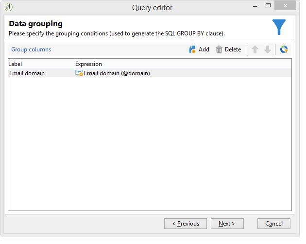
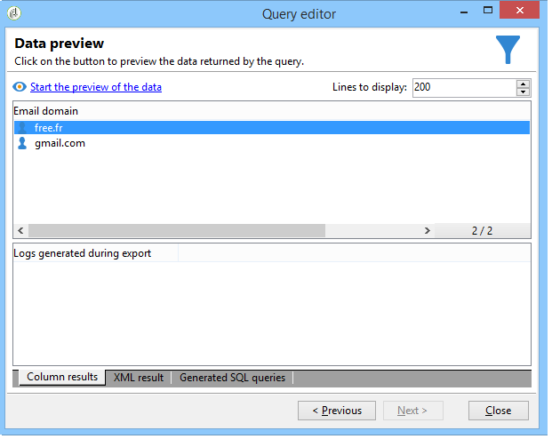

# Query’s uitvoeren met behulp van groeperingsbeheer {#querying-using-grouping-management}

In dit voorbeeld willen we een query uitvoeren om alle e-maildomeinen te zoeken die meer dan 30 keer zijn aangewezen tijdens eerdere leveringen.

* Welke tabel moet worden geselecteerd?

   De tabel met ontvangers (nms:ontvanger)

* Velden die moeten worden geselecteerd in uitvoerkolommen?

   E-maildomein en primaire sleutel (met aantal)

* Gegevensgroepering?

   Gebaseerd op e-maildomein met een aantal primaire sleutels boven 30. Deze bewerking wordt uitgevoerd met de optie **[!UICONTROL Group by + Having]**. **[!UICONTROL Group by + Having]** Hiermee kunt u gegevens groeperen (&quot;groeperen door&quot;) en een selectie maken van gegroepeerde objecten (&quot;hebben&quot;).

U kunt dit voorbeeld maken door de volgende stappen toe te passen:

1. Open **[!UICONTROL Generic query editor]** en kies de Ontvanger lijst (**nms:ontvanger**).

   

1. Selecteer in het venster **[!UICONTROL Data to extract]** de velden **[!UICONTROL Email domain]** en **[!UICONTROL Primary key]**. Een telling op het **[!UICONTROL Primary key]** gebied in werking stellen.

   Voor meer op primaire zeer belangrijke tellingen, verwijs naar [deze sectie](../../platform/using/defining-filter-conditions.md#building-expressions).

1. Schakel het selectievakje **[!UICONTROL Handle groupings (GROUP BY + HAVING)]** in.

   

1. Sorteer de e-maildomeinen in aflopende volgorde in het venster **[!UICONTROL Sorting]**. Om dit te doen, controleer **[!UICONTROL Yes]** in **[!UICONTROL Descending sort]** kolom. Klik op **[!UICONTROL Next]**.

   

1. In **[!UICONTROL Data filtering]** selecteert u **[!UICONTROL Filtering conditions]**. Ga naar het **[!UICONTROL Target elements]** venster en klik **[!UICONTROL Next]**.
1. Selecteer **[!UICONTROL Data grouping]** in het venster **[!UICONTROL Email domain]** door op **[!UICONTROL Add]** te klikken.

   Dit venster voor gegevensgroepering wordt alleen weergegeven als het vak **[!UICONTROL Handle groupings (GROUP BY + HAVING]**) is ingeschakeld.

   

1. Geef in het venster **[!UICONTROL Grouping condition]** een aantal primaire sleutels op dat groter is dan 30, aangezien we alleen willen dat e-maildomeinen die meer dan 30 keer zijn aangewezen als resultaat worden geretourneerd.

   Dit venster wordt weergegeven wanneer het selectievakje **[!UICONTROL Manage groupings (GROUP BY + HAVING)]** is ingeschakeld: Hier wordt het groeperingsresultaat gefilterd (HAVING).

   

1. Klik in het venster **[!UICONTROL Data formatting]** op **[!UICONTROL Next]**: hier is geen opmaak nodig .
1. Klik in het venster met gegevensvoorvertoning op **[!UICONTROL Launch data preview]**: hier worden drie verschillende e-maildomeinen geretourneerd die meer dan 30 keer als doel hebben.

   
