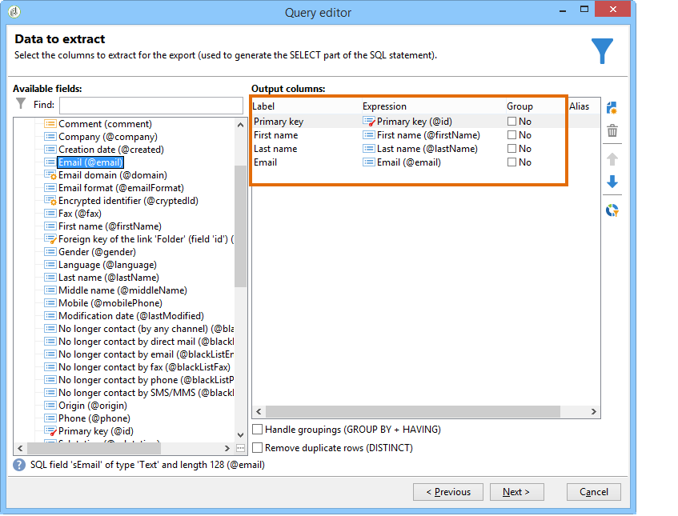
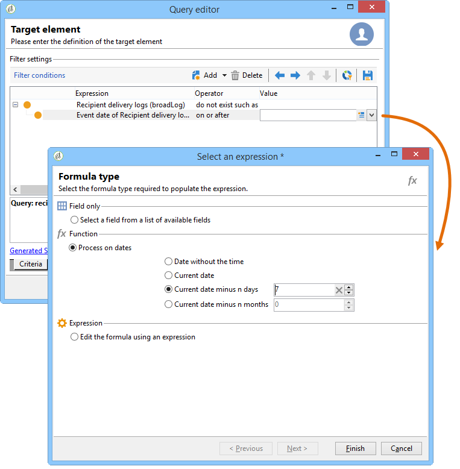

# Het vragen gebruikend een vele-aan-vele verhouding {#querying-using-a-many-to-many-relationship}

In dit voorbeeld willen we ontvangers herstellen die de afgelopen 7 dagen geen contact hebben gehad. Deze query heeft betrekking op alle leveringen.

Dit voorbeeld toont ook hoe te om een filter met betrekking tot de keus van een inzamelingselement (of oranje knoop) te vormen. Verzamelingselementen zijn beschikbaar in het **[!UICONTROL Field to select]** venster.

* Welke tabel moet worden geselecteerd?

   De tabel met ontvangers (**nms:ontvanger**)

* Velden die moeten worden geselecteerd voor de uitvoerkolom

   Primaire sleutel, Achternaam, Voornaam en E-mail

* Op basis van welke criteria wordt de gefilterde informatie

   Gebaseerd op de leveringslogboeken van ontvangers die 7 dagen voor vandaag teruggaan

Voer de volgende stappen uit:

1. Open de Algemene vraagredacteur en selecteer de Ontvangerlijst **[!UICONTROL (nms:recipient)]**.
1. Selecteer in het **[!UICONTROL Data to extract]** venster **[!UICONTROL Primary key]**, **[!UICONTROL First name]** en **[!UICONTROL Last name]** **[!UICONTROL Email]**.

   

1. Sorteer de namen in alfabetische volgorde in het sorteervenster.

   

1. Selecteer in het **[!UICONTROL Data filtering]** venster **[!UICONTROL Filtering conditions]**.
1. In het **[!UICONTROL Target element]** venster, impliceert de het filtreren voorwaarde voor het halen van profielen zonder het volgen logboek voor de laatste 7 dagen twee stappen. Het element dat u moet selecteren, is een veel-op-veel-koppeling.

   * Begin door het **[!UICONTROL Recipient delivery logs (broadlog)]** inzamelingselement (oranje knoop) voor de eerste **[!UICONTROL Value]** kolom te selecteren.

      

      Kies de **[!UICONTROL do not exist as]** operator. U hoeft geen tweede waarde op deze regel te selecteren.

   * De inhoud van de tweede filtervoorwaarde is afhankelijk van de eerste. Hier wordt het **[!UICONTROL Event date]** veld direct in de **[!UICONTROL Recipient delivery logs]** tabel weergegeven omdat er een koppeling naar deze tabel is.

      

      Selecteren **[!UICONTROL Event date]** met de **[!UICONTROL greater than or equal to]** operator. Selecteer de **[!UICONTROL DaysAgo (7)]** waarde. Klik hiertoe in het **[!UICONTROL Edit expression]** **[!UICONTROL Value]** veld. Selecteer in het **[!UICONTROL Formula type]** venster **[!UICONTROL Process on dates]** en geef &quot;7&quot; als waarde **[!UICONTROL Current date minus n days]** op.

      

      De filtervoorwaarde wordt gevormd.

      

1. Schakel in het **[!UICONTROL Data formatting]** venster de achternaam in hoofdletters in. Klik op de **[!UICONTROL Last name]** regel in de **[!UICONTROL Transformation]** kolom en selecteer **[!UICONTROL Switch to upper case]** de regel in de vervolgkeuzelijst.

   

1. Gebruik de **[!UICONTROL Add a calculated field]** functie om een kolom in het venster van de gegevensvoorproef op te nemen.

   In dit voorbeeld voegt u een berekend veld met de eerste en laatste naam van de ontvangers toe in één kolom. Klik op de **[!UICONTROL Add a calculated field]** functie. Voer in het **[!UICONTROL Export calculated field definition]** venster een label en een interne naam in en kies het **[!UICONTROL JavaScript Expression]** type. Voer vervolgens de volgende expressie in:

   ```
   var rep = source._firstName+" - "+source._lastName
   return rep
   ```

   

   Klik **[!UICONTROL OK]**. Het **[!UICONTROL Data formatting]** venster is geconfigureerd.

   Zie deze sectie voor meer informatie over het toevoegen van berekende velden.

1. Het resultaat wordt weergegeven in het **[!UICONTROL Data preview]** venster. Ontvangers die de laatste 7 dagen geen contact hebben gehad, worden in alfabetische volgorde weergegeven. Namen worden in hoofdletters weergegeven en de kolom met de voor- en achternaam is gemaakt.

   
