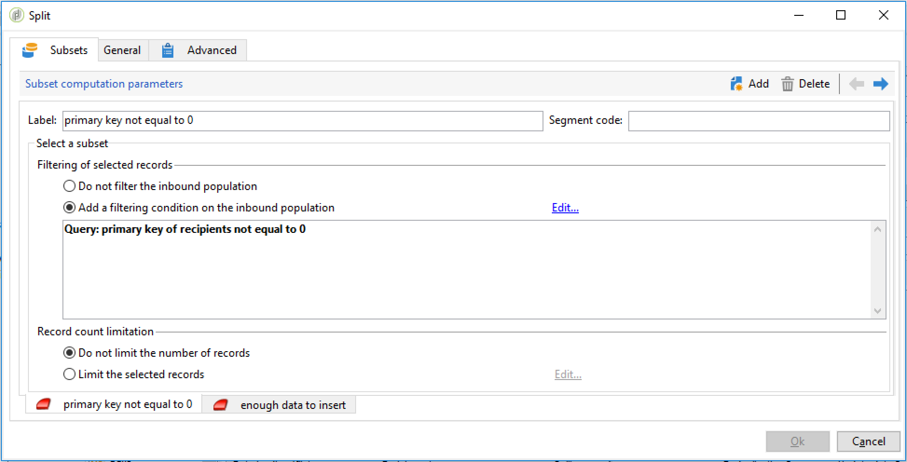

# Een terugkerende importworkflow instellen {#setting-up-a-recurring-import}

Het gebruik van een werkstroomsjabloon is de beste manier als u regelmatig bestanden met dezelfde structuur moet importeren.

In dit voorbeeld ziet u hoe u een workflow instelt die opnieuw kan worden gebruikt voor het importeren van profielen die afkomstig zijn van een CRM in de Adobe Campaign-database. Raadpleeg deze [sectie](../../workflow/using/about-activities.md) voor meer informatie over alle mogelijke instellingen voor elke activiteit.

1. Creeer een nieuw werkschemamalplaatje van **[!UICONTROL Resources > Templates > Workflow templates]**.
1. Voeg de volgende activiteiten toe:

   * **[!UICONTROL Data loading (file)]**: Definieer de verwachte structuur van het bestand met de gegevens die u wilt importeren.
   * **[!UICONTROL Enrichment]**: De geïmporteerde gegevens afstemmen op de databasegegevens.
   * **[!UICONTROL Split]**: Maak filters om records op een andere manier te verwerken, afhankelijk van de vraag of ze met elkaar in overeenstemming kunnen worden gebracht.
   * **[!UICONTROL Deduplication]**: Dupliceer de gegevens uit het binnenkomende bestand voordat deze in de database worden ingevoegd.
   * **[!UICONTROL Update data]**: Werk de database bij met de geïmporteerde profielen.

   

1. Configureer de **[!UICONTROL Data Loading (file)]**-activiteit:

   * Definieer de verwachte structuur door een voorbeeldbestand te uploaden. Het voorbeeldbestand mag slechts een paar regels bevatten, maar alle kolommen die nodig zijn voor het importeren. Controleer en bewerk de bestandsindeling om te controleren of het type van elke kolom correct is ingesteld: tekst, datum, geheel getal, enz. Bijvoorbeeld:

      ```
      lastname;firstname;birthdate;email;crmID
      Smith;Hayden;23/05/1989;hayden.smith@mailtest.com;123456
      ```

   * Selecteer **[!UICONTROL Upload a file from the local machine]** in de sectie **[!UICONTROL Name of the file to load]** en laat het veld leeg. Telkens wanneer een nieuwe werkstroom van dit malplaatje wordt gecreeerd, kunt u hier het dossier specificeren u wilt, zolang het aan de bepaalde structuur beantwoordt.

      U kunt alle opties gebruiken, maar u moet de sjabloon dienovereenkomstig aanpassen. Als u bijvoorbeeld **[!UICONTROL Specified in the transition]** selecteert, kunt u een **[!UICONTROL File Transfer]**-activiteit toevoegen voordat u het bestand ophaalt dat u wilt importeren vanaf een FTP-/SFTP-server. Met S3- of SFTP-verbinding kunt u ook segmentgegevens importeren naar Adobe Campaign met het Adobe Real-Time Customer Data-platform. Raadpleeg voor meer informatie deze [documentatie](https://docs.adobe.com/content/help/en/experience-platform/rtcdp/destinations/destinations-cat/adobe-destinations/adobe-campaign-destination.html).

      

1. Configureer de **[!UICONTROL Enrichment]**-activiteit. Het doel van deze activiteit in dit verband is de identificatie van de binnenkomende gegevens.

   * Selecteer **[!UICONTROL Enrichment]** op het tabblad **[!UICONTROL Add data]** en definieer een koppeling tussen de geïmporteerde gegevens en de ontvangers voor dimensie. In dit voorbeeld wordt het aangepaste veld **CRM ID** gebruikt om de verbindingsvoorwaarde te maken. Gebruik het veld of de combinatie van velden die u nodig hebt, zolang u unieke records kunt identificeren.
   * Laat op het tabblad **[!UICONTROL Reconciliation]** de optie **[!UICONTROL Identify the document from the working data]** uitgeschakeld.

   

1. Configureer de **[!UICONTROL Split]**-activiteit om onderling afgestemde ontvangers in één overgang en ontvangers op te halen die niet in overeenstemming konden worden gebracht, maar die voldoende gegevens in een tweede overgang hebben.

   De overgang met onderling verzochte ontvangers kan dan worden gebruikt om het gegevensbestand bij te werken. De overgang met onbekende ontvangers kan dan worden gebruikt om nieuwe ontvankelijke ingangen in het gegevensbestand tot stand te brengen als een minimumreeks informatie in het dossier beschikbaar is.

   Ontvangers die niet in overeenstemming kunnen worden gebracht en niet genoeg gegevens hebben, worden in een complementaire uitgaande overgang geselecteerd en kunnen in een afzonderlijk bestand worden geëxporteerd of eenvoudig worden genegeerd.

   * Selecteer **[!UICONTROL Use the additional data only]** als filterinstelling op het tabblad **[!UICONTROL General]** van de activiteit en zorg ervoor dat **[!UICONTROL Targeting dimension]** automatisch wordt ingesteld op **[!UICONTROL Enrichment]**.

      Controleer de optie **[!UICONTROL Generate complement]** om te kunnen zien of kan om het even welk verslag niet in het gegevensbestand worden opgenomen. Indien nodig kunt u de aanvullende gegevens verder verwerken: bestand exporteren, lijst bijwerken, enz.

   * In de eerste ondergroep van **[!UICONTROL Subsets]** tabel, voeg een het filtreren voorwaarde op de binnenkomende bevolking toe om slechts verslagen te selecteren waarvoor de ontvankelijke primaire sleutel niet gelijk aan 0 is. Op deze manier worden gegevens uit het bestand die in overeenstemming zijn met ontvangers uit de database, geselecteerd in die subset.

      

   * Voeg een tweede subset toe die onverzochte records selecteert die voldoende gegevens bevatten om in de database te worden ingevoegd. Bijvoorbeeld: e-mailadres, voornaam en achternaam.

      Subsets worden verwerkt in hun aanmaakvolgorde. Dit houdt in dat wanneer deze tweede subset wordt verwerkt, alle records die al in de database bestaan al in de eerste subset zijn geselecteerd.

      

   * Alle verslagen die niet in de eerste twee subsets worden geselecteerd worden geselecteerd in **[!UICONTROL Complement]**.

1. Vorm de **[!UICONTROL Update data]** activiteit die na de eerste uitgaande overgang van de **[!UICONTROL Split]** eerder gevormde activiteit wordt gevestigd.

   * Selecteer **[!UICONTROL Update]** als **[!UICONTROL Operation type]** omdat de binnenkomende overgang alleen ontvangers bevat die al in de database aanwezig zijn.
   * Selecteer **[!UICONTROL Record identification]** in de sectie **[!UICONTROL Using reconciliation keys]** en definieer een sleutel tussen de doeldimensie en de koppeling die wordt gemaakt in **[!UICONTROL Enrichment]**. In dit voorbeeld wordt het aangepaste veld **CRM ID** gebruikt.
   * Geef in de sectie **[!UICONTROL Fields to update]** de velden van de afmeting ontvangers op die moeten worden bijgewerkt met de waarde van de corresponderende kolom in het bestand. Als de namen van de bestandskolommen identiek of bijna identiek zijn aan de namen van de afmetingsvelden van de ontvangers, kunt u de toverknop gebruiken om de verschillende velden automatisch aan te passen.

      

1. Vorm de **[!UICONTROL Deduplication]** activiteit die na de overgang wordt gevestigd die onverzoende ontvangers bevat:

   * Selecteer **[!UICONTROL Edit configuration]** en plaats het richten afmeting aan het tijdelijke schema dat van **[!UICONTROL Enrichment]** activiteit van het werkschema wordt geproduceerd.

      

   * In dit voorbeeld wordt het e-mailveld gebruikt om unieke profielen te zoeken. U kunt elk veld gebruiken waarvan u zeker weet dat het is ingevuld en deel uitmaakt van een unieke combinatie.
   * Selecteer **[!UICONTROL Deduplication method]** in het scherm **[!UICONTROL Advanced parameters]** en controleer de optie **[!UICONTROL Disable automatic filtering of 0 ID records]** om ervoor te zorgen dat records met een primaire sleutel gelijk aan 0 (die alle records van deze overgang moeten zijn) niet worden uitgesloten.

   

1. Vorm **[!UICONTROL Update data]** activiteit die na **[!UICONTROL Deduplication]** eerder gevormde activiteit wordt gevestigd.

   * Selecteer **[!UICONTROL Insert]** als **[!UICONTROL Operation type]** aangezien de binnenkomende overgang slechts ontvangers bevat die niet in het gegevensbestand aanwezig zijn.
   * Selecteer **[!UICONTROL Record identification]** in de sectie **[!UICONTROL Directly using the targeting dimension]** en kies de **[!UICONTROL Recipients]**-dimensie.
   * Geef in de sectie **[!UICONTROL Fields to update]** de velden van de afmeting ontvangers op die moeten worden bijgewerkt met de waarde van de corresponderende kolom in het bestand. Als de namen van de bestandskolommen identiek of bijna identiek zijn aan de namen van de afmetingsvelden van de ontvangers, kunt u de toverknop gebruiken om de verschillende velden automatisch aan te passen.

      

1. Na de derde overgang van de **[!UICONTROL Split]** activiteit, voeg **[!UICONTROL Data extraction (file)]** activiteit en **[!UICONTROL File transfer]** activiteit toe als u spoor van gegevens wilt houden die niet in het gegevensbestand worden opgenomen. Configureer die activiteiten om de kolom die u nodig hebt te exporteren en om het bestand over te brengen naar een FTP- of SFTP-server waar u het bestand kunt ophalen.
1. Voeg een **[!UICONTROL End]** activiteit toe en sla het werkschemamalplaatje op.

De sjabloon kan nu worden gebruikt en is beschikbaar voor elke nieuwe workflow. Alles is dan nodig om het bestand op te geven dat de gegevens bevat die in de **[!UICONTROL Data loading (file)]**-activiteit moeten worden geïmporteerd.


