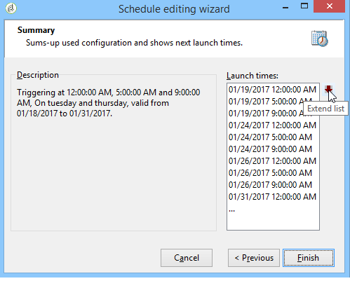

# Planner{#scheduler}

De **Planner** is een blijvende taak die zijn overgang op de tijden activeert die door zijn programma worden gespecificeerd.

De **[!UICONTROL Scheduler]** activiteit moet worden beschouwd als een geplande start. De regels voor het positioneren van de activiteit in het diagram zijn hetzelfde als voor de **[!UICONTROL Start]** activiteit. Deze activiteit moet geen binnenkomende overgang hebben.

Het is aan te raden een workflow niet meer dan om de 15 minuten te plannen, omdat dit de algehele systeemprestaties kan belemmeren en blokken in de database kan maken.

Gebruik nooit meer dan één **[!UICONTROL Scheduler]** activiteit per vertakking wanneer u uw werkstroom bouwt. Raadpleeg voor meer informatie: [Activiteiten](../../workflow/using/workflow-best-practices.md#using-activities)gebruiken.

De planner bepaalt het activeringsprogramma van de overgang. Om het te vormen, klik het grafische voorwerp tweemaal, dan klik **[!UICONTROL Change...]**

Met een wizard kunt u de frequentie en de geldigheidsperiode van de activiteit definiëren. De configuratiestappen zijn als volgt:

1. Selecteer de activeringsfrequentie en klik op **[!UICONTROL Next]**.

   

1. Geef de activeringstijden en -dagen op. De parameters voor deze stap zijn afhankelijk van de frequentie die u in de vorige stap hebt geselecteerd. Als u ervoor kiest om de activiteit meerdere keren per dag te lanceren, zullen de configuratieopties als volgt zijn:

   

1. Bepaal de geldigheidsperiode van het programma of specificeer hoe vaak het zal worden uitgevoerd.

   

1. Controleer de configuratie en klik **[!UICONTROL Finish]** om op te slaan.

   

Het gebruiken van een planneractiviteit kan tot verscheidene uitvoeringen van een werkschema leiden die tezelfdertijd lopen. Bijvoorbeeld, kunt u een planner hebben die de werkschemauitvoering elk uur teweegbrengt, maar soms neemt de uitvoering van het volledige werkschema meer dan een uur. U kunt de uitvoering overslaan als de workflow al wordt uitgevoerd. Raadpleeg [deze pagina](../../workflow/using/monitoring-workflow-execution.md#preventing-simultaneous-multiple-execution)voor meer informatie over het voorkomen van gelijktijdige uitvoering van een workflow.

De overgang kan enkele uren later worden geactiveerd als de workflow een taak op lange termijn, zoals importeren, zou uitvoeren of als de wfserver-module een tijd zou zijn gestopt. In dit geval, kan het noodzakelijk zijn om de uitvoering van de taak te beperken die door de planner tot een bepaalde tijdwaaier wordt geactiveerd.
