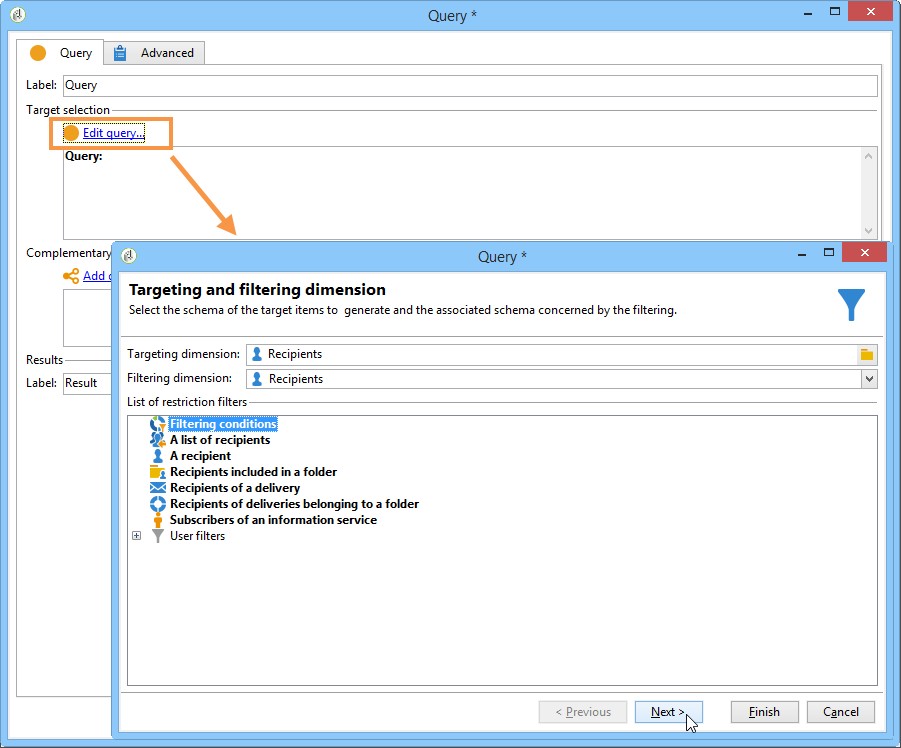
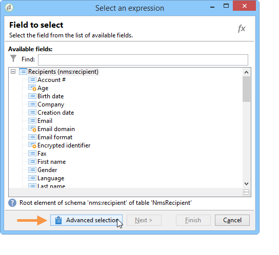

# Een verjaardagsbericht verzenden{#sending-a-birthday-email}

## Inleiding {#introduction}

In dit geval wordt beschreven hoe u een terugkerende e-mail naar een lijst met ontvangers op de dag van hun geboortedatum wilt sturen.

Voor het instellen van dit gebruiksgeval hebben we de volgende workflow voor doelversie gemaakt:


Met deze (dagelijkse) workflow worden alle ontvangers geselecteerd die op de huidige datum jarig zijn.

Deze manier van werken kan ook worden gevonden in de vorm van een video. Raadpleeg voor meer informatie de video [Een workflow](https://docs.campaign.adobe.com/doc/AC/en/Videos/Videos.html) maken.

Hiertoe maakt u een campagne en klikt u op het **[!UICONTROL Targeting and workflows]** tabblad. Raadpleeg voor meer informatie het hoofddoel [Samenstellen in een workflowsectie](../../campaign/using/marketing-campaign-deliveries.md#building-the-main-target-in-a-workflow) .

Voer vervolgens de volgende stappen uit:

## Het plannen van het verzenden {#configuring-the-scheduler}

1. Eerst, voeg een **Planner** toe om het verzenden van de levering in werking te stellen elke dag. In het onderstaande voorbeeld wordt de levering elke dag om 18.00 uur gemaakt.

   


## Ontvangers identificeren van wie de verjaardag het is {#identifying-recipients-whose-birthday-it-is}

Na het vormen van de **[!UICONTROL Scheduler]** activiteit zodat het werkschema elke dag begint, identificeer alle ontvangers waarvan geboortedatum de huidige datum evenaart.

Hiervoor voert u de volgende stappen uit:

1. Sleep een **[!UICONTROL Query]** activiteit naar de werkstroom en dubbelklik erop.
1. Klik op de koppeling Query **** bewerken en selecteer **[!UICONTROL Filtering conditions]**.

   

1. Klik op de eerste cel van de **[!UICONTROL Expression]** kolom en klik **[!UICONTROL Edit expression]** om de expressie-editor te openen.

   

1. Klik **[!UICONTROL Advanced selection]** om de filtermodus te selecteren.

   

1. Selecteer **[!UICONTROL Edit the formula using an expression]** en klik **[!UICONTROL Next]** om de uitdrukkingsredacteur te tonen.
1. Dubbelklik in de lijst met functies **[!UICONTROL Day]** op de knop **[!UICONTROL Date]** . Deze functie retourneert het getal dat de dag vertegenwoordigt die overeenkomt met de datum die als parameter is doorgegeven.

   

1. Dubbelklik in de lijst met beschikbare velden **[!UICONTROL Birth date]**. In het bovenste gedeelte van de editor wordt dan de volgende formule weergegeven:

   ```
   Day(@birthDate)
   ```

   Klik **[!UICONTROL Finish]** om te bevestigen.

1. Selecteer in de query-editor in de eerste cel van de **[!UICONTROL Operator]** kolom **[!UICONTROL equal to]**.

   

1. Klik vervolgens op de eerste cel van de tweede kolom (**[!UICONTROL Value]**) en klik **[!UICONTROL Edit expression]** om de editor voor de expressie te openen.
1. Dubbelklik in de lijst met functies **[!UICONTROL Day]** op de knop **[!UICONTROL Date]** .
1. Dubbelklik op de **[!UICONTROL GetDate]** functie om de huidige datum op te halen.

   

   In het bovenste gedeelte van de editor wordt de volgende formule weergegeven:

   ```
   Day(GetDate())
   ```

   Klik **[!UICONTROL Finish]** om te bevestigen.

1. Herhaal deze procedure om de geboortemaand van de huidige maand op te halen. Klik hiertoe op de **[!UICONTROL Add]** knop en herhaal stap 3 tot en met 10, waarbij u de waarde vervangt **[!UICONTROL Day]** door **[!UICONTROL Month]**.

   De volledige vraag is als volgt:

   

Koppel het resultaat van de **[!UICONTROL Query]** activiteit aan een **[!UICONTROL Email delivery]** activiteit om een e-mail naar de lijst van al uw ontvangers op hun verjaardag te verzenden.

## Met inbegrip van ontvangers geboren op 29 februari (facultatief) {#including-recipients-born-on-february-29th--optional-}

Als u alle ontvangers wilt opnemen die op 29 februari zijn geboren, toont deze gebruikszaak hoe u een terugkerende e-mail naar een lijst met ontvangers voor hun verjaardag wilt sturen - of het nu een schrikkeljaar is of niet.

De belangrijkste implementatiestappen voor dit gebruiksgeval zijn:

* Ontvangers selecteren
* Kiezen of het een schrikkeljaar is
* Ontvangers selecteren die op 29 februari zijn geboren

Voor het instellen van dit gebruiksgeval hebben we de volgende workflow voor doelversie gemaakt:


Als het huidige jaar geen schrikkeljaar **** is en de workflow op 1 maart wordt uitgevoerd, moeten we alle ontvangers selecteren die hun verjaardag gisteren (29 februari) zouden hebben gehad en ze toevoegen aan de lijst met ontvangers. In alle andere gevallen is geen aanvullende actie vereist.

### Stap 1: De ontvangers selecteren {#step-1--selecting-the-recipients}

Na het vormen van de **[!UICONTROL Scheduler]** activiteit zodat het werkschema elke dag begint, identificeer alle ontvangers de waarvan verjaardag de huidige dag is.

>[!NOTE]
>
>Als het huidige jaar een schrikkeljaar is, worden alle ontvangers die op 29 februari geboren zijn automatisch opgenomen.


Ontvangers selecteren waarvan de verjaardag overeenkomt met de huidige datum, wordt weergegeven in de sectie [Ontvangers identificeren waarvan de verjaardag](#identifying-recipients-whose-birthday-it-is) overeenkomt met de huidige datum.

### Stap 2: Selecteer of het een schrikkeljaar is {#step-2--select-whether-or-not-it-is-a-leap-year}

Met deze **[!UICONTROL Test]** activiteit kunt u controleren of het een schrikkeljaar is en of de huidige datum 1 maart is.

Als de test wordt geverifieerd (het jaar is geen schrikkeljaar - er is geen 29 februari - en de huidige datum is inderdaad 1 maart), wordt de **[!UICONTROL True]** overgang mogelijk gemaakt en worden de ontvangers die op 29 februari geboren zijn toegevoegd aan de eerste levering van 1 maart. Anders, wordt de **[!UICONTROL False]** overgang toegelaten en slechts zullen de ontvangers die op de huidige datum worden geboren de levering ontvangen.

Kopieer en plak de onderstaande code in de **[!UICONTROL Initialization script]** sectie van het **[!UICONTROL Advanced]** tabblad.

```
function isLeapYear(iYear)
{
    if(iYear/4 == Math.floor(iYear/4))
    {
        if(iYear/100 != Math.floor(iYear/100))
        {
            // Divisible by 4 only -> Leap Year
            return 1;
        }
        else
        {
            if(iYear/400 == Math.floor(iYear/400))
            {
                // Divisible by 4, 100 and 400 -> Leap year
                return 1;
            }
        }
    }
    // all others: no leap year
    return 0;
}

// Return today's date and time
var currentTime = new Date()
// returns the month (from 0 to 11)
var month = currentTime.getMonth() + 1
// returns the day of the month (from 1 to 31)
var day = currentTime.getDate()
// returns the year (four digits)
var year = currentTime.getFullYear()

// is current year a leap year?
vars.currentIsALeapYear = isLeapYear(year);

// is current date the first of march?
if(month == 3 && day == 1) {
  // today is 1st of march
vars.firstOfMarch = 1;
}
```


Voeg de volgende voorwaarde in de **[!UICONTROL Conditional forks]** sectie toe:

```
vars.currentIsALeapYear == 0 && vars.firstOfMarch == 1
```


### Stap 3: Selecteer de ontvangers die op 29 februari zijn geboren {#step-3--select-any-recipients-born-on-february-29th}

Maak een **[!UICONTROL Fork]** activiteit en koppel een van de uitgaande overgangen aan een **[!UICONTROL Query]** activiteit.

Selecteer in deze query alle ontvangers waarvan de geboortedatum 29 februari is.


Combineer de resultaten met een **[!UICONTROL Union]** activiteit.

Koppel de resultaten van de twee **[!UICONTROL Test]** activiteitfilialen aan een **[!UICONTROL Email delivery]** activiteit om een e-mail naar de lijst van al uw ontvangers op hun verjaardag te verzenden, zelfs aan die geboren op 29 februari tijdens een niet-schrikkeljaar.

## Een terugkerende levering maken {#creating-a-recurring-delivery-in-a-targeting-workflow}

Voeg een **Terugkomende leveringsactiviteit** toe die op het malplaatje wordt gebaseerd van de verjaardags e-mail dat u wilt verzenden.

>[!CAUTION]
>
>Om de workflows uit te voeren, moeten de technische workflows met betrekking tot het campagneproces worden gestart. Raadpleeg voor meer informatie de sectie [Lijst met workflows voor](../../workflow/using/campaign.md) campagneprocessen.
>
>Als de goedkeuringsstappen voor de campagne zijn ingeschakeld, worden de leveringen pas verzonden nadat deze stappen zijn bevestigd. Raadpleeg voor meer informatie de [sectie De processen kiezen die moeten worden goedgekeurd](../../campaign/using/marketing-campaign-approval.md#choosing-the-processes-to-be-approved) .


