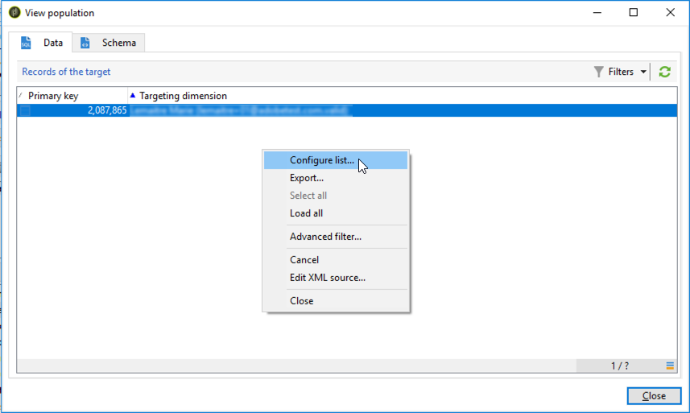

# Persoonlijke waarschuwingen verzenden aan operatoren{#sending-personalized-alerts-to-operators}

In dit voorbeeld willen wij een alarm naar een exploitant verzenden die de naam van profielen zal bevatten die een nieuwsbrief opende maar niet de verbinding klikte het bevat.

De velden voor de voornaam en achternaam van de profielen zijn gekoppeld aan de **[!UICONTROL Recipients]** doeldimensie, terwijl de **[!UICONTROL Alert]** activiteit is gekoppeld aan de **[!UICONTROL Operator]** doeldimensie. Als gevolg hiervan is er geen veld beschikbaar tussen de twee doeldimensies om een afstemming uit te voeren en de velden voor de voornaam en achternaam op te halen en deze weer te geven in de activiteit Waarschuwing.

Het proces bestaat uit het ontwikkelen van een workflow zoals hieronder:

1. Gebruik een **[!UICONTROL Query]** activiteit aan doelgegevens.
1. Voeg een **[!UICONTROL JavaScript code]** activiteit in het werkschema toe om de bevolking van de vraag aan de instantievariabele te bewaren.
1. Gebruik een **[!UICONTROL Test]** activiteit om het aantal inwoners te controleren.
1. Gebruik een **[!UICONTROL Alert]** activiteit om een alarm naar een exploitant, afhankelijk van het **[!UICONTROL Test]** activiteitenresultaat te verzenden.


## De populatie opslaan in de instantievariabele {#saving-the-population-to-the-instance-variable}

Voeg de onderstaande code toe aan de **[!UICONTROL JavaScript code]** activiteit.

```
var query = xtk.queryDef.create(  
    <queryDef schema="temp:query" operation="select">  
      <select>  
       <node expr="[target/recipient.@firstName]"/>  
       <node expr="[target/recipient.@lastName]"/>  
      </select>  
     </queryDef>  
  );  
  var items = query.ExecuteQuery();
```

Zorg ervoor dat de Javascript-code overeenkomt met uw workflowgegevens:

* De **[!UICONTROL queryDef schema]** tag moet overeenkomen met de naam van de doeldimensie die wordt gebruikt in de queryactiviteit.
* De **[!UICONTROL node expr]** tag moet overeenkomen met de naam van de velden die u wilt ophalen.


Volg onderstaande stappen om deze gegevens op te halen:

1. Klik met de rechtermuisknop op de uitgaande overgang van de **[!UICONTROL Query]** activiteit en selecteer **[!UICONTROL Display the target]**.

   

1. Klik met de rechtermuisknop op de lijst en selecteer vervolgens **[!UICONTROL Configure list]**.

   

1. De query voor dimensie en veldnamen wordt in de lijst weergegeven.

   

## Het aantal inwoners testen {#testing-the-population-count}

Voeg de onderstaande code toe aan de **[!UICONTROL Test]** activiteit om te controleren of de doelpopulatie ten minste 1 profiel bevat.

```
var.recCount>0
```


## De waarschuwing instellen {#setting-up-the-alert}

Nu de populatie met de gewenste velden is toegevoegd aan de instantievariabele, kunt u deze informatie toevoegen aan de **[!UICONTROL Alert]** activiteit.

Hiervoor voegt u de onderstaande code toe aan het **[!UICONTROL Source]** tabblad:

```
<ul>
<%
var items = new XML(instance.vars.items)
for each (var item in items){
%>
<li><%= item.target.@firstName %> <%= item.target.@lastName %></li>
<%
} %></ul>
```

>[!NOTE]
>
>Met de **[!UICONTROL <%= item.target.recipient.@fieldName %>]** opdracht kunt u een van de velden toevoegen die via de **[!UICONTROL JavaScript code]** activiteit aan de instantievariabele zijn opgeslagen.\
>U kunt zo veel velden toevoegen als u wilt, mits deze zijn ingevoegd in de JavaScript-code.


