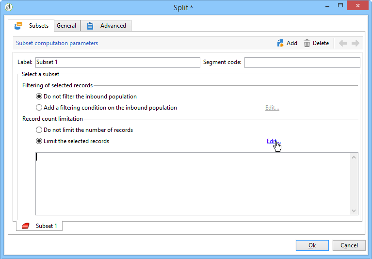

# Splitsen{#split}

Met een **gesplitste** activiteit kunt u een doel opsplitsen in verschillende subsets. Het doel wordt geconstrueerd met alle ontvangen resultaten: alle voorgaande activiteiten moeten dus zijn voltooid om deze activiteit te kunnen uitvoeren .

Deze activiteit leidt niet tot een unie van binnenkomende populaties. Als verschillende overgangen in één gesplitste activiteit landen, adviseren wij een **[!UICONTROL Union]** activiteit voor het op te nemen.

Voor een voorbeeld van de splitsingsactiviteit die wordt gebruikt, raadpleegt u Subsets [maken met behulp van de splitsingsactiviteit](../../workflow/using/targeting-data.md#creating-subsets-using-the-split-activity).

In [deze sectie](../../workflow/using/cross-channel-delivery-workflow.md)wordt een voorbeeld gegeven waarin wordt geïllustreerd hoe u de activiteit Splitsen kunt gebruiken om het doel in verschillende populaties te segmenteren met behulp van filtervoorwaarden.

In [deze sectie](../../workflow/using/javascript-scripts-and-templates.md)vindt u een voorbeeld van het gebruik van een instantievariabele in een gesplitste activiteit.

Als u deze activiteit wilt configureren, definieert u de inhoud en het label van de subset op het **[!UICONTROL Subsets]** tabblad en kiest u vervolgens de doeldimensie op het **[!UICONTROL General]** tabblad.

## Subsets maken {#creating-subsets}

Een subset maken:

1. Klik op het label in het desbetreffende veld en selecteer het filter dat u wilt toepassen.
1. Als u de binnenkomende populatie wilt filteren, selecteert u de **[!UICONTROL Add a filtering condition]** optie en klikt u op de **[!UICONTROL Edit...]** koppeling.

   Selecteer het type filter dat op de gegevens moet worden toegepast om het in deze set op te nemen.

   Het proces is het zelfde als voor een **Vraag**-type activiteit.

   >[!NOTE]
   >
   >U kunt de gegevens filteren in maximaal twee externe databases (FDA).

1. U kunt het maximumaantal records opgeven dat uit het doel moet worden geëxtraheerd om de subset te maken. U doet dit door de **[!UICONTROL Limit the selected records]** optie te selecteren en op de **[!UICONTROL Edit...]** koppeling te klikken.

   Met een wizard kunt u de selectiemodus kiezen voor records van deze subset. U vindt de stappen in het [beperken van het aantal subsetrecords](#limiting-the-number-of-subset-records).

   

1. Desgewenst kunt u andere subsets **** toevoegen met de **[!UICONTROL Add]** knop.

   

   >[!NOTE]
   >
   >Als de **[!UICONTROL Enable overlapping of output populations]** optie niet is ingeschakeld, worden subsets gemaakt in de volgorde van de tabbladen. Gebruik de pijlen in de rechterbovensectie van dit venster om ze te verplaatsen. Als de eerste subset bijvoorbeeld 70% van de oorspronkelijke populatie herstelt, past de volgende subset zijn selectiecriteria alleen toe op de resterende 30%, enzovoort.

   Voor elke gemaakte subset wordt een uitgaande overgang toegevoegd aan de splitsingsactiviteit.

   

   U kunt kiezen om één enkele uitgaande overgang (en reeksen identificeren gebruikend de segmentcode, bijvoorbeeld) te produceren: Selecteer hiervoor de **[!UICONTROL Generate subsets in the same table]** optie op het **[!UICONTROL General]** tabblad.

   Als het wordt voltooid, wordt de segmentcode van elke subset automatisch opgeslagen in een extra kolom. Deze kolom zal in de verpersoonlijkingsgebieden op leveringsniveau toegankelijk zijn.

## Het aantal subsetrecords beperken {#limiting-the-number-of-subset-records}

Als u niet de gehele populatie wilt gebruiken die zich in een subset bevindt, kunt u het aantal records beperken dat deze bevat.

1. Controleer de **[!UICONTROL Limit the selected records]** optie in het bewerkingsvenster van de subset en klik op de **[!UICONTROL Edit...]** koppeling.
1. Selecteer het type limiet voor uw keuze:

   * **[!UICONTROL Activate random sampling]**: bij deze optie wordt een aselecte steekproef van de records genomen . Het type willekeurige bemonstering is afhankelijk van de database-engine.
   * **[!UICONTROL Keep only the first records after sorting]**: Met deze optie kunt u een beperking definiëren op basis van een of meer sorteervolgorden. Als u het **[!UICONTROL Age]** veld selecteert als sorteercriterium en 100 als limiet, blijven alleen de jongste 100 ontvangers behouden.
   * **[!UICONTROL Keep the first ones after sorting (criteria, random)]**: Met deze optie worden de twee vorige opties gecombineerd. Hiermee kunt u een beperking definiëren op basis van een of meer sorteervolgorden en vervolgens een willekeurige selectie toepassen op de eerste records als sommige records dezelfde waarden hebben als de gedefinieerde criteria.

      Als u bijvoorbeeld het **[!UICONTROL Age]** veld selecteert als sorteercriteria en u vervolgens een limiet van 100 definieert, maar de 2000 jongste ontvangers in de database zijn alle 18, worden 100 ontvangers willekeurig geselecteerd uit die 2000.
   

1. Als u sorteercriteria wilt definiëren, kunt u met een extra stap de kolommen en de sorteervolgorde definiëren.

   

1. Kies vervolgens de methode voor gegevensbeperking.

   

   Er zijn verschillende manieren om dit te doen:

   * **[!UICONTROL Size (in %)]**: een percentage records. De configuratie hieronder extraheert bijvoorbeeld 10% van de totale bevolking.

      Het percentage is van toepassing op de initiële populatie, niet op het resultaat van de activiteit.

   * **[!UICONTROL Size (as a % of the segment)]**: een percentage van de gegevens dat alleen betrekking heeft op de subgroepen en niet op de initiële populatie.
   * **[!UICONTROL Maximum size]**: een maximum aantal records.
   * **[!UICONTROL By data grouping]**: u kunt een limiet instellen voor het aantal records, afhankelijk van de waarden in een opgegeven veld van de binnenkomende populatie. Raadpleeg [Beperking van het aantal subsetrecords door gegevensgroepering](#limiting-the-number-of-subset-records-by-data-grouping)voor meer informatie over dit onderwerp.
   * **[!UICONTROL By data grouping (in %)]**: u kunt een limiet instellen voor het aantal records, afhankelijk van de waarden in een bepaald veld van de binnenkomende populatie met een percentage. Raadpleeg [Beperking van het aantal subsetrecords door gegevensgroepering](#limiting-the-number-of-subset-records-by-data-grouping)voor meer informatie over dit onderwerp.
   * **[!UICONTROL By data distribution]**: Als uw groeperingsgebieden teveel waarden hebben of als u wilt vermijden opnieuw ingaat de waarden voor elke nieuwe gespleten activiteit, laat de Campagne van Adobe u een **[!UICONTROL By data distribution]** beperking (facultatieve Verdeelde module) vormen. Raadpleeg voor meer informatie [het Beperken van het aantal subsetrecords per gegevensdistributie](#limiting-the-number-of-subset-records-per-data-distribution).

1. Klik **[!UICONTROL Finish]** om de criteria voor de recordselectie goed te keuren. De bepaalde configuratie wordt dan getoond in het middelste venster van de redacteur.

## Het aantal subsetrecords beperken door gegevensgroepering {#limiting-the-number-of-subset-records-by-data-grouping}

U kunt het aantal records beperken door gegevensgroepering. Deze grenswaarde kan met een vaste waarde of een percentage worden vastgesteld.

Als u het **[!UICONTROL Language]** veld bijvoorbeeld selecteert als een groepsveld, kunt u een lijst met records voor elke taal definiëren.

1. Nadat u de gegevensbeperkingswaarden hebt geselecteerd, selecteert u deze **[!UICONTROL By data grouping]** of **[!UICONTROL By data grouping (as a %)]** klikt u op **[!UICONTROL Next]**.

   

1. Selecteer vervolgens het (de) groeperingsveld(en) (bijvoorbeeld het **[!UICONTROL Language]** veld) en klik **[!UICONTROL Next]**.

   

1. Geef ten slotte de drempelwaarden voor gegevensgroepering op (waarbij de vaste waarden of percentages worden gebruikt, afhankelijk van de eerder geselecteerde groeperingsmethode). Als u dezelfde drempel voor elke waarde wilt instellen, bijvoorbeeld als u het aantal records voor elke taal wilt instellen op 10, selecteert u de **[!UICONTROL All data groupings are the same size]** optie. Als u voor elke waarde een andere limiet wilt instellen, selecteert u de **[!UICONTROL Limitations by grouping value]** optie. Op deze manier kunt u een andere beperking kiezen voor Engels, Frans, enzovoort.

   

1. Klik **[!UICONTROL Finish]** om de beperking goed te keuren en terug te keren naar het bewerken van de gesplitste activiteit.

## Het aantal subsetrecords per gegevensdistributie beperken {#limiting-the-number-of-subset-records-per-data-distribution}

Als uw groeperingsvelden een te groot aantal waarden bevatten of als u het opnieuw instellen van waarden voor elke nieuwe gesplitste activiteit wilt voorkomen, kunt u met Adobe Campaign een beperking per gegevensdistributie maken. Als u gegevensbeperkingswaarden selecteert (zie de sectie Subsets  maken voor meer informatie), selecteert u de **[!UICONTROL By data distribution]** optie en selecteert u een sjabloon in het keuzemenu. Hieronder ziet u hoe u een sjabloon voor gegevensdistributie maakt.

Voor een voorbeeld van de **[!UICONTROL Local approval]** activiteit met een distributiemalplaatje, verwijs naar het [Gebruiken van de lokale goedkeuringsactiviteit](../../workflow/using/using-the-local-approval-activity.md).

>[!IMPORTANT]
>
>Als u deze functie wilt gebruiken, moet u de module Distributed Marketing aanschaffen. Dit is een optie Campagne. Controleer uw licentieovereenkomst.

Met de sjabloon voor gegevensdistributie kunt u het aantal records beperken aan de hand van een lijst met groeperingswaarden. Voer de volgende stappen uit om een sjabloon voor gegevensdistributie te maken:

1. Om het malplaatje van de gegevensdistributie tot stand te brengen, ga naar de **[!UICONTROL Resources > Campaign management > Data distribution]** knoop en klik **[!UICONTROL New]**.

   

1. Op het **[!UICONTROL General]** tabblad kunt u het label en de uitvoeringscontext van de distributie invoeren (dimensie voor focus, distributieveld).

   

   De volgende velden moeten worden ingevuld:

   * **[!UICONTROL Label]**: label voor de distributiesjabloon.
   * **[!UICONTROL Targeting dimension]**: Voer de doeldimensie in waarop de gegevensverspreiding zal worden toegepast, **[!UICONTROL Recipient]** bijvoorbeeld. Dit schema moet altijd compatibel zijn met de gegevens die worden gebruikt in de doelworkflow.
   * **[!UICONTROL Distribution field]**: Selecteer een veld via de doeldimensie. Als u bijvoorbeeld het **[!UICONTROL Email domain]** veld selecteert, wordt de lijst met ontvangers uitgesplitst naar domein.
   * **[!UICONTROL Distribution type]**: Selecteer op het **[!UICONTROL Distribution]** tabblad de manier waarop de beperkingswaarde van het doel wordt opgesplitst: **[!UICONTROL Percentage]** of **[!UICONTROL Set]**.
   * **[!UICONTROL Assignment type]**: Selecteer het gegevenstype voor de toewijzing van de gegevensdistributie. U kunt kiezen tussen toewijzen per groep of operator of toewijzen door lokale entiteit. Toewijzing door lokale entiteit wordt gebruikt in **Distributed Marketing**. Zie deze [sectie](../../campaign/using/about-distributed-marketing.md)voor meer informatie.
   * **[!UICONTROL Approval storage]**: als u een **[!UICONTROL Local approval]** activiteit in uw het richten werkschema (verwijs naar [Lokale goedkeuring](../../workflow/using/local-approval.md)) gebruikt, ga het schema in waarin de goedkeuringsresultaten zullen worden opgeslagen. U moet één opslagschema per het richten schema specificeren. Als u het **[!UICONTROL Recipients]** het richten schema gebruikt, ga het standaard **[!UICONTROL Local approval of recipients]** opslagschema in.

      In het geval van een eenvoudige beperking door gegevensgroepering zonder lokale goedkeuring, te hoeven u niet om het **[!UICONTROL Approvals storage]** gebied in te gaan.

1. Als u een **[!UICONTROL Local approval]** activiteit gebruikt (verwijs naar [Lokale goedkeuring](../../workflow/using/local-approval.md)), ga **[!UICONTROL Advanced settings]** voor het distributiemalplaatje in:

   

   De volgende velden moeten worden ingevuld:

   * **[!UICONTROL Approve targeted messages]**: Schakel deze optie in als u wilt dat alle ontvangers vooraf worden geselecteerd in de lijst met ontvangers die moeten worden goedgekeurd. Als deze optie is uitgeschakeld, wordt geen ontvanger vooraf geselecteerd.

      >[!NOTE]
      >
      >Deze optie is standaard ingeschakeld.

      

   * **[!UICONTROL Delivery label]**: Hiermee kunt u een expressie definiëren om het leveringslabel weer te geven in het retourbericht. De standaarduitdrukking verstrekt informatie over het standaardetiket van de levering (compute koord). U kunt deze expressie wijzigen.

      

   * **[!UICONTROL Grouping field]**: In dit veld kunt u de groepering definiëren die wordt gebruikt om ontvangers weer te geven in goedkeurings- en retourberichten.

      

   * **[!UICONTROL Web Interface]**: Hiermee kunt u een webtoepassing koppelen aan de lijst met ontvangers. In het goedkeurings en terugkeerbericht, zal elke ontvanger klikbaar zijn en zal met de geselecteerde Webtoepassing verbinden. In het **[!UICONTROL Parameters]** veld (bijvoorbeeld **[!UICONTROL recipientId]**) kunt u de aanvullende parameter configureren die in de URL en de webtoepassing moet worden gebruikt.

      

1. Op het **[!UICONTROL Breakdown]** tabblad kunt u de lijst met distributiewaarden definiëren.

   

   * **[!UICONTROL Value]**: Voer de distributiewaarden in.
   * **[!UICONTROL Percentage / Set]**: Voer de recordlimiet (vast of percentage) in die aan elke waarde is gekoppeld.

      Deze kolom wordt gedefinieerd door het **[!UICONTROL Distribution type]** veld op het **[!UICONTROL General]** tabblad.

   * **[!UICONTROL Label]**: Voer het label in dat aan elke waarde is gekoppeld.
   * **[!UICONTROL Group or operator]**: als u een **[!UICONTROL Local approval]** activiteit gebruikt (zie [Lokale goedkeuring](../../workflow/using/local-approval.md)), selecteer de exploitant of de groep exploitanten die aan elke verdelingswaarde worden toegewezen.

      In het geval van een eenvoudige beperking door gegevensgroepering zonder lokale goedkeuring, te hoeven u niet om het **[!UICONTROL Group or operator]** gebied in te gaan.

      >[!IMPORTANT]
      >
      >Controleer of de juiste rechten aan de exploitanten zijn toegekend.

   * **[!UICONTROL Local entity]**: Selecteer de lokale entiteit die aan elke distributiewaarde is toegewezen. Lokale entiteiten worden gebruikt in **Distributed Marketing**. Zie deze [sectie](../../campaign/using/about-distributed-marketing.md)voor meer informatie.

## Parameters filteren {#filtering-parameters}

Klik op het **[!UICONTROL General]** tabblad om het activiteitlabel in te voeren. Selecteer de doel- en filterafmetingen voor deze splitsing. Indien nodig kunt u deze afmetingen voor een bepaalde subset wijzigen.

Controleer de **[!UICONTROL Generate complement]** optie als u de resterende populatie wilt uitbuiten. De complement is het binnenkomende doel min de samenvoeging van de subsets. Een extra uitgaande overgang zal dan aan de activiteit worden toegevoegd, als volgt:

Deze optie werkt alleen correct als de binnenkomende gegevens een primaire sleutel hebben.

Bijvoorbeeld, als de gegevens direct van een extern gegevensbestand zoals Netezza (die het begrip van een index niet steunt) via een **[!UICONTROL Data loading (RDBMS)]** activiteit worden gelezen, zal de aanvulling die door de **[!UICONTROL Split]** activiteit wordt geproduceerd onjuist zijn.

U voorkomt dit door een **[!UICONTROL Enrichment]** activiteit vlak voor de **[!UICONTROL Split]** activiteit te slepen en neer te zetten. In de **[!UICONTROL Enrichment]** activiteit, controleer **[!UICONTROL Keep all additional data from the main set]** en specificeer in de extra gegevens de kolommen die u voor het vormen van de filters van de **[!UICONTROL Split]** activiteit wilt gebruiken. De gegevens van de binnenkomende overgang van de **[!UICONTROL Split]** activiteit worden dan plaatselijk opgeslagen in een tijdelijke lijst op de server van de Campagne van Adobe en de aanvulling kan correct worden geproduceerd.

Met de **[!UICONTROL Enable overlapping of output populations]** optie kunt u populaties beheren die tot verschillende subsets behoren:

* Wanneer het vakje niet wordt gecontroleerd, zorgt de gespleten activiteit ervoor een ontvanger niet in verscheidene outputovergangen kan aanwezig zijn, zelfs als het aan de criteria van verscheidene subsets voldoet. Deze worden als doel ingesteld op het eerste tabblad met overeenkomende criteria.
* Als het selectievakje is ingeschakeld, kunnen de ontvangers in verschillende subsets worden gevonden als ze voldoen aan hun filtercriteria. Adobe Campaign raadt u aan exclusieve criteria te gebruiken.

## Invoerparameters {#input-parameters}

* tableName
* schema

Elke binnenkomende gebeurtenis moet een doel specificeren dat door deze parameters wordt bepaald.

## Uitvoerparameters {#output-parameters}

* tableName
* schema
* recCount

Deze reeks van drie waarden identificeert het doel dat uit de uitsluiting voortvloeit. **[!UICONTROL tableName]** is de naam van de lijst die de doelherkenningstekens registreert, **[!UICONTROL schema]** is het schema van de bevolking (gewoonlijk nms:ontvanger) en **[!UICONTROL recCount]** is het aantal elementen in de lijst.

De overgang verbonden aan het complement heeft de zelfde parameters.
