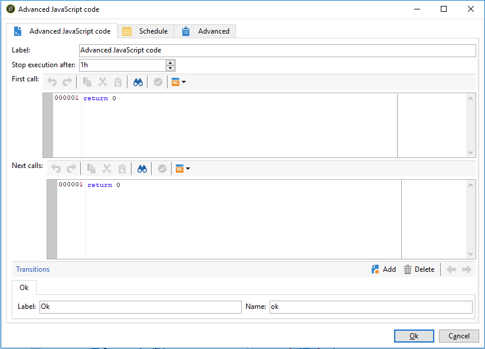

# SQL-code en JavaScript-code{#sql-code-and-javascript-code}

## SQL-code {#sql-code}

Een activiteit **[!UICONTROL SQL code]** voert een SQL manuscript uit. Het script is een JST-sjabloon.

* **[!UICONTROL Script]**

   Het centrale gebied van de editor bevat het script dat moet worden uitgevoerd. Dit script is een JST-sjabloon en kan daarom worden geconfigureerd volgens de workflowcontext.

* **[!UICONTROL Processing errors]**

   Zie [Fouten verwerken](../../workflow/using/monitoring-workflow-execution.md#processing-errors).

## JavaScript-code en geavanceerde JavaScript-code {#javascript-code}

**[!UICONTROL JavaScript code]** en  **[!UICONTROL Advanced JavaScript code]** activiteiten voeren een JavaScript-script uit in de context van een workflow. Raadpleeg de sectie [JavaScript-scripts en sjablonen](../../workflow/using/javascript-scripts-and-templates.md) voor meer informatie over scripts.

### Uitvoeringstijd {#exec-delay}

Vanaf release 20.2 is een uitvoeringstijd toegevoegd aan de **[!UICONTROL JavaScript code]**- en **[!UICONTROL Advanced JavaScript code]**-activiteiten. Standaard kan de uitvoeringsfase niet langer duren dan 1 uur. Na deze vertraging wordt het proces afgebroken met een foutbericht en mislukt de uitvoering van de activiteit.

U kunt deze vertraging wijzigen in het veld **[!UICONTROL Stop execution after]** dat beschikbaar is in deze activiteiten.

Als u deze limiet wilt negeren, moet u de waarde instellen op **0**.

### JavaScript-code {#js-code-desc}

* **[!UICONTROL Script]**: Het centrale gebied van de editor bevat het script dat moet worden uitgevoerd.

* **[!UICONTROL Process errors]**: Raadpleeg  [Verwerkingsfouten](../../workflow/using/monitoring-workflow-execution.md#processing-errors).

### Geavanceerde JavaScript-code {#adv-js-code-desc}

* **[!UICONTROL First call]**: De eerste streek van de redacteur bevat het manuscript om tijdens de eerste vraag uit te voeren.
* **[!UICONTROL Next calls]**: De tweede streek van de redacteur bevat het manuscript om tijdens de volgende vraag uit te voeren.
* **[!UICONTROL Transitions]**: U kunt verschillende uitvoerovergangen voor activiteiten definiëren.
* **[!UICONTROL Schedule]**: Op het  **[!UICONTROL Schedule]** tabblad kunt u plannen wanneer de activiteit moet worden geactiveerd.
