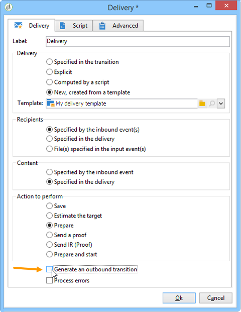

# Start en einde{#start-and-end}

De **[!UICONTROL Start]** en **[!UICONTROL End]** Met activiteiten kunt u het begin en einde van een werkstroom grafisch markeren. Deze activiteiten hebben geen functioneel effect en zijn derhalve facultatief.

* **[!UICONTROL Start]**

  Het uitvoeren van een werkschema begint met activiteiten zonder een binnenkomende overgang en Begin-type activiteiten.

  

* **[!UICONTROL End]**

  U kunt de **[!UICONTROL End]** om alle actieve taken te onderbreken. Dubbelklik hiertoe op de activiteit om de eigenschappen weer te geven en controleer de gewenste optie.

  

  De gegevens in de werktabel worden automatisch verwijderd wanneer de eindactiviteit is ingeschakeld. Als dit niet nodig is en om onnodige belasting te voorkomen, kunt u de overgang uitschakelen bij de laatste uitgevoerde activiteit. Schakel bijvoorbeeld bij een leveringsuitvoer, als er geen proces is gepland, de relevante optie uit zoals hieronder wordt weergegeven:

  
