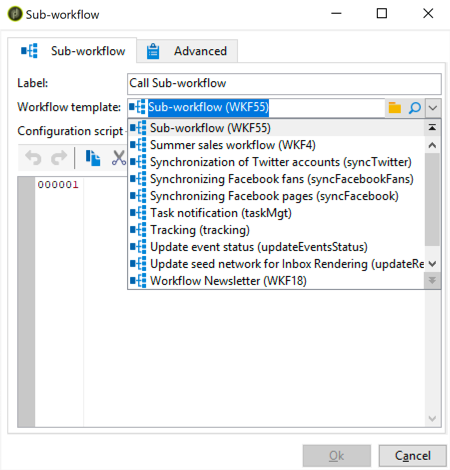

# Subworkflow{#sub-workflow}

Met de **[!UICONTROL Sub-workflow]** activiteit kunt u de uitvoering van een andere workflow starten en het resultaat herstellen. Met deze activiteit kunt u complexe workflows gebruiken terwijl u een vereenvoudigde interface gebruikt.

U kunt meerdere subworkflows aanroepen in één workflow. Subworkflows worden synchroon uitgevoerd.

>[!NOTE]
>
>De subworkflow kan alleen correct worden uitgevoerd als u één sprong van het type &quot;aankomst&quot; met het laagste getal hebt en slechts één sprong van het type &quot;start&quot; met het hoogste getal. Als u bijvoorbeeld &quot;start&quot;-sprongen hebt met een prioriteit 1, 2 en 3, hebt u slechts één sprongreis van het type &quot;start&quot; met een prioriteit 3.

1. Maak een workflow die u als een subworkflow in een andere workflow wilt gebruiken.
1. Voeg een **[!UICONTROL Jump (end point)]** activiteit met een prioriteit van 1 aan het begin van de werkstroom in. Als u meerdere sprongen van het type &quot;aankomst&quot; hebt, gebruikt Adobe Campaign de &quot;aankomst&quot;-sprong met het laagste aantal.

   Voeg een **[!UICONTROL Jump (start point)]** activiteit in met een prioriteit van 2 aan het einde van de workflow. Als u meerdere sprongen van het type &quot;start&quot; hebt, gebruikt Adobe Campagne de &quot;start&quot;-sprong met het hoogste aantal.

   

   >[!NOTE]
   >
   >Als de subworkflowactiviteit verwijst naar een werkstroom met verschillende **[!UICONTROL Jump]** activiteiten, wordt de subwerkstroom uitgevoerd tussen het type &quot;aankomst&quot; met het laagste getal en de sprong van het type &quot;start&quot; met het hoogste getal.

1. Vul deze subworkflow in en sla deze op.
1. Een &#39;hoofdworkflow&#39; maken.
1. Voeg een **[!UICONTROL Sub-workflow]** activiteit in en open deze.
1. Selecteer de workflow die u wilt gebruiken in de **[!UICONTROL Workflow template]** vervolgkeuzelijst.

   

1. U kunt ook een configuratiescript toevoegen om de workflow waarnaar wordt verwezen te wijzigen.
1. Klik **[!UICONTROL Ok]**. Er wordt automatisch een uitgaande overgang gemaakt met het label van de **[!UICONTROL Jump (start point)]** activiteit uit de geselecteerde workflow.

   

1. Voer de workflow uit.

Wanneer de workflow eenmaal is uitgevoerd, bevindt de workflow die als een subworkflow is aangeroepen zich nog steeds in de **[!UICONTROL Being edited]** status. Dit betekent het volgende:

* U kunt niet met de rechtermuisknop op de overgangen klikken om het doel weer te geven.
* Het aantal intermediaire populaties kan niet worden weergegeven.
* De logbestanden worden samengevoegd in de &quot;master&quot;-workflow en worden alleen aangeduid als &quot;subworkflow&quot;.

Deze workflow is slechts een sjabloon. Er wordt een nieuwe subworkflow op basis van deze sjabloon gemaakt wanneer deze wordt aangeroepen vanuit de &quot;master&quot;-workflow.

## Invoerparameters (optioneel) {#input-parameters--optional-}

* tableName
* schema

Elke binnenkomende gebeurtenis moet een doel specificeren dat door deze parameters wordt bepaald.

## Uitvoerparameters {#output-parameters}

* tableName
* schema
* recCount

Deze reeks van drie waarden identificeert de bevolking die door de vraag wordt gericht. **[!UICONTROL tableName]** is de naam van de lijst die de doelherkenningstekens registreert, **[!UICONTROL schema]** is het schema van de bevolking (gewoonlijk nms:ontvanger) en **[!UICONTROL recCount]** is het aantal elementen in de lijst.

* targetSchema

Deze waarde is het schema van de het werklijst. Deze parameter is geldig voor alle overgangen met **[!UICONTROL tableName]** en **[!UICONTROL schema]**.
