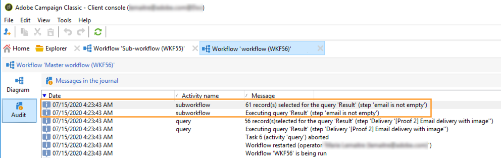

# Subworkflow{#sub-workflow}

Met de activiteit **[!UICONTROL Sub-workflow]** kunt u de uitvoering van een andere workflow starten en het resultaat herstellen. Met deze activiteit kunt u complexe workflows gebruiken terwijl u een vereenvoudigde interface gebruikt.

U kunt meerdere subworkflows aanroepen in één workflow. Subworkflows worden synchroon uitgevoerd.

In het onderstaande voorbeeld roept een primaire workflow een subworkflow aan met behulp van sprongen. Zie [deze sectie](../../workflow/using/jump--start-point-and-end-point-.md) voor meer informatie over grafische objecten van het sprongtype.

1. Maak een workflow die u als een subworkflow in een andere workflow wilt gebruiken.
1. Voeg een **[!UICONTROL Jump (end point)]** activiteit met een prioriteit van 1 aan het begin van het werkschema in. Als u meerdere sprongen van het type &quot;eindpunt&quot; hebt, gebruikt Adobe Campaign de sprongen &quot;eindpunt&quot; met het laagste getal.
1. Voeg een activiteit **[!UICONTROL Jump (start point)]** met een prioriteit van 2 aan het eind van het werkschema in. Als u meerdere sprongen van het type &quot;beginpunt&quot; hebt, gebruikt Adobe Campaign de sprong &quot;beginpunt&quot; met het hoogste getal.

   

   >[!NOTE]
   >
   >Als de subworkflowactiviteit verwijst naar een werkstroom met verschillende **[!UICONTROL Jump]** activiteiten, wordt de subwerkstroom uitgevoerd tussen het type &quot;eindpunt&quot; springen met het laagste getal en het type &quot;beginpunt&quot; springen met het hoogste getal.
   >
   >De subworkflow kan alleen correct worden uitgevoerd als u slechts één sprongreis van het type &quot;eindpunt&quot; met het laagste getal hebt en slechts één sprongreis van het type &quot;beginpunt&quot; met het hoogste getal.

1. Vul deze subworkflow in en sla deze op.
1. Een primaire workflow maken.
1. Voeg een **[!UICONTROL Sub-workflow]** activiteit in en open het.
1. Selecteer de workflow die u wilt gebruiken in de vervolgkeuzelijst **[!UICONTROL Workflow template]**.

   

1. U kunt ook een configuratiescript toevoegen om de workflow waarnaar wordt verwezen te wijzigen.
1. Klik op **[!UICONTROL Ok]**. Er wordt automatisch een uitgaande overgang gemaakt met het label van de **[!UICONTROL Jump (start point)]**-activiteit uit de geselecteerde workflow.

   

1. Voer de workflow uit.

Nadat de workflow is uitgevoerd, blijft de status **[!UICONTROL Being edited]** behouden, wat het volgende betekent:

* U kunt niet met de rechtermuisknop op de overgangen klikken om het doel weer te geven.
* Het aantal intermediaire populaties kan niet worden weergegeven.
* De logboeken van de subworkflow worden weergegeven in de primaire workflow.

   

>[!NOTE]
>
>Als er een fout optreedt in de subworkflow, wordt de primaire workflow gepauzeerd en wordt er een kopie van de subworkflow gemaakt.

## Invoerparameters (optioneel) {#input-parameters--optional-}

* tableName
* schema

Elke binnenkomende gebeurtenis moet een doel specificeren dat door deze parameters wordt bepaald.

## Uitvoerparameters {#output-parameters}

* tableName
* schema
* recCount

Deze reeks van drie waarden identificeert de bevolking die door de vraag wordt gericht. **[!UICONTROL tableName]** is de naam van de lijst die de doelherkenningstekens registreert,  **[!UICONTROL schema]** is het schema van de bevolking (gewoonlijk nms:ontvanger) en  **[!UICONTROL recCount]** is het aantal elementen in de lijst.

* targetSchema: Deze waarde is het schema van de het werklijst. Deze parameter is geldig voor alle overgangen met **[!UICONTROL tableName]** en **[!UICONTROL schema]**.
