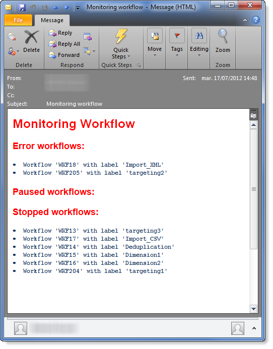

# Workflows controleren{#supervising-workflows}

In dit geval wordt het maken van een workflow beschreven waarmee u de status kunt controleren van een set werkstromen die worden gepauzeerd, gestopt of met fouten.

Het doel van de verordening is:

* Gebruik een werkschema om een groep bedrijfswerkschema&#39;s te controleren.
* Verzend een bericht naar een supervisor via een &quot;levering&quot;activiteit.

Als u de status van een set workflows wilt controleren, moet u de volgende stappen uitvoeren:

1. Maak de controleworkflow.
1. Schrijf JavaScript om te bepalen of werkstromen worden gepauzeerd, tegengehouden of met fouten.
1. Maak de **[!UICONTROL Test]**-activiteit.
1. Bereid het leveringsmalplaatje voor.

>[!NOTE]
>
>Naast het werkschema, staat de Campagne **WerkstroomHeatmap** u toe om in details de werkschema&#39;s te analyseren die momenteel lopen. Raadpleeg voor meer informatie de [toegewezen sectie](../../workflow/using/heatmap.md).
>
>Raadpleeg **deze sectie** voor meer informatie over hoe u de uitvoering van uw workflows kunt controleren.[](../../workflow/using/monitoring-workflow-execution.md)

## Stap 1: De bewakingsworkflow {#step-1--creating-the-monitoring-workflow} maken

De werkschemamap die wij gaan controleren is **&quot;CustomWorkflows&quot;** omslag die in **Beleid > Productie > Technische werkschema&#39;s** knoop wordt opgeslagen. Deze map bevat een set bedrijfsworkflows.

De **Monitoring workflow** wordt opgeslagen in de hoofdmap van de map Technical Workflows. Het gebruikte label is **&quot;Controle&quot;**.

Het volgende schema toont de opeenvolging van activiteiten:


Deze workflow bestaat uit:

* a **&quot;Start&quot;** activiteit.
* a **&quot;JavaScript code&quot;** activiteit verantwoordelijk voor het analyseren van de omslag van bedrijfswerkschema&#39;s.
* a **&quot;Test&quot;** activiteit om een levering naar de supervisor te verzenden of het werkschema opnieuw te beginnen.
* a **&quot;Levering&quot;** activiteit verantwoordelijk voor berichtlay-out.
* a **&quot;Wacht&quot;** activiteit die de loodtijden tussen werkschemariteraties controleert.

## Stap 2: Het schrijven van JavaScript {#step-2--writing-the-javascript}

Het eerste deel van de JavaScript-code valt samen met een **query (queryDef)** waarmee u de workflows kunt identificeren met de status &quot;pause&quot; (@state == 13), &quot;error&quot; (@failed == 1) of &quot;stopped&quot; (@state == 20).

De **interne naam** van de te controleren werkschemamap wordt gegeven in de volgende voorwaarde:

```
<condition boolOperator="AND" expr="[folder/@name] = 'Folder20'" internalId="1"/>
```

```
var strError = "";
var strPaused = "";
var strStop = "";

var queryWkfError = xtk.queryDef.create(
  <queryDef schema="xtk:workflow" operation="select">
    <select>
      <node expr="@internalName"/>
      <node expr="@state"/>
      <node expr="@label"/>
      <node expr="@failed"/>
      <node expr="@state"/>   
    </select>
    <where id="12837805386">
      <condition boolOperator="AND" expr="[folder/@name] = 'Folder20'" internalId="1"/>
        <condition boolOperator="AND" internalId="2">
          <condition boolOperator="OR" expr="@state = 20" internalId="3"/>
          <condition expr="@state = 13" internalId="4"/>
        </condition>  
    </where>
  </queryDef>
);
var ndWkfError = queryWkfError.ExecuteQuery(); 
```

In het tweede deel van de JavaScript-code kunt u **een bericht weergeven voor elke workflow** op basis van de status die tijdens de query is hersteld.

>[!NOTE]
>
>De gemaakte tekenreeksen moeten worden geladen in de gebeurtenisvariabelen van de workflow.

```
for each ( var wkf in ndWkfError.workflow ) 
{
  if ( wkf.@state == 13 )  // Status 13 = paused
  {
    if ( wkf.@failed == 1 )
      strError += "<li>Workflow '" + wkf.@internalName + "' with the label '" + wkf.@label + "'</li>";
    else
      strPaused += "<li>Workflow '" + wkf.@internalName + "' with the label '" + wkf.@label + "'</li>";
  }
  
  if ( wkf.@state == 20 )  // Status 20 = stop
    strStop += "<li>Workflow '" + wkf.@internalName + "' with the label '" + wkf.@label + "'</li>";
}

vars.strWorkflowError = strError;
vars.strWorkflowPaused = strPaused;
vars.strWorkflowStop = strStop;
```

## Stap 3: De &#39;Test&#39;-activiteit {#step-3--creating-the--test--activity} maken

De &quot;Test&quot;activiteit laat u bepalen of een levering moet worden verzonden of of het controlewerkschema een andere die cyclus moet in werking stellen op de &quot;Wacht&quot;activiteit wordt gebaseerd.

Een levering wordt verzonden naar de supervisor **als minstens één van de drie gebeurtenisvariabelen &quot;vars.strWorkflowError&quot;, &quot;vars.strWorkflowPaused&quot;, of &quot;vars.strWorkflowStop&quot; niet-void is.**


De activiteit &quot;wacht&quot;kan worden gevormd om het controlewerkschema met regelmatige intervallen opnieuw te beginnen. Voor dit gebruiksgeval, **wordt de wachttijd geplaatst aan één uur**.


## Stap 4: De levering {#step-4--preparing-the-delivery} voorbereiden

De activiteit &quot;van de Levering&quot;is gebaseerd op een **leveringsmalplaatje** dat in **Middelen > Malplaatjes > de malplaatjes van de Levering** knoop wordt opgeslagen.

Deze sjabloon moet het volgende bevatten:

* **het e-mailadres van de toezichthouder**.
* **HTML-** inhoud voor het invoegen van gepersonaliseerde tekst.

   

   De drie gedeclareerde variabelen (WF_Stop, WF_Paused, WF_Error) komen overeen met de drie workflowgebeurtenisvariabelen.

   Deze variabelen moeten in **Variabelen** lusje van de eigenschappen van het leveringsmalplaatje worden verklaard.

   Als u **de inhoud van de workflowgebeurtenisvariabelen** wilt herstellen, moet u de variabelen declareren die specifiek zijn voor de levering en die worden geïnitialiseerd met waarden die door de JavaScript-code worden geretourneerd.

   De leveringssjabloon heeft de volgende inhoud:

   

Zodra het malplaatje is gecreeerd en goedgekeurd, moet u **Delivery** activiteit vormen aan:

* Koppel de activiteit van de &quot;Levering&quot;aan eerder gecreeerd leveringsmalplaatje.
* Koppel de de gebeurtenisvariabelen van het werkschema aan die specifiek voor het leveringsmalplaatje.

Dubbelklik op de activiteit **Delivery** en selecteer de volgende opties:

* Aflevering: Selecteer **Nieuw, gecreeerd van een malplaatje**, en selecteer eerder gecreeerd leveringsmalplaatje.
* Selecteer **Opgegeven in de aflevering** voor de velden **Ontvangers en Inhoud**.
* Uit te voeren handeling: Selecteer **Voorbereiden en starten**.
* Schakel de optie **Procesfouten** uit.

   

* Ga naar **Script** tabel van **Delivery** activiteit, voeg drie **karakterkoord** typevariabelen via het het het gebiedmenu van het verpersoonlijkingsgebied toe.

   

   

   De drie gedeclareerde variabelen zijn:

   ```
   delivery.variables._var[0].stringValue = vars.strWorkflowError;
   delivery.variables._var[1].stringValue = vars.strWorkflowPaused;
   delivery.variables._var[2].stringValue = vars.strWorkflowStop; 
   ```

Zodra deze controlewerkstroom wordt gelanceerd, verzendt het het volgende overzicht naar de ontvanger:



