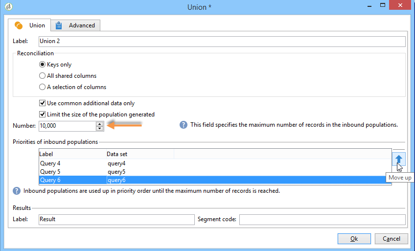
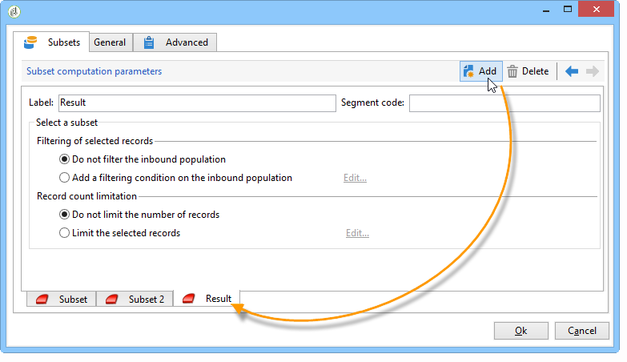

# Targetingdata{#targeting-data}

## Query’s maken {#creating-queries}

### Gegevens {#selecting-data} selecteren

Met een activiteit **[!UICONTROL Query]** kunt u basisgegevens selecteren om de doelpopulatie samen te stellen. Voor meer op dit, verwijs naar [Creërend een vraag](../../workflow/using/query.md#creating-a-query).

U kunt ook de volgende activiteiten gebruiken om gegevens in de database te zoeken en te verfijnen: [Incrementele query](../../workflow/using/incremental-query.md), [Leeslijst](../../workflow/using/read-list.md).

Het is mogelijk aanvullende gegevens te verzamelen die gedurende de gehele levenscyclus van de werkstroom moeten worden doorgestuurd en verwerkt. Raadpleeg [Gegevens toevoegen](../../workflow/using/query.md#adding-data) en [Extra gegevens bewerken](#editing-additional-data) voor meer informatie.

### Aanvullende gegevens bewerken {#editing-additional-data}

Zodra extra gegevens zijn toegevoegd, kunt u het uitgeven of het gebruiken om het doel te raffineren dat in de vraagactiviteit wordt bepaald.

Met de koppeling **[!UICONTROL Edit additional data...]** kunt u de toegevoegde gegevens weergeven en wijzigen of toevoegen.

Als u gegevens wilt toevoegen aan de eerder gedefinieerde uitvoerkolommen, selecteert u deze in de lijst met beschikbare velden. Als u een nieuwe uitvoerkolom wilt maken, klikt u op het pictogram **[!UICONTROL Add]**, selecteert u het veld en klikt u op **[!UICONTROL Edit expression]**.

Definieer een berekeningsmodus voor het veld dat moet worden toegevoegd, zoals bijvoorbeeld een aggregaat.

Met de optie **[!UICONTROL Add a sub-item]** kunt u berekende gegevens aan de verzameling koppelen. Hiermee kunt u de aanvullende gegevens uit de verzameling selecteren of geaggregeerde berekeningen voor verzamelingselementen definiëren.

De subelementen worden weergegeven in de substructuur van de verzameling waaraan ze zijn toegewezen.

Verzamelingen worden weergegeven op het subtabblad **[!UICONTROL Collections]**. U kunt de verzamelde elementen filteren door op het pictogram **[!UICONTROL Detail]** van de geselecteerde verzameling te klikken. Met de filterwizard kunt u de verzamelde gegevens selecteren en de filtervoorwaarden opgeven die op de gegevens in de verzameling moeten worden toegepast.

### Het doel verfijnen met extra gegevens {#refining-the-target-using-additional-data}

De extra verzamelde gegevens kunnen u toelaten om gegevens het filtreren in het gegevensbestand te verfijnen. Klik hiertoe op de koppeling **[!UICONTROL Refine the target using additional data...]**: Hiermee kunt u de toegevoegde gegevens te veel filteren.

### Gegevens {#homogenizing-data} homogeneren

In **[!UICONTROL Union]** of **[!UICONTROL Intersection]** type activiteiten, kunt u verkiezen om slechts gedeelde extra gegevens te houden om de gegevens verenigbaar te houden. In dit geval bevat de tijdelijke uitvoerwerktabel van deze activiteit alleen de aanvullende gegevens die in alle binnenkomende sets worden gevonden.

### Afstemming met extra gegevens {#reconciliation-with-additional-data}

Tijdens de afstemmingsfasen (**[!UICONTROL Union]**, **[!UICONTROL Intersection]**, enz. activiteiten) selecteert u de kolommen die u wilt gebruiken voor het afstemmen van gegevens in de extra kolommen. Hiertoe configureert u een afstemming op een selectie van kolommen en geeft u de hoofdset op. Selecteer vervolgens de kolommen in de onderste kolom van het venster, zoals in het volgende voorbeeld wordt getoond:

### Subsets {#creating-subsets} maken

Met de activiteit **[!UICONTROL Split]** kunt u subsets maken op basis van criteria die zijn gedefinieerd via extractiequery&#39;s. Voor elke ondergroep, wanneer u een filtervoorwaarde op de bevolking uitgeeft, zult u tot de standaardvraagactiviteit toegang hebben die u de voorwaarden van de doelsegmentatie laat bepalen.

U kunt een doel in verscheidene subsets verdelen gebruikend slechts extra gegevens als het filtreren voorwaarden, of naast doelgegevens. U kunt externe gegevens ook gebruiken als u de optie **Federated Data Access** hebt aangeschaft.

Raadpleeg [Subsets maken met de activiteit Splitsen](#creating-subsets-using-the-split-activity) voor meer informatie.

## Gegevens segmenteren {#segmenting-data}

### Het combineren van verscheidene doelstellingen (Unie) {#combining-several-targets--union-}

Met de vakbondsactiviteit kunt u het resultaat van verschillende activiteiten in één overgang combineren. Stellen hoeven niet noodzakelijkerwijs homogeen te zijn.

De volgende afstemmingsopties voor gegevens zijn beschikbaar:

* **[!UICONTROL Keys only]**

   Deze optie kan worden gebruikt als de inputpopulaties homogeen zijn.

* **[!UICONTROL All columns in common]**

   Met deze optie kunt u gegevens afstemmen op basis van alle kolommen die de verschillende populaties van het doel gemeen hebben.

   Adobe Campaign geeft kolommen aan op basis van hun naam. Er wordt een tolerantiedrempel aanvaard: Een kolom &#39;E-mail&#39; kan bijvoorbeeld worden herkend als identiek aan een kolom &#39;@email&#39;.

* **[!UICONTROL A selection of columns]**

   Selecteer deze optie om de lijst met kolommen te definiëren waarop de afstemming van gegevens wordt toegepast.

   Begin door de belangrijkste reeks (die bevat de brongegevens) te selecteren, dan de kolommen die voor de verbinding moeten worden gebruikt.

   

   >[!CAUTION]
   >
   >Tijdens de afstemming van gegevens worden populaties niet gededupliceerd.

   U kunt de populatiegrootte tot een bepaald aantal verslagen beperken. Klik hiertoe op de gewenste optie en geef het aantal records op dat u wilt behouden.

   Specificeer ook de prioriteit van inkomend populaties: in de onderste sectie van het venster worden de binnenkomende overgangen van de union-activiteit weergegeven en kunt u deze sorteren met de blauwe pijlen rechts van het venster.

   De gegevens worden eerst overgenomen uit de populatie van de eerste binnenkomende overgang in de lijst. Als het maximum niet is bereikt, worden ze onttrokken aan de populatie van de tweede binnenkomende overgang, enz.

   

### Bezig met extraheren van gewrichtsgegevens (doorsnede) {#extracting-joint-data--intersection-}

Met het snijpunt kunt u alleen de regels herstellen die worden gedeeld door de populaties van binnenkomende overgangen. Deze activiteit wordt als de vakbondsactiviteit gevormd.

Bovendien is het mogelijk om slechts een selectie van kolommen te houden, of slechts de kolommen die door de binnenkomende bevolking worden gedeeld.

De intersectieactiviteit wordt beschreven in de sectie [Intersection](../../workflow/using/intersection.md).

### Exclusief een populatie (Uitsluiting) {#excluding-a-population--exclusion-}

Met de uitsluitingsactiviteit kunt u de elementen van een doel uitsluiten van een andere doelpopulatie. De doeldimensie van deze activiteit is die van de hoofdset.

Indien nodig, is het mogelijk om binnenkomende lijsten te manipuleren. Om een doel van een andere dimensie uit te sluiten, moet dit doel worden teruggebracht naar dezelfde doeldimensie als het hoofddoel. Klik hiertoe op de knop **[!UICONTROL Add]** en geef de voorwaarden voor het wijzigen van de dimensie op.

Afstemming van gegevens vindt plaats via een id, een veranderende as of een samenvoeging. Een voorbeeld is beschikbaar in [Gegevens uit een lijst gebruiken: Leeslijst](../../workflow/using/importing-data.md#using-data-from-a-list--read-list).

### Subsets maken met behulp van de splitsingsactiviteit {#creating-subsets-using-the-split-activity}

De activiteit **[!UICONTROL Split]** is een standaardactiviteit die u zo vele reeksen door één of verscheidene het filtreren dimensies zonodig laat tot stand brengen, evenals het produceren van of één outputovergang per ondergroep of een unieke overgang.

De extra gegevens die door de binnenkomende overgang worden overgebracht kunnen in de het filtreren criteria worden gebruikt.

Om het te vormen, moet u eerst criteria selecteren:

1. In uw werkschema, sleep en laat vallen een **[!UICONTROL Split]** activiteit.
1. Selecteer op het tabblad **[!UICONTROL General]** de gewenste optie: **[!UICONTROL Use data from the target and additional data]**, **[!UICONTROL Use the additional data only]** of **[!UICONTROL Use external data]**.
1. Als de optie **[!UICONTROL Use data from the target and additional data]** wordt geselecteerd, laat de het richten afmeting u alle gegevens gebruiken die door de binnenkomende overgang worden overgebracht.

   

   Wanneer subsets worden gemaakt, worden de eerder vermelde filterparameters gebruikt.

   Als u filtervoorwaarden wilt definiëren, kiest u de optie **[!UICONTROL Add a filtering condition on the inbound population]** en klikt u op de koppeling **[!UICONTROL Edit...]**. Geef vervolgens de filtervoorwaarden op voor het maken van deze subset.

   

   Een voorbeeld dat toont hoe te om het filtreren voorwaarden in **[!UICONTROL Split]** activiteit te gebruiken om het doel in verschillende populaties te segmenteren wordt beschreven in [deze sectie](../../workflow/using/cross-channel-delivery-workflow.md).

   In het veld **[!UICONTROL Label]** kunt u de zojuist gemaakte subset een naam geven, die overeenkomt met de uitgaande overgang.

   U kunt ook een segmentcode aan de subset toewijzen om deze te identificeren en te gebruiken om de populatie te bepalen.

   Indien nodig, kunt u de het richten en het filtreren dimensies individueel voor elke ondergroep veranderen u wilt tot stand brengen. Hiervoor bewerkt u de filtervoorwaarde van de subset en controleert u de optie **[!UICONTROL Use a specific filtering dimension]**.

   

1. Als de optie **[!UICONTROL Use the additional data only]** is geselecteerd, worden alleen aanvullende gegevens aangeboden voor het filteren van subsets.

   

1. Als de **Federated Data Access** optie wordt toegelaten, **[!UICONTROL Use external data]** laat u gegevens in een extern gegevensbestand verwerken dat reeds wordt gevormd, of een nieuwe verbinding aan een gegevensbestand creëren.

   

   Raadpleeg deze [sectie](../../installation/using/about-fda.md) voor meer informatie.

Vervolgens moeten nieuwe subsets worden toegevoegd:

1. Klik op de knop **[!UICONTROL Add]** en definieer de filtervoorwaarden.

   

1. Definieer de filterdimensie op het tabblad **[!UICONTROL General]** van de activiteit (zie boven). Deze wordt standaard toegepast op alle subsets.

   

1. Indien nodig kunt u de filterdimensie voor elke subset afzonderlijk wijzigen. Hiermee kunt u een set maken voor alle houders van een Gold-kaart, één voor alle ontvangers die op de meest recente nieuwsbrief hebben geklikt en een derde voor personen van 18 tot en met 25 jaar die de laatste 30 dagen in de winkel een aankoop hebben gedaan, allemaal met dezelfde gesplitste activiteit. Selecteer hiertoe de optie **[!UICONTROL Use a specific filtering dimension]** en selecteer de context voor het filteren van gegevens.

   

   >[!NOTE]
   >
   >Als u de optie **Federated Data Access** hebt verworven, kunt u subsets maken op basis van de informatie in een externe basis. Selecteer hiertoe het schema van de externe tabel in het veld **[!UICONTROL Targeting dimension]**. Raadpleeg [Toegang tot een externe database (FDA)](../../workflow/using/accessing-an-external-database--fda-.md) voor meer informatie hierover.

Nadat subsets zijn gemaakt, toont de splitsingsactiviteit standaard evenveel uitvoerovergangen als er subsets zijn:

U kunt al deze subsets groeperen in één uitvoerovergang. In dit geval is de koppeling naar de desbetreffende subsets bijvoorbeeld zichtbaar in de segmentcode. Selecteer de optie **[!UICONTROL Generate all subsets in the same table]** om dit te doen.

Bijvoorbeeld, kunt u één enkele leveringsactiviteit plaatsen en de leveringsinhoud personaliseren die op de segmentcode van elke ontvankelijke reeks wordt gebaseerd:

Subsets kunnen ook worden gemaakt met de activiteit **[!UICONTROL Cells]**. Raadpleeg voor meer informatie de sectie [Cellen](../../workflow/using/cells.md).

### Doelgegevens {#using-targeted-data} gebruiken

Zodra de gegevens zijn geïdentificeerd en opgesteld, kunnen ze in de volgende context worden gebruikt:

* U kunt de gegevens in de database bijwerken na gegevensmanipulatie in de verschillende werkstroomfasen.

   Voor meer op dit, [Update gegevens](../../workflow/using/update-data.md).

* U kunt ook de inhoud van bestaande lijsten vernieuwen.

   Raadpleeg [List update](../../workflow/using/list-update.md) voor meer informatie hierover.

* U kunt leveringen rechtstreeks voorbereiden of starten in de workflow.

   Raadpleeg [Delivery](../../workflow/using/delivery.md), [Delivery control](../../workflow/using/delivery-control.md) en [Continuous delivery](../../workflow/using/continuous-delivery.md) voor meer informatie.

## Gegevensbeheer {#data-management}

In Adobe Campaign combineert het gegevensbeheer een reeks activiteiten om complexe doelgerichte problemen op te lossen door efficiëntere en flexibelere hulpmiddelen aan te bieden. Dit laat u verenigbaar beheer van alle communicatie met een contact uitvoeren gebruikend informatie met betrekking tot hun contracten, abonnementen, reactiviteit aan leveringen, enz. Met data management kunt u de levenscyclus van data bijhouden tijdens segmentatiebewerkingen, met name:

* Het vereenvoudigen en optimaliseren van targetingprocessen, door data op te nemen die niet in de datamart worden gemodelleerd (het maken van nieuwe tabellen: lokale extensie voor elke targetingworkflow afhankelijk van de configuratie).
* Het bijhouden en overbrengen van bufferberekeningen, vooral tijdens fasen voor de opbouw van doelen of voor databasebeheer.
* Het openen van externe databases (optioneel): heterogene databases waarmee tijdens het targetingproces rekening wordt gehouden.

Voor de uitvoering van deze transacties biedt Adobe Campaign:

* Gegevensverzameling: [Bestandsoverdracht](../../workflow/using/file-transfer.md), [Gegevens laden (bestand)](../../workflow/using/data-loading--file-.md), [Gegevens laden (RDBMS)](../../workflow/using/data-loading--rdbms-.md), [Gegevens bijwerken](../../workflow/using/update-data.md). In deze eerste stap voor het verzamelen van gegevens worden de gegevens voorbereid, zodat ze in andere activiteiten kunnen worden verwerkt. Verschillende parameters moeten worden gecontroleerd om ervoor te zorgen dat de workflow correct wordt uitgevoerd en de verwachte resultaten oplevert. Wanneer u bijvoorbeeld gegevens importeert, moet de primaire sleutel (sleutel) voor deze gegevens uniek zijn voor elke record.
* Doelactiviteiten zijn verrijkt met opties voor gegevensbeheer: [Query](../../workflow/using/query.md), [Union](../../workflow/using/union.md), [Intersection](../../workflow/using/intersection.md), [Splitsen](../../workflow/using/split.md). Zo kunt u een samenvoeging of een doorsnede configureren tussen gegevens van verschillende doeldimensies, zolang de gegevens met elkaar in overeenstemming zijn.
* Transformatie van gegevens: [Verrijking](../../workflow/using/enrichment.md), [Dimensie wijzigen](../../workflow/using/change-dimension.md).

>[!CAUTION]
>
>Wanneer twee workflows zijn gekoppeld, betekent het verwijderen van een brontabelelement niet dat alle gegevens die eraan zijn gekoppeld, worden verwijderd.
>  
>Als u bijvoorbeeld een ontvanger verwijdert via een workflow, wordt niet alle leveringsgeschiedenis van de ontvanger verwijderd. Als u echter een ontvanger rechtstreeks in de map &#39;Ontvangers&#39; verwijdert, worden alle gegevens die aan deze ontvanger zijn gekoppeld, ook verwijderd.

### Gegevens {#enriching-and-modifying-data} verrijken en wijzigen

Naast het richten afmeting, laat de het filtreren afmeting u de aard van de verzamelde gegevens specificeren. Zie [Afmetingen voor richten en filteren](../../workflow/using/building-a-workflow.md#targeting-and-filtering-dimensions).

De geïdentificeerde en verzamelde gegevens kunnen worden verrijkt, geaggregeerd en gemanipuleerd om de doelconstructie te optimaliseren. Hiervoor gebruikt u, naast de gegevensmanipulatieactiviteiten die worden beschreven in de sectie [Gegevens segmenteren](#segmenting-data), het volgende:

* Met de activiteit **[!UICONTROL Enrichment]** kunt u tijdelijk kolommen aan een schema toevoegen en informatie aan bepaalde elementen toevoegen. Het wordt gedetailleerd in [Verrijking](../../workflow/using/enrichment.md) sectie van de bewaarplaats van activiteiten.
* Met de activiteit **[!UICONTROL Edit schema]** kunt u de structuur van een schema wijzigen. Het wordt gedetailleerd in [geef schema](../../workflow/using/edit-schema.md) sectie van de bewaarplaats van activiteiten uit.
* Met de activiteit **[!UICONTROL Change dimension]** kunt u de doeldimensie tijdens de ontwerpcyclus wijzigen. Dit wordt beschreven in de sectie [Dimensie wijzigen](../../workflow/using/change-dimension.md).

