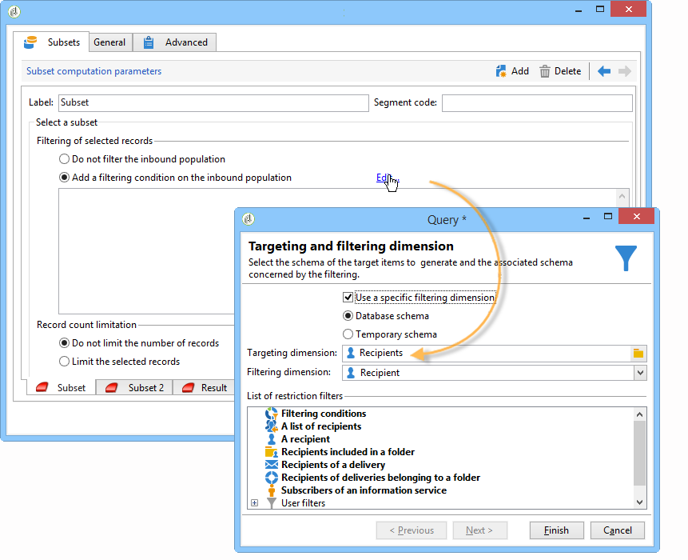

# Doelgegevens{#targeting-data}

## Vragen maken {#creating-queries}

### Gegevens selecteren {#selecting-data}

Met een **[!UICONTROL Query]** activiteit kunt u basisgegevens selecteren om de doelpopulatie samen te stellen. Voor meer op dit, verwijs naar het [Creëren van een vraag](../../workflow/using/query.md#creating-a-query).

U kunt ook de volgende activiteiten gebruiken om gegevens in de database te zoeken en te verfijnen: [Incrementele query](../../workflow/using/incremental-query.md), [Leeslijst](../../workflow/using/read-list.md).

Het is mogelijk aanvullende gegevens te verzamelen die gedurende de gehele levenscyclus van de werkstroom moeten worden doorgestuurd en verwerkt. Raadpleeg voor meer informatie [Gegevens](../../workflow/using/query.md#adding-data) toevoegen en aanvullende gegevens bewerken.

### Extra gegevens bewerken {#editing-additional-data}

Zodra extra gegevens zijn toegevoegd, kunt u het uitgeven of het gebruiken om het doel te raffineren dat in de vraagactiviteit wordt bepaald.

Met de **[!UICONTROL Edit additional data...]** koppeling kunt u de toegevoegde gegevens weergeven en wijzigen of toevoegen.

Als u gegevens wilt toevoegen aan de eerder gedefinieerde uitvoerkolommen, selecteert u deze in de lijst met beschikbare velden. Als u een nieuwe uitvoerkolom wilt maken, klikt u op het **[!UICONTROL Add]** pictogram, selecteert u het veld en klikt u op **[!UICONTROL Edit expression]**.

Definieer een berekeningsmodus voor het veld dat moet worden toegevoegd, zoals bijvoorbeeld een aggregaat.

Met de **[!UICONTROL Add a sub-item]** optie kunt u berekende gegevens aan de verzameling koppelen. Hiermee kunt u de aanvullende gegevens uit de verzameling selecteren of geaggregeerde berekeningen voor verzamelingselementen definiëren.

De subelementen worden weergegeven in de substructuur van de verzameling waaraan ze zijn toegewezen.

Verzamelingen worden weergegeven op het **[!UICONTROL Collections]** subtabblad. U kunt de verzamelde elementen filteren door op het **[!UICONTROL Detail]** pictogram van de geselecteerde verzameling te klikken. Met de filterwizard kunt u de verzamelde gegevens selecteren en de filtervoorwaarden opgeven die op de gegevens in de verzameling moeten worden toegepast.

### Het doel verfijnen met behulp van aanvullende gegevens {#refining-the-target-using-additional-data}

De extra verzamelde gegevens kunnen u toelaten om gegevens het filtreren in het gegevensbestand te verfijnen. Klik hiertoe op de **[!UICONTROL Refine the target using additional data...]** koppeling: Hiermee kunt u de toegevoegde gegevens te veel filteren.

### Gegevens homogeneren {#homogenizing-data}

Bij activiteiten **[!UICONTROL Union]** of **[!UICONTROL Intersection]** type kunt u ervoor kiezen alleen gedeelde aanvullende gegevens te behouden om de gegevens consistent te houden. In dit geval bevat de tijdelijke uitvoerwerktabel van deze activiteit alleen de aanvullende gegevens die in alle binnenkomende sets worden gevonden.

### Afstemming met aanvullende gegevens {#reconciliation-with-additional-data}

Tijdens de afstemmingsfasen (**[!UICONTROL Union]**, **[!UICONTROL Intersection]** enz.) activiteiten) selecteert u de kolommen die u wilt gebruiken voor het afstemmen van gegevens in de extra kolommen. Hiertoe configureert u een afstemming op een selectie van kolommen en geeft u de hoofdset op. Selecteer vervolgens de kolommen in de onderste kolom van het venster, zoals in het volgende voorbeeld wordt getoond:

### Subsets maken {#creating-subsets}

Met de **[!UICONTROL Split]** activiteit kunt u subsets maken op basis van criteria die zijn gedefinieerd via extractiequery&#39;s. Voor elke ondergroep, wanneer u een filtervoorwaarde op de bevolking uitgeeft, zult u tot de standaardvraagactiviteit toegang hebben die u de voorwaarden van de doelsegmentatie laat bepalen.

U kunt een doel in verscheidene subsets verdelen gebruikend slechts extra gegevens als het filtreren voorwaarden, of naast doelgegevens. U kunt externe gegevens ook gebruiken als u de optie **Federated Data Access** hebt aangeschaft.

Raadpleeg Subsets [maken met behulp van de splitsingsactiviteit](#creating-subsets-using-the-split-activity)voor meer informatie.

## Gegevens segmenteren {#segmenting-data}

### Combinatie van verschillende doelen (Unie) {#combining-several-targets--union-}

Met de vakbondsactiviteit kunt u het resultaat van verschillende activiteiten in één overgang combineren. Stellen hoeven niet noodzakelijkerwijs homogeen te zijn.

De volgende afstemmingsopties voor gegevens zijn beschikbaar:

* **[!UICONTROL Keys only]**

   Deze optie kan worden gebruikt als de inputpopulaties homogeen zijn.

* **[!UICONTROL All columns in common]**

   Met deze optie kunt u gegevens afstemmen op basis van alle kolommen die de verschillende populaties van het doel gemeen hebben.

   De Campagne van Adobe identificeert kolommen op hun naam worden gebaseerd. Er wordt een tolerantiedrempel aanvaard: Een kolom &#39;E-mail&#39; kan bijvoorbeeld worden herkend als identiek aan een kolom &#39;@email&#39;.

* **[!UICONTROL A selection of columns]**

   Selecteer deze optie om de lijst met kolommen te definiëren waarop de afstemming van gegevens wordt toegepast.

   Begin door de belangrijkste reeks (die bevat de brongegevens) te selecteren, dan de kolommen die voor de verbinding moeten worden gebruikt.

   

   >[!CAUTION]
   >
   >Tijdens de afstemming van gegevens worden populaties niet gededupliceerd.

   U kunt de populatiegrootte tot een bepaald aantal verslagen beperken. Klik hiertoe op de gewenste optie en geef het aantal records op dat u wilt behouden.

   Specificeer ook de prioriteit van inkomend populaties: in de onderste sectie van het venster worden de binnenkomende overgangen van de union-activiteit weergegeven en kunt u deze sorteren met de blauwe pijlen rechts van het venster.

   De gegevens worden eerst overgenomen uit de populatie van de eerste binnenkomende overgang in de lijst. Als het maximum niet is bereikt, worden ze onttrokken aan de populatie van de tweede binnenkomende overgang, enz.

   

### Verbindingsgegevens extraheren (doorsnede) {#extracting-joint-data--intersection-}

Met het snijpunt kunt u alleen de regels herstellen die worden gedeeld door de populaties van binnenkomende overgangen. Deze activiteit wordt als de vakbondsactiviteit gevormd.

Bovendien is het mogelijk om slechts een selectie van kolommen te houden, of slechts de kolommen die door de binnenkomende bevolking worden gedeeld.

De intersectieactiviteit wordt beschreven in de sectie [Intersectie](../../workflow/using/intersection.md) .

### Exclusief een populatie (Uitsluiting) {#excluding-a-population--exclusion-}

Met de uitsluitingsactiviteit kunt u de elementen van een doel uitsluiten van een andere doelpopulatie. De doeldimensie van deze activiteit is die van de hoofdset.

Indien nodig, is het mogelijk om binnenkomende lijsten te manipuleren. Om een doel van een andere dimensie uit te sluiten, moet dit doel worden teruggebracht naar dezelfde doeldimensie als het hoofddoel. Klik hiertoe op de **[!UICONTROL Add]** knop en geef de voorwaarden voor het wijzigen van de afmetingen op.

Afstemming van gegevens vindt plaats via een id, een veranderende as of een samenvoeging. Een voorbeeld is beschikbaar in Gegevens [gebruiken van een lijst: Leeslijst](../../workflow/using/importing-data.md#using-data-from-a-list--read-list).

### Subsets maken met behulp van de splitsingsactiviteit {#creating-subsets-using-the-split-activity}

De **[!UICONTROL Split]** activiteit is een standaardactiviteit die u zo vele reeksen door één of verscheidene het filtreren dimensies zonodig, evenals het produceren van of één outputovergang per ondergroep of een unieke overgang laat tot stand brengen.

De extra gegevens die door de binnenkomende overgang worden overgebracht kunnen in de het filtreren criteria worden gebruikt.

Om het te vormen, moet u eerst criteria selecteren:

1. Sleep een **[!UICONTROL Split]** activiteit in de workflow en zet deze neer.
1. Selecteer op het **[!UICONTROL General]** tabblad de gewenste optie: **[!UICONTROL Use data from the target and additional data]**, **[!UICONTROL Use the additional data only]** of **[!UICONTROL Use external data]**.
1. Als de **[!UICONTROL Use data from the target and additional data]** optie is geselecteerd, kunt u met de doeldimensie alle gegevens gebruiken die door de binnenkomende overgang worden overgebracht.

   

   Wanneer subsets worden gemaakt, worden de eerder vermelde filterparameters gebruikt.

   Als u filtervoorwaarden wilt definiëren, kiest u de **[!UICONTROL Add a filtering condition on the inbound population]** optie en klikt u op de **[!UICONTROL Edit...]** koppeling. Geef vervolgens de filtervoorwaarden op voor het maken van deze subset.

   

   Een voorbeeld dat toont hoe te om filtervoorwaarden in de **[!UICONTROL Split]** activiteit te gebruiken om het doel in verschillende populaties te segmenteren wordt beschreven in [deze sectie](../../workflow/using/cross-channel-delivery-workflow.md).

   In het **[!UICONTROL Label]** veld kunt u de nieuwe subset een naam geven die overeenkomt met de uitgaande overgang.

   U kunt ook een segmentcode aan de subset toewijzen om deze te identificeren en te gebruiken om de populatie te bepalen.

   Indien nodig, kunt u de het richten en het filtreren dimensies individueel voor elke ondergroep veranderen u wilt tot stand brengen. Hiervoor bewerkt u de filtervoorwaarde van de subset en controleert u de **[!UICONTROL Use a specific filtering dimension]** optie.

   

1. Als de **[!UICONTROL Use the additional data only]** optie is geselecteerd, worden alleen aanvullende gegevens aangeboden voor het filteren van subsets.

   

1. Als de optie **Federated Data Access** is ingeschakeld, **[!UICONTROL Use external data]** kunt u gegevens verwerken in een externe database die al is geconfigureerd, of een nieuwe verbinding met een database maken.

   

   Zie deze [sectie](../../platform/using/accessing-an-external-database.md)voor meer informatie.

Vervolgens moeten nieuwe subsets worden toegevoegd:

1. Klik op de **[!UICONTROL Add]** knop en definieer de filtervoorwaarden.

   

1. Definieer de filterdimensie op het **[!UICONTROL General]** tabblad van de activiteit (zie boven). Deze wordt standaard toegepast op alle subsets.

   

1. Indien nodig kunt u de filterdimensie voor elke subset afzonderlijk wijzigen. Hiermee kunt u een set maken voor alle houders van een Gold-kaart, één voor alle ontvangers die op de meest recente nieuwsbrief hebben geklikt en een derde voor personen van 18 tot en met 25 jaar die de laatste 30 dagen in de winkel een aankoop hebben gedaan, allemaal met dezelfde gesplitste activiteit. U doet dit door de **[!UICONTROL Use a specific filtering dimension]** optie te selecteren en de context voor het filteren van gegevens te selecteren.

   

   >[!NOTE]
   >
   >Als u de optie **Federated Data Access** hebt verkregen, kunt u subsets maken op basis van de informatie in een externe basis. Selecteer hiertoe het schema van de externe tabel in het **[!UICONTROL Targeting dimension]** veld. Raadpleeg [Toegang tot een externe database (FDA)](../../workflow/using/accessing-an-external-database--fda-.md)voor meer informatie hierover.

Nadat subsets zijn gemaakt, toont de splitsingsactiviteit standaard evenveel uitvoerovergangen als er subsets zijn:

U kunt al deze subsets groeperen in één uitvoerovergang. In dit geval is de koppeling naar de desbetreffende subsets bijvoorbeeld zichtbaar in de segmentcode. Selecteer de **[!UICONTROL Generate all subsets in the same table]** optie om dit te doen.

Bijvoorbeeld, kunt u één enkele leveringsactiviteit plaatsen en de leveringsinhoud personaliseren die op de segmentcode van elke ontvankelijke reeks wordt gebaseerd:

Subsets kunnen ook worden gemaakt met behulp van de **[!UICONTROL Cells]** activiteit. Raadpleeg de sectie [Cellen](../../workflow/using/cells.md) voor meer informatie hierover.

### Doelgegevens gebruiken {#using-targeted-data}

Zodra de gegevens zijn geïdentificeerd en opgesteld, kunnen ze in de volgende context worden gebruikt:

* U kunt de gegevens in de database bijwerken na gegevensmanipulatie in de verschillende werkstroomfasen.

   Voor meer informatie hierover, [werk gegevens](../../workflow/using/update-data.md)bij.

* U kunt ook de inhoud van bestaande lijsten vernieuwen.

   Zie [Lijstupdate](../../workflow/using/list-update.md)voor meer informatie.

* U kunt leveringen rechtstreeks voorbereiden of starten in de workflow.

   Raadpleeg voor meer informatie [Levering](../../workflow/using/delivery.md), [Leveringscontrole](../../workflow/using/delivery-control.md) en [Doorlopende levering](../../workflow/using/continuous-delivery.md).

## Gegevensbeheer {#data-management}

In de Campagne van Adobe, combineert het Gegevensbeheer een reeks activiteiten om complexe gerichte kwesties op te lossen door efficiëntere en flexibelere hulpmiddelen aan te bieden. Dit laat u verenigbaar beheer van alle communicatie met een contact uitvoeren gebruikend informatie met betrekking tot hun contracten, abonnementen, reactiviteit aan leveringen, enz. Met gegevensbeheer kunt u de levenscyclus van gegevens bijhouden tijdens segmentatiebewerkingen, met name:

* Het vereenvoudigen en optimaliseren van het richten processen, door gegevens op te nemen die niet in datamart worden gemodelleerd (het creëren van nieuwe lijsten: lokale extensie voor elke doelworkflow (afhankelijk van de configuratie).
* Het houden van en het overbrengen van bufferberekeningen, vooral tijdens de fasen van de doelbouw of voor gegevensbestandbeleid.
* Toegang tot externe basen (optioneel): heterogene databases waarmee tijdens het doelproces rekening wordt gehouden.

Voor het implementeren van deze bewerkingen biedt Adobe Campaign de volgende opties:

* Gegevensverzameling: [Bestandsoverdracht](../../workflow/using/file-transfer.md), [Gegevens laden (bestand)](../../workflow/using/data-loading--file-.md), [Gegevens laden (RDBMS)](../../workflow/using/data-loading--rdbms-.md), Gegevens [bijwerken](../../workflow/using/update-data.md). In deze eerste stap voor het verzamelen van gegevens worden de gegevens voorbereid, zodat ze in andere activiteiten kunnen worden verwerkt. Verschillende parameters moeten worden gecontroleerd om ervoor te zorgen dat de workflow correct wordt uitgevoerd en de verwachte resultaten oplevert. Wanneer u bijvoorbeeld gegevens importeert, moet de primaire sleutel (sleutel) voor deze gegevens uniek zijn voor elke record.
* Doelactiviteiten zijn verrijkt met opties voor gegevensbeheer: [Query](../../workflow/using/query.md), [Union](../../workflow/using/union.md), [Intersection](../../workflow/using/intersection.md), [Split](../../workflow/using/split.md). Zo kunt u een samenvoeging of een doorsnede configureren tussen gegevens van verschillende doeldimensies, zolang de gegevens met elkaar in overeenstemming zijn.
* Transformatie van gegevens: [Verrijking](../../workflow/using/enrichment.md), dimensie wijzigen.

>[!CAUTION]
>
>Wanneer twee workflows zijn gekoppeld, betekent het verwijderen van een brontabelelement niet dat alle gegevens die eraan zijn gekoppeld, worden verwijderd.
>  
>Als u bijvoorbeeld een ontvanger verwijdert via een workflow, wordt niet alle leveringsgeschiedenis van de ontvanger verwijderd. Als u echter een ontvanger rechtstreeks in de map &#39;Ontvangers&#39; verwijdert, worden alle gegevens die aan deze ontvanger zijn gekoppeld, ook verwijderd.

### Gegevens verrijken en wijzigen {#enriching-and-modifying-data}

Naast het richten afmeting, laat de het filtreren afmeting u de aard van de verzamelde gegevens specificeren. Zie [Afmetingen](../../workflow/using/building-a-workflow.md#targeting-and-filtering-dimensions)instellen en filteren.

De geïdentificeerde en verzamelde gegevens kunnen worden verrijkt, geaggregeerd en gemanipuleerd om de doelconstructie te optimaliseren. Hiervoor gebruikt u, naast de gegevensmanipulatieactiviteiten die worden beschreven in de sectie [Segmenteringsgegevens](#segmenting-data) , het volgende:

* Met de **[!UICONTROL Enrichment]** activiteit kunt u tijdelijk kolommen aan een schema toevoegen en informatie aan bepaalde elementen toevoegen. Dit wordt beschreven in de sectie [Verrijking](../../workflow/using/enrichment.md) van de gegevensopslagplaats van activiteiten.
* Met de **[!UICONTROL Edit schema]** activiteit kunt u de structuur van een schema wijzigen. Het wordt gedetailleerd in de [Edit schema](../../workflow/using/edit-schema.md) sectie van de bewaarplaats van activiteiten.
* Met de **[!UICONTROL Change dimension]** activiteit kunt u de doeldimensie tijdens de ontwerpcyclus wijzigen. Dit wordt beschreven in de sectie Dimensie  wijzigen.

