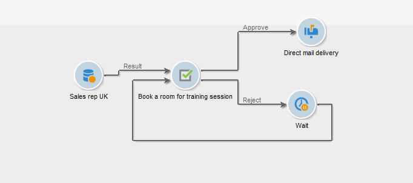

# Taak{#task}

>[!AVAILABILITY]
>
>:warning: Deze mogelijkheid is alleen beschikbaar in Campaign Classic v7. [Meer informatie](../../mrm/using/creating-and-managing-tasks.md)

In een campagnewerkstroom, **[!UICONTROL Task]** Met activiteit kunt u twee scenario&#39;s opgeven: de eerste als de taak is voltooid en een tweede als de taak niet is voltooid (als deze handmatig als onvolledig is gemarkeerd of als deze vervalt).

Hoe te vormen en een taak in werking te stellen is gedetailleerd in [Campaign Classic v7-documentatie](../../mrm/using/creating-and-managing-tasks.md).

De **[!UICONTROL Resources]** Met deze optie kunt u verschillende operatoren definiëren en een goedkeuringsschema voor de taak opgeven. Als de persoon die het verzoek afwijst dit niet doet, wordt de taak zelf niet afgewezen.
