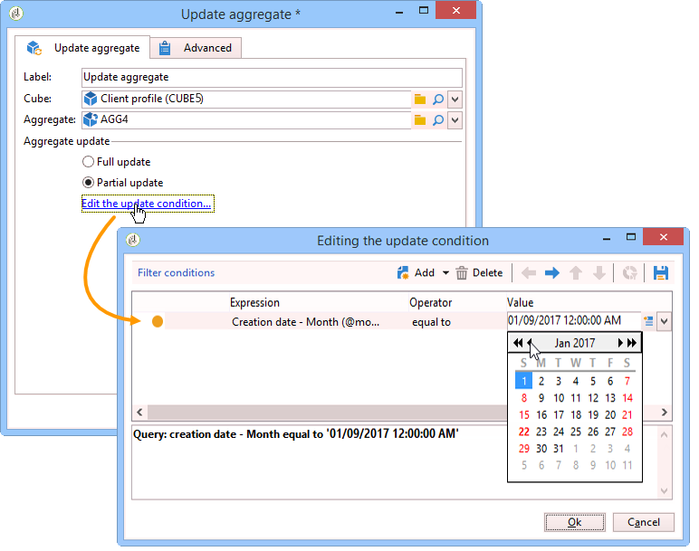

# Samenvoegen bijwerken{#update-aggregate}

Voor rapportagedoeleinden worden aggregaten op kubueniveau gedefinieerd. Er is een **[!UICONTROL Workflow]** tabblad beschikbaar wanneer u een aggregaat configureert.

Raadpleeg de desbetreffende [sectie](../../reporting/using/concepts-and-methodology.md#calculating-and-using-aggregates)voor meer informatie over kubussen en het gebruik van aggregaten in Adobe Campagne.

Met de **[!UICONTROL Update aggregate]** activiteit kunt u de updatemodus selecteren die u wilt toepassen: volledig of gedeeltelijk.

Standaard wordt bij elke berekening een volledige update uitgevoerd. Als u een gedeeltelijke update wilt inschakelen, selecteert u de desbetreffende optie en definieert u de updatevoorwaarden.

**Goede praktijken**: een **[!UICONTROL Scheduler]** activiteit kan worden gebruikt om de frequentie van de actualiseringen van de berekeningen te specificeren.

