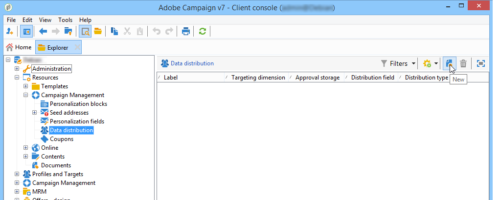

# De lokale goedkeuringsactiviteit gebruiken{#using-the-local-approval-activity}

Met de **[!UICONTROL Local approval]** activiteit die in een gericht werkschema wordt geïntegreerd, kunt u een goedkeuringsproces voor ontvangers instellen voordat de levering wordt verzonden.

>[!CAUTION]
>
>Als u deze functie wilt gebruiken, moet u de module Distributed Marketing aanschaffen. Dit is een optie Campagne. Controleer uw licentieovereenkomst.

Voor het instellen van dit gebruiksgeval hebben we de volgende workflow voor doelversie gemaakt:

De belangrijkste stappen in het lokale goedkeuringsproces zijn:

1. De populatie die het gevolg is van doelgerichte acties, kan worden beperkt door een **[!UICONTROL Split]** soort activiteit waarbij gebruik wordt gemaakt van een gegevensdistributiemodel.

   

1. De **[!UICONTROL Local approval]** activiteit neemt dan en verzendt een bericht e-mail naar elke lokale supervisor over. De activiteit wordt opgeschort tot elke lokale supervisor de ontvangers goedkeurt die aan hen worden toegewezen.

   

1. Wanneer de deadline voor goedkeuring is bereikt, wordt de workflow opnieuw gestart. In dit voorbeeld begint de **[!UICONTROL Delivery]** activiteit en wordt de levering verzonden naar de goedgekeurde doelen.

   >[!NOTE]
   >
   >Zodra de deadline is bereikt, worden ontvangers die niet zijn goedgekeurd, uitgesloten van doelbinding.

   

1. Een paar dagen later verzendt de tweede **[!UICONTROL Local approval]** typeactiviteit een bericht e-mail naar elke lokale supervisor met een samenvatting van de acties die door hun contacten worden uitgevoerd (kliks, opent, enz.).

   

## Stap 1: De sjabloon voor gegevensdistributie maken {#step-1--creating-the-data-distribution-template-}

Met de sjabloon voor gegevensdistributie kunt u de populatie beperken die het resultaat is van het richten op basis van gegevensgroepering, terwijl u elke waarde kunt toewijzen aan een lokale toezichthouder. In dit voorbeeld hebben we het **[!UICONTROL Email address domain]** veld gedefinieerd als een distributieveld en een domein toegewezen aan elke lokale toezichthouder

Voor meer informatie over het creëren van een malplaatje van de gegevensdistributie, verwijs naar het [Beperken van het aantal subsetverslagen per gegevensdistributie](../../workflow/using/split.md#limiting-the-number-of-subset-records-per-data-distribution).

1. Om het malplaatje van de gegevensdistributie tot stand te brengen, ga naar de **[!UICONTROL Resources > Campaign management > Data distribution]** knoop en klik **[!UICONTROL New]**.

   

1. Selecteer het **[!UICONTROL General]** tabblad.

   

1. Voer de **[!UICONTROL Label]** en de **[!UICONTROL Distribution context]** gegevens in. In dit voorbeeld, hebben wij het het **[!UICONTROL Recipient]** richten schema en het **[!UICONTROL Email domain]** gebied als distributieveld geselecteerd. De lijst met ontvangers wordt uitgesplitst naar domein.
1. Selecteer in het **[!UICONTROL Distribution type]** veld hoe de waarde van de doelbeperking wordt uitgedrukt op het **[!UICONTROL Distribution]** tabblad. Hier hebben we gekozen **[!UICONTROL Percentage]**.
1. Voer in het **[!UICONTROL Approval storage]** veld het opslagschema in van de goedkeuringen die overeenkomen met het doelschema in gebruik. Hier gaan wij het standaardopslagschema gebruiken: **[!UICONTROL Local approval of recipients]**.
1. Klik vervolgens op de **[!UICONTROL Advanced parameters]** koppeling.

   

1. Laat de **[!UICONTROL Approve the targeted messages]** optie ingeschakeld zodat alle ontvangers vooraf zijn geselecteerd in de lijst met goed te keuren ontvangers.
1. Op het **[!UICONTROL Delivery label]** gebied, hebben wij de standaarduitdrukking verlaten (rekenings koord van de levering). Het standaardlabel van de levering wordt gebruikt in de feedbackmelding.
1. In de **[!UICONTROL Grouping field]** sectie hebben we het **[!UICONTROL Gender]** veld geselecteerd als een groeperingsveld voor het weergeven van ontvangers in goedkeurings- en feedbackberichten.
1. In de **[!UICONTROL Edit targeted messages]** sectie hebben we de **[!UICONTROL Edit recipients]** webtoepassing en de **[!UICONTROL recipientId]** parameter geselecteerd. In de goedkeurings- en feedbackberichten kunnen ontvangers klikken en verwijzen ze naar de URL van de webtoepassing. De extra URL-parameter wordt **[!UICONTROL recipientId]** gebruikt.
1. Klik vervolgens op het **[!UICONTROL Distribution]** tabblad. Voer voor elk domein de volgende velden in:

   

   * **[!UICONTROL Value]**: Voer de waarde van de domeinnaam in.
   * **[!UICONTROL Percentage / Fixed]**: Voer voor elk domein de maximale waarde in. aantal ontvangers waarnaar u de levering wilt verzenden. In dit voorbeeld willen we de levering beperken tot 10% per domein.
   * **[!UICONTROL Label]**: Voer het label in van het domein dat moet worden weergegeven in de goedkeurings- en feedbackberichten.
   * **[!UICONTROL Group or operator]**: selecteert de exploitant of de groep exploitanten die aan het domein worden toegewezen.

      >[!CAUTION]
      >
      >Controleer of de juiste rechten aan de exploitanten zijn toegekend.

## Stap 2: De doelworkflow maken {#step-2--creating-the-targeting-workflow}

Voor het instellen van dit gebruiksgeval hebben we de volgende workflow voor doelversie gemaakt:

De volgende activiteiten zijn toegevoegd:

* Twee **[!UICONTROL Query]** activiteiten
* Eén **[!UICONTROL Intersection]** activiteit
* Eén **[!UICONTROL Split]** activiteit
* Eén **[!UICONTROL Local approval]** activiteit
* Eén **[!UICONTROL Delivery]** activiteit
* Eén **[!UICONTROL Wait]** activiteit
* een tweede **[!UICONTROL Local approval]** activiteit,
* Eén **[!UICONTROL End]** activiteit.

### Zoekopdrachten, doorsnede en Splitsen {#queries--intersection-and-split}

Het stroomopwaartse richten bestaat uit twee vragen, één doorsnede en één spleet. De populatie die het gevolg is van het richten van een doelgroep kan worden beperkt door een **[!UICONTROL Split]** activiteit te gebruiken die een sjabloon voor gegevensverspreiding gebruikt.

Voor meer bij het vormen van een gespleten activiteit, verwijs naar [Gesplitst](../../workflow/using/split.md). Het maken van een sjabloon voor gegevensdistributie wordt gedetailleerd beschreven in het [beperken van het aantal subsetrecords per gegevensdistributie](../../workflow/using/split.md#limiting-the-number-of-subset-records-per-data-distribution).

Als u niet de bevolking van de vraag wilt beperken, moet u niet de **[!UICONTROL Query]**, **[!UICONTROL Intersection]**, en **[!UICONTROL Split]** activiteiten gebruiken. Vul in dit geval de sjabloon voor gegevensdistributie in de eerste **[!UICONTROL Local approval]** activiteit in.

1. Selecteer de **[!UICONTROL Record count limitation]** optie in de **[!UICONTROL Limit the selected records]** sectie en klik op de **[!UICONTROL Edit]** koppeling.

   

1. Selecteer de **[!UICONTROL Keep only the first records after sorting]** optie en klik **[!UICONTROL Next]**.

   

1. Voeg in de **[!UICONTROL Sort columns]** sectie het veld toe waarop de sortering wordt toegepast. Hier hebben we het **[!UICONTROL Email]** veld gekozen. Klik **[!UICONTROL Next]**.

   

1. Selecteer de **[!UICONTROL By data distribution]** optie, selecteer eerder gecreeerd distributiemalplaatje (verwijs naar [Stap 1: Het creëren van het malplaatje](#step-1--creating-the-data-distribution-template-)van de gegevensdistributie) en klik **[!UICONTROL Finish]**.

   

In het distributiemalplaatje, hebben wij ervoor gekozen om de bevolking tot 10% per groeperingswaarde te beperken, die met de waarden samenvalt die in het werkschema worden getoond (340 als input en 34 als output).

### Goedkeuringsmelding {#approval-notification}

De **[!UICONTROL Local approval]** activiteit laat u een bericht naar elke lokale supervisor verzenden.

Voor meer bij het vormen van de **[!UICONTROL Local approval]** activiteit, verwijs naar [Lokale goedkeuring](../../workflow/using/local-approval.md).

De volgende velden moeten worden ingevuld:

1. Selecteer in de **[!UICONTROL Action to execute]** sectie de **[!UICONTROL Target approval notification]** optie.
1. Selecteer in de **[!UICONTROL Distribution context]** sectie de **[!UICONTROL Specified in the transition]** optie.

   Als u de beoogde populatie niet wilt beperken, selecteert u hier de **[!UICONTROL Explicit]** optie en voert u de eerder gemaakte distributiesjabloon in het **[!UICONTROL Data distribution]** veld in.

1. Selecteer in de **[!UICONTROL Notification]** sectie de leveringssjabloon en het onderwerp dat voor de e-mailmelding moet worden gebruikt. Hier hebben we de standaardsjabloon gekozen: **[!UICONTROL Local approval notification]**.
1. In de **[!UICONTROL Approval schedule]** sectie hebben we de standaardgoedkeuringsdeadline (3 dagen) behouden en een herinnering toegevoegd. De levering duurt 3 dagen na de aanvang van de goedkeuring. Zodra de goedkeuringsdeadline is bereikt, worden de ontvangers die niet zijn goedgekeurd niet in aanmerking genomen door zich te richten.

De door de **[!UICONTROL Local approval]** activiteit aan lokale toezichthouders verzonden e-mail met kennisgeving ziet er als volgt uit:

### Wachten {#wait}

Met de wachtactiviteiten kunt u het starten van de tweede lokale goedkeuringsactiviteit uitstellen die de feedbackmelding voor levering verzendt. In het **[!UICONTROL Duration]** veld hebben we de **[!UICONTROL 5d]** waarde (5 dagen) ingevoerd. De acties die de ontvangers gedurende vijf dagen na de verzending van de levering uitvoeren, worden in de feedbackmelding opgenomen.

### Feedbackmelding {#feedback-notification}

De tweede **[!UICONTROL Local approval]** activiteit laat u een levering verzenden terugkoppelt bericht aan elke lokale supervisor.

De volgende velden moeten worden ingevoerd.

1. Kies in de **[!UICONTROL Action to execute]** sectie **[!UICONTROL Delivery feedback report]**.
1. Kies in de **[!UICONTROL Delivery]** sectie **[!UICONTROL Specified in the transition]**.
1. Selecteer in de **[!UICONTROL Notification]** sectie de leveringssjabloon en het onderwerp dat voor de e-mailmelding moet worden gebruikt.

Zodra de termijn die in de wachttijdactiviteit wordt gevormd wordt bereikt, verzendt de tweede **[!UICONTROL Local approval]** typeactiviteit het volgende bericht e-mail naar elke lokale supervisor:

### Goedkeuring bijhouden door de beheerder {#approval-tracking-by-the-administrator}

Telkens wanneer de lokale goedkeuringsactiviteit begint, wordt een goedkeuringstaak gecreeerd. De beheerder kan elk van deze goedkeuringstaken controleren.

Ga naar de doelworkflow van uw campagne en klik op het **[!UICONTROL Local approval tasks]** tabblad.

De lijst van lokale goedkeuringstaken kan ook via het **[!UICONTROL Approval tasks]** lusje van het malplaatje van de gegevensdistributie worden betreden.

Selecteer de taak die u wilt controleren en klik op de **[!UICONTROL Detail]** knop. Op het **[!UICONTROL General]** tabblad van de lokale goedkeuringstaak kunt u informatie over de taak weergeven. Indien nodig kunt u de goedkeuringsdatums en de herinneringsdatums wijzigen.

Dit tabblad bevat de volgende informatie:

* het label en de id van de taak
* het gebruikte distributiemalplaatje
* het aantal gerichte berichten
* de gekoppelde workflow en campagne
* het taakschema

Op het **[!UICONTROL Distribution]** tabblad voor de taak kunt u de goedkeuringslogboeken, hun status, het aantal berichten dat u wilt ontvangen, de goedkeuringsdatum en de operator die de levering heeft goedgekeurd, weergeven.

Selecteer een goedkeuringslogboek en klik op de **[!UICONTROL Detail]** knop om meer informatie weer te geven. Op het **[!UICONTROL General]** tabblad van het lokale goedkeuringslogboek kunt u algemene logboekgegevens weergeven. U kunt ook de goedkeuringsstatus wijzigen.

Dit tabblad bevat de volgende informatie:

* de daarmee verband houdende goedkeuringstaak
* de goedkeuringsstatus (**[!UICONTROL Approved]** of **[!UICONTROL Pending]**)
* het gebruikte distributiemalplaatje
* de lokale toezichthouder die de goedkeuring heeft verleend en de goedkeuringsdatum
* het aantal gerichte en goedgekeurde berichten

Op het **[!UICONTROL Targeted]** tabblad van het goedkeuringslogboek worden de lijst met beoogde ontvangers en hun goedkeuringsstatus weergegeven. U kunt deze status desgewenst wijzigen.

