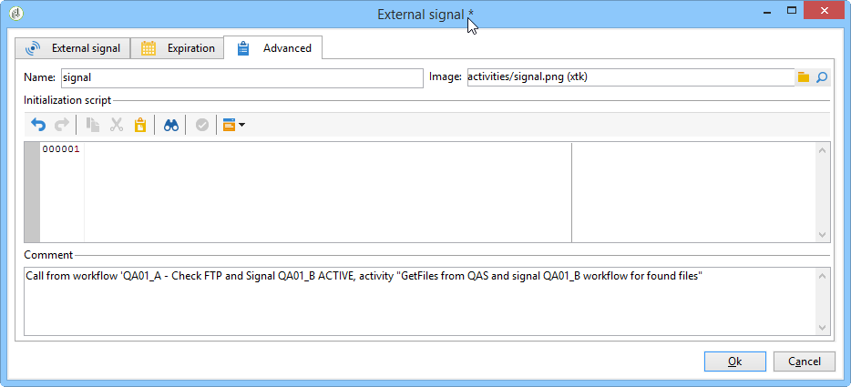

# Best practices voor workflows{#workflow-best-practices}

## Uitvoering en prestaties {#execution-and-performance}

Hieronder vindt u algemene richtlijnen voor het optimaliseren van de campagneprestaties, waaronder tips en trucs voor het toepassen op uw workflows.

Richtlijnen voor het oplossen van problemen met betrekking tot de uitvoering van workflows zijn ook beschikbaar in [deze sectie](../../production/using/workflow-execution.md).

### Logboeken {#logs}

De JavaScript-methode **[!UICONTROL logInfo()]** is een ideale oplossing voor foutopsporing in een workflow. Het is nuttig, maar het moet zorgvuldig worden gebruikt, vooral voor activiteiten die vaak worden uitgevoerd: het kan de logboeken overladen en beduidend de grootte van de logboeklijst verhogen. Maar misschien heb je meer nodig dan **[!UICONTROL logInfo()]**.

Er zijn twee aanvullende oplossingen beschikbaar om u te helpen:

* **Behoud het resultaat van tussentijdse populaties tussen twee executies**

   Met deze optie blijven tijdelijke tabellen tussen twee uitvoeringen van een workflow staan. Het is beschikbaar op het **[!UICONTROL General]** tabblad Eigenschappen van de workflow en kan worden gebruikt voor ontwikkelings- en testdoeleinden om gegevens te controleren en de resultaten te controleren. U kunt deze optie in ontwikkelomgevingen gebruiken, maar nooit in productieomgevingen. Het houden van tijdelijke lijsten zou in de grootte van het gegevensbestand kunnen resulteren die beduidend en uiteindelijk de groottegrens wordt bereikt. Bovendien zal het de back-up vertragen.

   Alleen de werktabellen van de laatste uitvoering van de workflow worden bewaard. De werklijsten van vorige uitvoeringen worden gezuiverd door het **[!UICONTROL cleanup]** werkschema, dat op een dagelijkse basis loopt.

   >[!CAUTION]
   >
   >Deze optie mag nooit worden ingeschakeld in een productiewerkstroom. Deze optie wordt gebruikt om de resultaten te analyseren en is alleen ontworpen voor testdoeleinden en moet daarom alleen worden gebruikt in ontwikkelings- of testomgevingen.

* **SQL-query&#39;s vastleggen in het journaal**

   Deze optie is beschikbaar op het **[!UICONTROL Execution]** tabblad met workfloweigenschappen en registreert alle SQL-query&#39;s die door het gereedschap worden gegenereerd op basis van de verschillende activiteiten. Het is een goede manier om te zien wat er daadwerkelijk door het platform wordt uitgevoerd. Deze optie mag echter alleen tijdelijk tijdens de ontwikkeling worden gebruikt en niet tijdens de productie worden geactiveerd.

Leeg de logboeken als ze niet meer nodig zijn. Workflowgeschiedenis wordt niet automatisch gewist: alle berichten worden standaard gehouden. De geschiedenis kan worden gewist via het **[!UICONTROL File > Actions]** menu of door op de knop Handelingen in de werkbalk boven de lijst te klikken. Selecteer Geschiedenis leegmaken.
Raadpleeg deze [documentatie](../../workflow/using/starting-a-workflow.md)voor meer informatie over het leegmaken van uw logbestanden.

### Workflowplanning {#workflow-planning}

* Probeer de dag een stabiel activiteitsniveau te handhaven en pieken te vermijden om te voorkomen dat de instantie overbelast raakt. Hiervoor verdeelt u de begintijden van de workflow gelijkmatig over de dag.
* Plan de gegevensbelasting &#39;s nachts om de bronconflict te verminderen.
* De lange werkschema&#39;s kunnen potentieel een effect op de server en gegevensbestandmiddelen hebben. Splits de langste workflows om de verwerkingstijd te verkorten.
* Om de totale uitvoeringstijd te verkorten, vervang tijdrovende activiteiten door vereenvoudigde en snellere activiteiten.
* Gebruik niet meer dan 20 workflows tegelijk. Wanneer te veel werkstromen tegelijkertijd worden uitgevoerd, kan het systeem zonder middelen en instabiel worden. Raadpleeg dit [artikel](https://helpx.adobe.com/ie/campaign/kb/workflows-not-starting-in-a-campaign-technical-workflows.html)voor meer informatie over waarom de workflow mogelijk niet wordt gestart.

### Workflow-uitvoering {#workflow-execution}

Het is aan te raden een workflow niet meer dan om de 15 minuten te plannen, omdat dit de algehele systeemprestaties kan belemmeren en blokken in de database kan maken.

Laat uw workflows niet pauzeren. Als u een tijdelijke werkstroom creeert, zorg ervoor het correct zal kunnen voltooien en niet in een **[!UICONTROL paused]** staat blijven. Als het wordt gepauzeerd, zou het impliceren dat u de tijdelijke lijsten moet houden en zo de grootte van het gegevensbestand verhogen. Wijs onder Workfloweigenschappen workflowtoezichthouders toe om een waarschuwing te verzenden wanneer een workflow mislukt of wordt gepauzeerd door het systeem.

U voorkomt als volgt dat workflows worden gepauzeerd:

* Controleer uw workflows regelmatig om te controleren of er geen onverwachte fouten zijn.
* Houd uw workflows zo eenvoudig mogelijk, bijvoorbeeld door grote workflows te splitsen in verschillende workflows. U kunt **[!UICONTROL External signal]** activiteiten gebruiken die hun uitvoering op de uitvoering van andere werkschema&#39;s teweegbrengen.
* Vermijd het hebben van gehandicapte activiteiten met stromen in uw werkschema&#39;s die draden open verlaten en tot vele tijdelijke lijsten leiden die veel ruimte kunnen verbruiken. Bewaar activiteiten niet in **[!UICONTROL Do not enable]** of **[!UICONTROL Enable but do not execute]** frames in uw workflows.

Stop ook ongebruikte workflows. Workflows die actief blijven, onderhouden verbindingen met de database.

Gebruik alleen onvoorwaardelijke stop in de zeldzame gevallen. Deze handeling niet regelmatig gebruiken. Het niet uitvoeren van een schone sluiting op verbindingen die door werkstromen aan het gegevensbestand worden geproduceerd beïnvloedt prestaties.

### Uitvoeren in de motoroptie {#execute-in-the-engine-option}

Schakel in het **[!UICONTROL Workflow properties]** venster nooit de **[!UICONTROL Execute in the engine]** optie in. Als deze optie is ingeschakeld, heeft de workflow prioriteit en worden alle andere workflows gestopt door de workflow-engine totdat deze is voltooid.

## Workflow-eigenschappen {#workflow-properties}

### Workflowmappen {#workflow-folders}

Adobe raadt u aan uw workflows te maken in een specifieke map.

Als de workflow van invloed is op het hele platform (bijvoorbeeld op het opschonen van processen), kunt u overwegen een submap toe te voegen aan de ingebouwde **[!UICONTROL Technical Workflows]** map.

### Workflownaamgeving {#workflow-naming}

Omdat het hen gemakkelijker maakt om te vinden en problemen op te lossen als zij niet op de verwachte manieren presteren, adviseert Adobe om uw werkschema&#39;s eigennamen en etiketten te geven: Vul het beschrijvingsveld van de werkstroom in om een overzicht te geven van het proces dat moet worden uitgevoerd zodat de exploitant het gemakkelijk kan begrijpen.

Als de workflow deel uitmaakt van een proces waarbij meerdere workflows zijn betrokken, kunt u expliciet zijn wanneer u een label invoert. het gebruik van getallen is een goede manier om de workflows te bestellen (door Label).

Bijvoorbeeld:

* 001 - Invoer - Ontvangers van de invoer
* 002 - Invoer - Uitvoer
* 003 - Invoer - Gegevens over de verkoop bij invoer
* 010 - Exporteren - Leveringslogboeken exporteren
* 011 - Logbestanden voor bijhouden van export

### Ernst van werkstroom {#workflow-severity}

U kunt de ernst van een werkstroom in de werkschemaeigenschappen, op het **[!UICONTROL Execution]** lusje vormen:

* Normaal
* Productie
* Kritiek

Door deze informatie op te geven tijdens het maken van een workflow, kunt u de ernst van het geconfigureerde proces beter begrijpen.

Deze optie heeft geen andere functionele gevolgen voor workflows dan campagneworkflows.

Workflows voor campagnes (workflows die zijn gemaakt als onderdeel van een campagne/bewerking) met een hogere prioriteit worden uitgevoerd als de campagne veel processen heeft die gelijktijdig moeten worden uitgevoerd. Standaard kunnen slechts 10 processen tegelijkertijd worden uitgevoerd in een campagne, volgens de optie NmsOperation_LimitConcurrency. Bijvoorbeeld, als een campagne 25 werkschema&#39;s bevat, zullen de werkschema&#39;s met een hogere strengheid dan in de eerste pool van 10 processen worden uitgevoerd.

### Workflowbewaking {#workflow-monitoring}

Alle geplande workflows die op productieomgevingen worden uitgevoerd, moeten worden gecontroleerd om te worden gewaarschuwd als er een fout optreedt.

In de werkschemaeigenschappen, selecteer een groep van de Supervisor, of het gebrek **[!UICONTROL Workflow supervisors]** of een douanegroep. Zorg ervoor dat ten minste één operator tot deze groep behoort, met een e-mailinstelling.

Voordat u een workflow gaat maken, moet u workflowsupervisors definiëren. Zij zullen per e-mail op de hoogte worden gesteld in het geval van fouten. Raadpleeg [Fouten](../../workflow/using/monitoring-workflow-execution.md#managing-errors)beheren voor meer informatie.

Controleer regelmatig het **[!UICONTROL Monitoring]** universum om de algemene status van de actieve workflows te bekijken. Raadpleeg voor meer informatie het [Instantietoezicht](../../workflow/using/monitoring-workflow-execution.md#instance-supervision).

Met de Workflow HeatMap kunnen beheerders van het Adobe Campagne-platform de belasting op de instantie controleren en workflows dienovereenkomstig plannen. Raadpleeg voor meer informatie de [workflowbewaking](../../workflow/using/heatmap.md).

## Activiteiten gebruiken {#using-activities}

>[!CAUTION]
>
>U kunt activiteiten kopiëren en plakken binnen dezelfde workflow. We raden echter niet aan plakactiviteiten over verschillende workflows te kopiëren. Sommige instellingen die zijn gekoppeld aan activiteiten zoals Leveringen en Planner kunnen leiden tot conflicten en fouten tijdens het uitvoeren van de doelworkflow. We raden u aan werkstromen te **dupliceren** . Zie Workflows [dupliceren voor meer informatie](../../workflow/using/building-a-workflow.md#duplicating-workflows).

### Naam van de activiteit {#name-of-the-activity}

Tijdens het ontwikkelen van uw workflow hebben alle activiteiten een naam, net als alle andere Adobe Campagneobjecten. Terwijl de naam door het hulpmiddel wordt geproduceerd, adviseren wij u het met een expliciete naam anders te noemen wanneer het vormen van het. Het risico dat het later gebeurt, is dat het de werkstroom kan onderbreken met activiteiten die de naam van een andere voorgaande activiteit gebruiken. Het zou dus moeilijk zijn om de namen achteraf bij te werken.

U vindt de naam van de activiteit op het **[!UICONTROL Advanced]** tabblad. Laat ze niet de naam **[!UICONTROL query]**, **[!UICONTROL query1]**, **[!UICONTROL query11]** maar geef ze expliciete namen, zoals **[!UICONTROL querySubscribedRecipients]**. Deze naam zal in het dagboek, en indien van toepassing in de SQL logboeken verschijnen, en dit zal helpen om het werkschema te zuiveren wanneer het vormen van het.

### Eerste en laatste activiteiten {#first-and-last-activities}

* Start uw workflow altijd met een **[!UICONTROL Start]** activiteit of een **[!UICONTROL Scheduler]** activiteit. Indien relevant kunt u ook een **[!UICONTROL External signal]** activiteit gebruiken.
* Gebruik bij het samenstellen van uw workflow slechts één **[!UICONTROL Scheduler]** activiteit per vertakking. Als de zelfde tak van een werkschema verscheidene planners (verbonden aan elkaar) heeft, zal het aantal uit te voeren taken exponentieel worden vermenigvuldigd, die het gegevensbestand aanzienlijk zou overbelasten. Deze regel is ook van toepassing op alle activiteiten met een **[!UICONTROL Scheduling & History]** tab. Meer weten over [plannen](../../workflow/using/scheduler.md)?

   

* Gebruik **[!UICONTROL End]** activiteiten voor elke workflow. Hiermee maakt Adobe Campagne tijdelijke ruimte vrij die wordt gebruikt voor berekeningen binnen workflows. Raadpleeg voor meer informatie: [Begin en einde](../../workflow/using/start-and-end.md).

### JavaScript binnen een activiteit {#javascript-within-an-activity}

U kunt JavaScript toevoegen bij het initialiseren van een workflowactiviteit. Dit kan op het **[!UICONTROL Advanced]** tabblad van een activiteit van de activiteit worden gedaan.

Om het spotting van het werkschema gemakkelijker te maken, adviseren wij gebruikend dubbele streepjes aan het begin en eind van het activiteitenetiket als volgt: — Mijn label —

### Signaal {#signal}

Meestal zult u niet weten waar het signaal vandaan komt. Om dit probleem te vermijden, gebruik het **[!UICONTROL Comment]** gebied binnen het **[!UICONTROL Advanced]** lusje van de signaalactiviteit om de verwachte oorsprong van een signaal voor deze activiteit te documenteren.

## Workflow-update {#workflow-update}

Een productiewerkstroom mag niet rechtstreeks worden bijgewerkt. Tenzij het proces bestaat uit het maken van een campagne met sjabloonworkflows, moeten processen eerst op een ontwikkelomgeving worden getest. Na deze validatie kan de workflow worden geïmplementeerd en op productie worden gestart.

Alle tests uitvoeren in ontwikkelings- of testomgevingen, niet in productieomgevingen. In een dergelijk geval kunnen de prestaties niet worden gewaarborgd.

Gearchiveerde workflows kunnen op ontwikkelings- of testplatforms in een gearchiveerde map worden bewaard, maar de productieomgeving moet zo schoon mogelijk blijven. Oude workflows moeten uit de productieomgeving worden verwijderd als ze inactief zijn.
